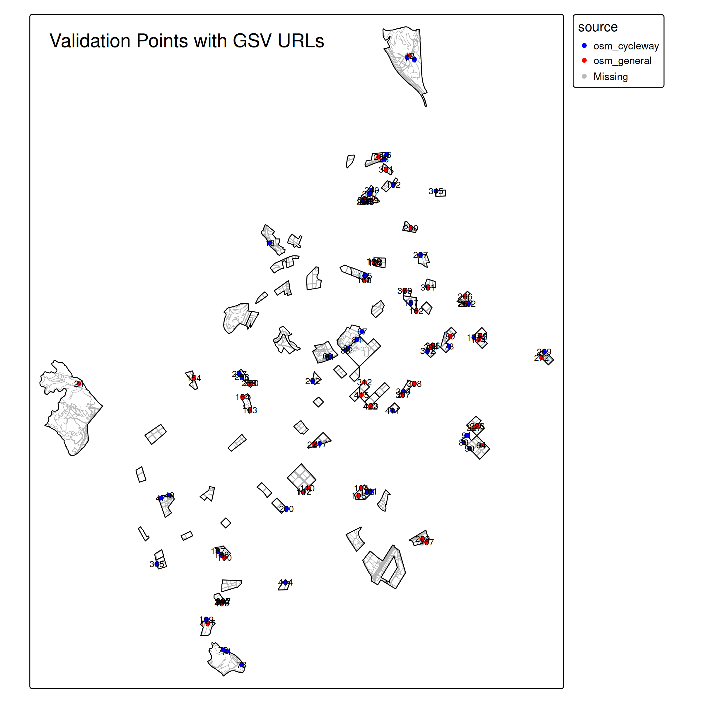

🔗 Part of the [ATRAPA database
project](https://github.com/GEMOTT/atrapa_database)  
⬅️ [Back to project
overview](https://github.com/GEMOTT/atrapa%20database) ➡️ [Next repo
related: Electoral and socioeconomic
data](https://github.com/GEMOTT/electoral-socioeconomic-data)

# Can OpenStreetMap Reliably Track Changes in Active Travel Infrastructure? A Multi-City Validation Across Seven European Cities

## Introduction

The relationship between the built environment and travel behaviour has
been widely studied, with many studies identifying associations between
environmental characteristics and travel patterns
(**cerin_neighbourhood_2017?**; **ding_neighborhood_2011?**;
**zhang_impact_2022?**). However, most research relies on
cross-sectional data, which cannot establish causality
(**mccormack_search_2011?**; **van_de_coevering_multi-period_2015?**).
In contrast, studies that track changes in both travel behaviour and the
built environment—such as longitudinal studies and natural
experiments—offer stronger causal insights but remain relatively scarce
(**karmeniemi_built_2018?**; **smith_systematic_2017?**;
**tcymbal_effects_2020?**).

One of the main challenges in expanding this area of research is the
limited availability of consistent, time-series data on the built
environment. While historical data on travel behaviour is often more
accessible—through sources like censuses, surveys, and increasingly,
crowdsourced platforms like Strava—comparable records of past urban
infrastructure are much harder to obtain. Some national road
datasets—such as those in Sweden, the Netherlands, Finland, Denmark, and
Norway—include long-term records of active travel networks, though
consistent and accessible historical data remains limited and varies
across countries, which hinders broader or international comparisons. An
alternative is to reconstruct historical built environment data manually
using maps, satellite imagery, and planning records, but this process is
highly resource-intensive and typically limited in scale.

The growing availability of Volunteered Geographic Information (VGI)
presents new opportunities to overcome data limitations in built
environment research. Among these sources, OpenStreetMap (OSM) stands
out for providing open, editable, and historical data on various types
of infrastructure, making it a promising tool for analysing urban
transformations over time. However, its application in this context
requires careful validation due to well-documented limitations in
accuracy, completeness, and temporal consistency
(**barron_comprehensive_2014?**; **zielstra_comparative_nodate?**).

While OSM has been widely used to assess infrastructure coverage and
routing potential, its reliability for capturing historical
transformations—especially in pedestrian-oriented infrastructure—remains
unclear. This study aims to evaluate the extent to which historical OSM
data can reliably capture urban transformations in active travel
infrastructure—such as bike lanes, pedestrian streets, and living
streets—across multiple European cities. We develop and apply a
semi-automated validation method that compares reported changes in OSM
to external reference sources, including street-level and satellite
imagery as well as official records. The analysis focuses on seven
cities selected for their relevance to a broader research initiative and
uses stratified sampling to reflect socio-demographic and spatial
diversity. While the present study is limited to these cases, the
framework is designed to be scalable and transferable, offering a
practical tool for researchers and planners seeking to monitor
infrastructure change over time.

This study builds on recent efforts to assess OSM’s data quality and
potential for infrastructure analysis, with particular attention to its
capacity to represent change over time.

<!-- ## Literature review -->
<!-- OSM is often used to study transport infrastructure—especially cycling networks—but few studies examine how these networks change over time. A countrywide assessment in Denmark found that neither OSM nor the official GeoDanmark dataset alone provided complete coverage; feature-level conflation was necessary to improve reliability, especially in rural areas [@viero_how_2025]. Viero et al. also introduced BikeDNA, an open-source tool that validates OSM cycling data with attention to network topology, local completeness, and spatial variation [@viero_bikedna_2024]. Similarly, Ferster et al. compared OSM with municipal datasets in six Canadian cities and found high agreement in total network length, though accuracy varied by infrastructure type—especially for newer or inconsistently tagged features [@ferster_developing_2023]. These studies underscore both the promise and the limitations of OSM for cycling infrastructure research. -->
<!-- In contrast, pedestrian networks—especially pedestrianized and living streets—have received significantly less attention in OSM validation studies. While some efforts have focused on sidewalks or routing networks (e.g. @zielstra_using_2012; https://wiki.openstreetmap.org/wiki/OpenSidewalks), few have assessed whether OSM reliably represents pedestrianized streets (e.g., highway=pedestrian) or living streets (highway=living_street), or whether these features accurately reflect real-world transformations over time. These types of infrastructure are increasingly relevant for sustainable mobility but pose unique challenges for mapping and validation due to tagging ambiguity and definitional variation across contexts [@national_technical_university_of_athens_greece_utilizing_2022; @omar_crowdsourcing_2022]. -->
<!-- Taken together, these studies demonstrate that OSM is a promising yet uneven source for analyzing changes in the built environment. However, most existing research focuses on static comparisons, routing applications, or cycling-specific infrastructure—often within single cities or countries. Very few studies assess OSM’s ability to capture infrastructure transformations over time, particularly for underrepresented networks like pedestrian and living streets. Our study addresses this gap by developing a validation framework that compares reported OSM transformations to multiple external sources—Google Street View, and satellite imagery—across seven European cities. In doing so, we assess the temporal completeness, spatial variation, and overall reliability of OSM as a longitudinal dataset for tracking changes in active travel infrastructure. -->

(Vierø, Vybornova, and Szell 2025)

(Brovelli et al. 2017; Ferster et al. 2020; Mordechai, n.d.)

## Data and Method

### Data Sources

- OpenStreetMap (OSM) snapshots: 2015, 2019, 2023
- Google Street View (GSV) imagery
- Satellite imagery

### Sampling Strategy

- Unit: census tracts (~60 per city)
- Sampling: stratified random based on:
  - Urban form: center, middle, periphery
  - Socio-demographics: income level or population density

### Change Detection in OSM

- Extract infrastructure from OSM for 2015, 2019, 2023
  - Focus tags: highway=cycleway, cycleway=\*, highway=pedestrian,
    highway=living_street
- Compare time periods:
  - Period 1: 2015–2019
  - Period 2: 2019–2023
- Identify changes:
  - Additions
  - Removals
  - Reclassifications

### Validation Strategy

#### OSM-Reported Changes (False Positives)

- Validate all reported changes using:
  - GSV for visual confirmation
  - Satellite imagery for layout verification
- Label each as:
  - ✅ Confirmed
  - ❌ False Positive +❓ Uncertain

#### Missed Changes (False Negatives)

- Sample ~100 street segments per city from within census tract sample
- For each segment, check imagery to see if:
  - Infrastructure exists in reality
  - But is missing from OSM

### Evaluation Metrics

- Accuracy = Confirmed OSM changes / All OSM-reported changes
- Completeness = Confirmed OSM changes / (Confirmed + Missed changes)
- SCI (Spatial Completeness Index) = Variation in completeness across
  tracts (e.g., standard deviation)

### Inclusion Criteria

- Include city/period/type only if:
  - Completeness ≥ 80%
  - SCI ≤ 15%
- Based on prior studies:
  - Hochmair et al. (2014), Barron et al. (2014), Elwood & Goodchild
    (2013)

#### Example Evaluation Table by Interval and Infrastructure Type

| City      | Interval  | Type           | Completeness | SCI    | Accuracy | Decision       |
|-----------|-----------|----------------|--------------|--------|----------|----------------|
| Barcelona | 2015–2019 | Bike Lanes     | 88% ✅       | 9% ✅  | 91% ✅   | ✅ Include     |
| Barcelona | 2015–2019 | Pedestrian     | 84% ✅       | 12% ✅ | 87% ✅   | ✅ Include     |
| Barcelona | 2015–2019 | Living Streets | 72% ❌       | 18% ❌ | 78% ❌   | ❌ Exclude     |
| Paris     | 2019–2023 | Bike Lanes     | 78% ❌       | 14% ✅ | 82% ✅   | ⚠️ Conditional |
| Paris     | 2019–2023 | Pedestrian     | 83% ✅       | 17% ❌ | 85% ✅   | ⚠️ Conditional |
| Warsaw    | 2015–2019 | Bike Lanes     | 70% ❌       | 10% ✅ | 75% ❌   | ❌ Exclude     |
| Milan     | 2019–2023 | Bike Lanes     | 90% ✅       | 11% ✅ | 89% ✅   | ✅ Include     |

## Results

### Descriptive analyses

# References

Brovelli, Maria Antonia, Marco Minghini, Monia Molinari, and Peter
Mooney. 2017. “Towards an Automated Comparison of OpenStreetMap with
Authoritative Road Datasets.” *Transactions in GIS* 21 (2): 191–206.
<https://doi.org/10.1111/tgis.12182>.

Ferster, Colin, Jaimy Fischer, Kevin Manaugh, Trisalyn Nelson, and
Meghan Winters. 2020. “Using OpenStreetMap to Inventory Bicycle
Infrastructure: A Comparison with Open Data from Cities.” *International
Journal of Sustainable Transportation* 14 (1): 64–73.
<https://doi.org/10.1080/15568318.2018.1519746>.

Mordechai, Dr. n.d. “How Good Is OpenStreetMap Information? A
Comparative Study of OpenStreetMap and Ordnance Survey Datasets for
London and the Rest of England.”
<https://www.ucl.ac.uk/~ucfamha/OSM%20data%20analysis%20070808_web_orig.pdf>.

Vierø, Ane Rahbek, Anastassia Vybornova, and Michael Szell. 2025. “How
Good Is Open Bicycle Network Data? A Countrywide Case Study of Denmark.”
*Geographical Analysis* 57 (1): 52–87.
<https://doi.org/10.1111/gean.12400>.

