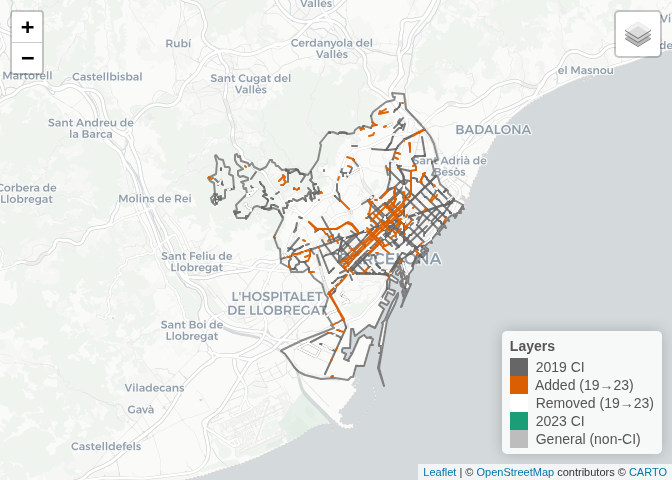
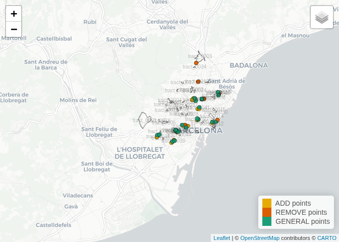

<!-- # Can OpenStreetMap Reliably Track Changes in Active Travel Infrastructure? Evidence from Barcelona with GSV Validation -->
<!-- ## Introduction -->
<!-- 🔗 Part of the [ATRAPA database project](https://github.com/GEMOTT/atrapa_database)\ -->
<!-- ⬅️ [Back to project overview](https://github.com/GEMOTT/atrapa%20database) ➡️ [Next repo related: Electoral and socioeconomic data](https://github.com/GEMOTT/electoral-socioeconomic-data) -->
<!-- The relationship between the built environment and travel behaviour has been widely studied, with many studies identifying associations between environmental characteristics and travel patterns [@cerin_neighbourhood_2017; @ding_neighborhood_2011; @zhang_impact_2022]. However, most research relies on cross-sectional data, which cannot establish causality [@mccormack_search_2011; @coevering_multi-period_2015]. In contrast, studies that track changes in both travel behaviour and the built environment—such as longitudinal studies and natural experiments—offer stronger causal insights but remain relatively scarce [@karmeniemi_built_2018; @smith_systematic_2017; @tcymbal_effects_2020]. -->
<!-- One of the main challenges in expanding this area of research is the limited availability of consistent, time-series data on the built environment. While historical data on travel behaviour is often more accessible—through sources like censuses, surveys, and increasingly, crowdsourced platforms like Strava—comparable records of past urban infrastructure are much harder to obtain. Long-term records of active travel networks, though consistent and accessible historical data remains limited and varies across cities, which hinders broader or international comparisons. An alternative is to reconstruct historical built environment data manually using maps, satellite imagery, and planning records, but this process is highly resource-intensive and typically limited in scale. -->
<!-- The growing availability of Volunteered Geographic Information (VGI) presents new opportunities to overcome data limitations in built environment research. Among these sources, OpenStreetMap (OSM) stands out for providing open, editable, and historical data on various types of infrastructure, making it a promising tool for analysing urban transformations over time. However, its application in this context requires careful validation due to well-documented limitations in accuracy, completeness, and temporal consistency [@barron_comprehensive_2014]. -->
<!-- While OSM has been widely used for mapping infrastructure and supporting routing applications, its utility for analysing changes in infrastructure over time is less well established. This study seeks to evaluate how accurately historical OSM data reflects changes in active travel infrastructure—specifically bike lanes, pedestrian streets, and living streets. We propose and apply a semi-automated validation method that compares reported OSM changes against external reference sources, including street-level imagery (Google Street View), satellite imagery, and official municipal records. -->
<!-- Focusing on the city of Barcelona, our approach uses stratified sampling to ensure spatial and socio-demographic diversity. While the analysis is limited to one city, the proposed framework is designed to be scalable and transferable, offering a practical methodology for researchers and planners seeking to monitor infrastructure change over time using open data sources. -->
<!-- This study builds on recent efforts to assess OSM’s data quality and potential for infrastructure analysis, with particular attention to its capacity to represent change over time. -->

# Validating OpenStreetMap for Detecting Cycling Infrastructure Change: A Pilot Study in Barcelona

- **Context**: Urban transformations (e.g. new bike lanes, pedestrian
  areas) can reshape mobility and health, but studying their effects
  requires reliable historical data.

- **Problem**: Standardised datasets of infrastructure change are rarely
  available across cities and years.

- **Solution**: Volunteered Geographic Information, especially
  OpenStreetMap (OSM), provides open and historical data on
  infrastructure, offering a potential way to track changes over time.

- **Aim**: Assess how well OSM detects cycling infrastructure (CI)
  changes (additions/removals), by estimating precision, recall, false
  negatives, and error-adjusted rates of change.

<!-- - **Outputs**: Measures of precision, recall, false negatives, error-adjusted change estimates, and stratum-level diagnostics. -->

- **Contribution**: Using Barcelona as a pilot case, this study provides
  one of the first systematic validations of OSM for detecting changes
  in cycling infrastructure, introduces an error-adjusted approach to
  estimate true additions and removals, and delivers city-level
  diagnostics to inform cross-city comparisons and practical monitoring
  of urban transformations.

## Data and Methods

### Setting and period

- **Study area**: Barcelona; period: 2019→2023 (snapshot dates:
  2020-01-01 for 2019 and 2024-01-01 for 2023).

### Network data (OSM)

- **Extraction**: Download OSM linework for both years.

- **CI selector**: `highway = cycleway`, bicycle-designated
  paths/tracks, roads with `cycleway:*` tags, `bicycle_road = yes`, and
  designated `living_street`/`pedestrian`.

- **Non-CI (general network)**: Base roads excluding all CI tags (strict
  complement).

- **Change detection**: Build ADDED (present in 2023, absent 2019) and
  REMOVED (present 2019, absent 2023) layers.

### Sampling frame and design

- **Stratified tracts**: Pre-selected census tracts by centrality ×
  density (3×3).

- **Per-tract quotas (example)**: ADD=2, REMOVE=1, GENERAL=2 (GENERAL =
  2023 non-CI network). Length-weighted sampling within tract; one
  midpoint per sampled segment.

- **Expected N**: At most \#tracts × (2+1+2), reduced where tracts have
  fewer or no candidates in one or more categories (ADD, REMOVE,
  GENERAL).

### Validation source and coding

- **Imagery**: Google Street View (GSV).

- **Tolerance windows**: 2019 target: ±1 year; 2023 target: ±2 years
  (fixed across coders).

- **Per-point fields (Excel)**:

  - *Metadata*: class (ADD/REMOVE/GENERAL), tract_id, stratum, lon, lat,
    gsv_link (+ clickable “Open GSV”).

  - *Verifiability*: verifiable_2019, verifiable_2023 (TRUE/FALSE).

  - *Presence*: present_2019, present_2023 (TRUE/FALSE/NA).

  - *Notes*: (obstruction, roadworks, poor angle, etc.).

- **Consistency rules**:

  - If verifiable\_\* = FALSE → set corresponding present\_\* = NA.

  - If imagery exists but unclear → keep verifiable\_\* = TRUE, set
    present\_\* = NA.

| stratum | REMOVE | ADD | GENERAL | Total |
|:--------|-------:|----:|--------:|------:|
| D1_C1   |      1 |   0 |       0 |     1 |
| D1_C2   |      1 |   3 |       4 |     8 |
| D1_C3   |      2 |   3 |       4 |     9 |
| D2_C1   |      1 |   0 |       0 |     1 |
| D2_C2   |      1 |   1 |       2 |     4 |
| D2_C3   |      0 |   1 |       2 |     3 |
| D3_C1   |      0 |   1 |       2 |     3 |
| D3_C2   |      0 |   2 |       2 |     4 |
| D3_C3   |      0 |   5 |       6 |    11 |
| TOTAL   |      6 |  16 |      22 |    44 |

Validation points by class and stratum

### Outcomes and metrics

- **Precision (ADD)**:

  - TP_ADD = points coded as ADD and verifiable in 2023, with
    infrastructure present.

  - FP_ADD = points coded as ADD and verifiable in 2023, but
    infrastructure absent.

  - Precision_ADD = TP_ADD / (TP_ADD + FP_ADD).

- **Precision (REMOVE)**:

  - Defined analogously, with present_2023 = FALSE as the true positive
    condition.

- **False negatives (GENERAL)**:

  - Strict FN: points coded as GENERAL, verifiable in both years, absent
    in 2019 but present in 2023.

  - FN_rate = FN_strict / N_strict, where N_strict = number of GENERAL
    points verifiable in both years.

- **Recall (ADD)**:

  - Recall_ADD = TP_ADD / (TP_ADD + FN_strict).

- **Calibration of OSM km (adds)**:

  - Adjustment of raw OSM-added kilometres using observed Precision_ADD
    and Recall_ADD.

$$
K_{\text{add, validated}}
\approx
K_{\text{add, OSM}}
\times
\frac{1 - \mathrm{FP}_{\text{ADD}}}{1 - \mathrm{FN}_{\text{ADD}}}
 \qquad(1)$$

(Analogous down-adjustment for removals using FP_REMOVE.)

<!-- Statistical analysis -->
<!-- Report proportions with 95% CIs (e.g., prop.test). -->
<!-- By-stratum estimates (centrality × density); compute a weighted overall (equal weights if equal per stratum; otherwise use design weights reflecting tract/pop coverage). -->
<!-- Sensitivity analyses: -->
<!-- “Loose FN”: verif_2023=TRUE & present_2023=TRUE (regardless of 2019). -->
<!-- Alternative tolerance windows (±0/±1 year). -->
<!-- Inter-rater reliability: double-code ~10% of points; report κ. -->
<!-- Reproducibility and ethics -->
<!-- Provide code (R/Quarto) and exact tag list; no personal data; imagery used is publicly accessible via GSV. -->
<!-- Results (template to fill once coded) -->
<!-- Sample flow. Counts by class and verifiability (table). -->
<!-- ADD: TP/FP counts, Precision_ADD with CI; by-stratum differences (heatmap/table). -->
<!-- REMOVE: TP/FP counts, Precision_REMOVE with CI; by-stratum. -->
<!-- GENERAL: FN_strict and FN_rate with CI; Recall_ADD with CI. -->
<!-- Calibration. Raw OSM km vs validated km (point estimate + CI); % change after adjustment. -->
<!-- Sensitivity. Changes under loose FN and alternative windows. -->
<!-- Reliability. κ for double-coded subset. -->
<!-- Discussion -->
<!-- Principal findings. (e.g., OSM precision high for ADD, moderate for REMOVE; FN_rate non-trivial in peripheral strata; recall X%.) -->
<!-- Implications. When and where OSM is dependable for monitoring CI; how to adjust OSM-based indicators. -->
<!-- Biases. Systematic error by urban context (density/centrality), imagery gaps. -->
<!-- Strengths & limitations. Stratified design; portable workflow; GSV timing constraints; sample size. -->
<!-- Relation to prior work. How estimates compare with municipal reports / prior validations. -->
<!-- Conclusions -->
<!-- OSM is [adequate / limited] for detecting CI changes when [conditions]. -->
<!-- Provide validated growth estimates with uncertainty; recommend routine stratified validation for cross-city comparability. -->
<!-- Tables & Figures (recommended) -->
<!-- T1. Sample counts by class × verifiability (and by stratum). -->
<!-- T2. ADD/REMOVE precision with 95% CIs (overall + by stratum). -->
<!-- T3. GENERAL FN_rate and Recall_ADD with 95% CIs (overall + by stratum). -->
<!-- F1. Stratified sampling map (tracts + sampled points). -->
<!-- F2. Heatmap of metrics by stratum. -->
<!-- F3. Raw vs validated km (adds/removals) with CIs (bar/CI plot). -->
<!-- Supp. Coding protocol examples (what counts as CI), sensitivity plots. -->
<!-- ## References -->
