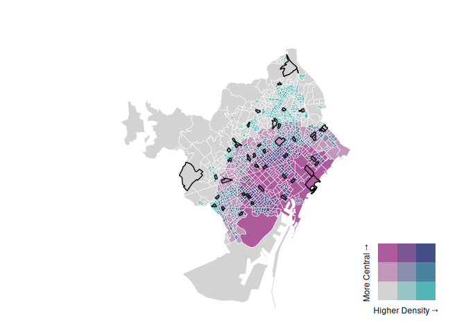
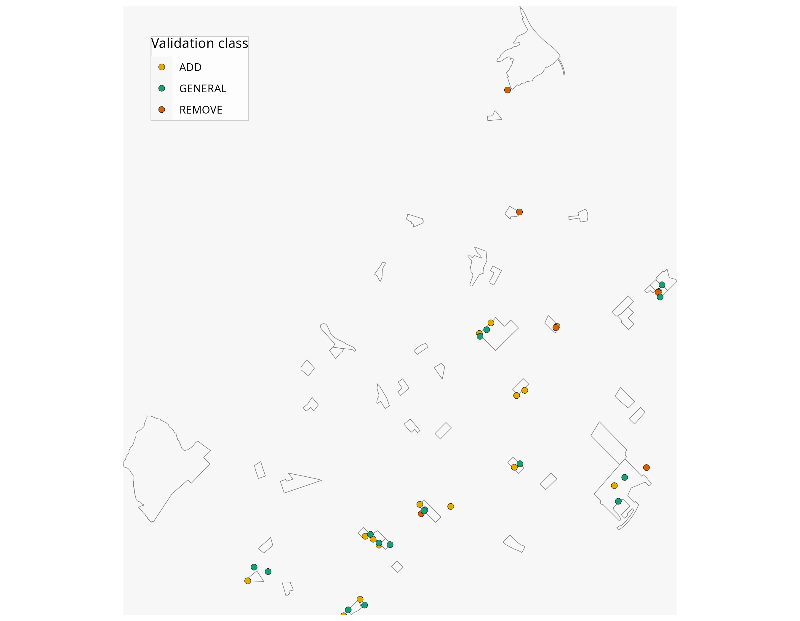
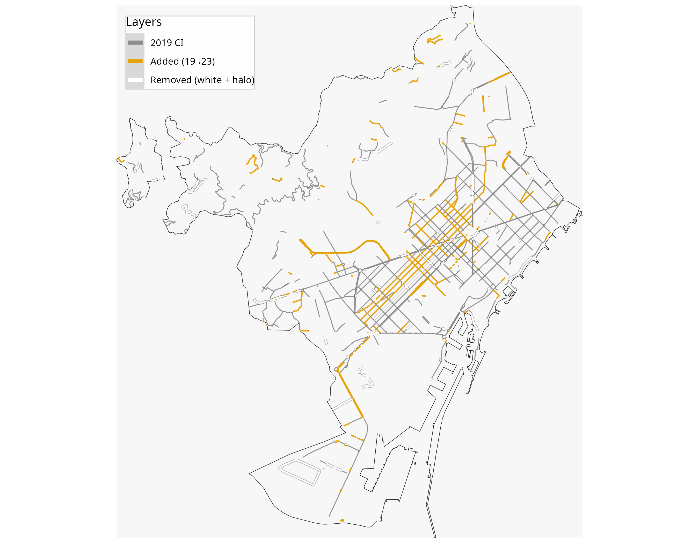

<link href="README_files/libs/htmltools-fill-0.5.8.1/fill.css" rel="stylesheet" />

<link href="README_files/libs/leaflet-1.3.1/leaflet.css" rel="stylesheet" />

<link href="README_files/libs/leafletfix-1.0.0/leafletfix.css" rel="stylesheet" />

<link href="README_files/libs/rstudio_leaflet-1.3.1/rstudio_leaflet.css" rel="stylesheet" />

<!-- # Can OpenStreetMap Reliably Track Changes in Active Travel Infrastructure? Evidence from Barcelona with GSV Validation -->
<!-- ## Introduction -->
<!-- 🔗 Part of the [ATRAPA database project](https://github.com/GEMOTT/atrapa_database)\ -->
<!-- ⬅️ [Back to project overview](https://github.com/GEMOTT/atrapa%20database) ➡️ [Next repo related: Electoral and socioeconomic data](https://github.com/GEMOTT/electoral-socioeconomic-data) -->
<!-- The relationship between the built environment and travel behaviour has been widely studied, with many studies identifying associations between environmental characteristics and travel patterns [@cerin_neighbourhood_2017; @ding_neighborhood_2011; @zhang_impact_2022]. However, most research relies on cross-sectional data, which cannot establish causality [@mccormack_search_2011; @coevering_multi-period_2015]. In contrast, studies that track changes in both travel behaviour and the built environment—such as longitudinal studies and natural experiments—offer stronger causal insights but remain relatively scarce [@karmeniemi_built_2018; @smith_systematic_2017; @tcymbal_effects_2020]. -->
<!-- One of the main challenges in expanding this area of research is the limited availability of consistent, time-series data on the built environment. While historical data on travel behaviour is often more accessible—through sources like censuses, surveys, and increasingly, crowdsourced platforms like Strava—comparable records of past urban infrastructure are much harder to obtain. Long-term records of active travel networks, though consistent and accessible historical data remains limited and varies across cities, which hinders broader or international comparisons. An alternative is to reconstruct historical built environment data manually using maps, satellite imagery, and planning records, but this process is highly resource-intensive and typically limited in scale. -->
<!-- The growing availability of Volunteered Geographic Information (VGI) presents new opportunities to overcome data limitations in built environment research. Among these sources, OpenStreetMap (OSM) stands out for providing open, editable, and historical data on various types of infrastructure, making it a promising tool for analysing urban transformations over time. However, its application in this context requires careful validation due to well-documented limitations in accuracy, completeness, and temporal consistency [@barron_comprehensive_2014]. -->
<!-- While OSM has been widely used for mapping infrastructure and supporting routing applications, its utility for analysing changes in infrastructure over time is less well established. This study seeks to evaluate how accurately historical OSM data reflects changes in active travel infrastructure—specifically bike lanes, pedestrian streets, and living streets. We propose and apply a semi-automated validation method that compares reported OSM changes against external reference sources, including street-level imagery (Google Street View), satellite imagery, and official municipal records. -->
<!-- Focusing on the city of Barcelona, our approach uses stratified sampling to ensure spatial and socio-demographic diversity. While the analysis is limited to one city, the proposed framework is designed to be scalable and transferable, offering a practical methodology for researchers and planners seeking to monitor infrastructure change over time using open data sources. -->
<!-- This study builds on recent efforts to assess OSM’s data quality and potential for infrastructure analysis, with particular attention to its capacity to represent change over time. -->

# Validating OpenStreetMap for Detecting Cycling Infrastructure Change: A Pilot Study in Barcelona

## Introduction

- **Context:** Urban transformations (e.g. new bike lanes, pedestrian
  areas) can reshape mobility and health, but studying their effects
  requires reliable historical data.

- **Problem:** Standardised datasets of infrastructure change are rarely
  available across cities and years.

- **Potential solution:** Volunteered Geographic Information, especially
  OpenStreetMap (OSM), provides open and historical data on
  infrastructure, offering a promising way to track changes over time.
  However, the reliability of OSM data for detecting infrastructure
  change is uncertain and requires systematic validation.

- **Aim:** Assess how well OSM detects cycling infrastructure (CI)
  changes (additions/removals), by estimating precision, recall, false
  negatives, and error-adjusted rates of change.

- **Contribution:** Using Barcelona as a pilot case, this study provides
  one of the first systematic validations of OSM for detecting changes
  in CI, introduces an error-adjusted approach to estimate true
  additions and removals, and delivers city-level diagnostics to inform
  cross-city comparisons and practical monitoring of urban
  transformations.

<!-- - **Outputs**: Measures of precision, recall, false negatives, error-adjusted change estimates, and stratum-level diagnostics. -->

## Data and Methods

### Data

#### Setting and period

- **Study area**: Barcelona; period: 2019→2023.

#### OpenStreetMap (OSM)

- **Extraction**: Download OSM linework for both years (snapshot dates:
  2020-01-01 for 2019 and 2024-01-01 for 2023).

- **CI selector**:

  - Keep segments with: `highway=cycleway` • `cycleway=*` or
    `cycleway:left/right/both=*` (lane/track/opposite/separate) •
    `bicycle_road=yes` • designated `path/footway/track` for bicycles.

  - Normalize geometries; metric CRS; min-length filter; tolerance
    buffer to reduce sliver noise.

- **Non-CI (general network)**: Base roads excluding all CI tags (strict
  complement).

#### Google Street View (GSV)

- Source of independent imagery; pano dates (2019–2023 range); coverage
  and limitations.

### Methods

#### Change detection

- ADDED: present in 2023, absent in 2019.
- REMOVED: present in 2019, absent in 2023.
- Computed via buffered geometric differencing, dropping tiny fragments.

#### Sampling frame

- Stratified tracts: Pre-selected census tracts by centrality × density
  (3×3).

- In sampled tracts, draw length-weighted points for ADD, REMOVE, and
  GENERAL (2023 non-CI network).

- Validation point = midpoint of the sampled segment.

#### Validation protocol

##### Coding rules

- **Tolerance windows**: 2019 condition = 2018–2020; 2023 condition =
  2021–2025.

- Per point & year:

  - Verifiability (yes/no). If not verifiable → presence = NA.

  - Presence of CI (yes/no/NA).

  - Notes (obstruction/works/angle).

  - Ambiguous but visible → keep verifiable=YES, presence=NA.

##### Outcomes and metrics

We evaluated OSM change detection against GSV imagery using three
indicators:

- **True Positive (TP):** an OSM-flagged change (ADD or REMOVE) that is
  confirmed in GSV.  
- **False Positive (FP):** an OSM-flagged change not confirmed in GSV
  (e.g. late mapping in ADD, data clean-up in REMOVE).  
- **False Negative (FN):** a true change observed in GENERAL points that
  OSM failed to flag (missed ADD or REMOVE).

From these indicators we computed:

- **Precision** = TP / (TP + FP)  
  → proportion of OSM-flagged changes that are correct.  
- **Recall** = TP / (TP + FN)  
  → proportion of true changes that OSM captures.  
- **F1 score** = 2PR / (P + R)  
  → harmonic mean of precision and recall.

Notes on calculation:

- **Precision** is estimated from *OSM-flagged points only* (15 ADD, 5
  REMOVE).  
- **False negatives (FN)** are detected in *GENERAL points* (20), which
  are not OSM-flagged.  
- **Recall** therefore combines both sources: OSM-flagged TPs in the
  numerator, and OSM-flagged TPs plus FN from GENERAL in the
  denominator.

Overall performance metrics are reported separately for ADD and REMOVE,
and pooled across classes.

<!-- ### Uncertainty & stratification -->
<!-- - 95% CIs for proportions: Wilson/score (prop.test(correct=FALSE)). -->
<!-- - By-stratum reporting (centrality × density); if strata imbalanced, compute design-weighted overall. -->
<!-- ### Sensitivity analyses -->
<!-- - Loose FN (ADD): count any verifiable present_2023==TRUE in GENERAL as FN_ADD (regardless of 2019). -->
<!-- - Alternative windows: tighten 2019 to calendar year; set 2023 to 2022–2024. -->
<!-- ### Inter-rater reliability -->
<!-- Double-code ~10–20% of points; report Cohen’s κ (+ % agreement) for presence per year. -->

#### Calibration

- Raw OSM change-km were scaled by the validation metrics (precision and
  recall) to obtain error-adjusted estimates of added and removed cycle
  infrastructure.

- Adjustments were computed separately for ADD and REMOVE classes, then
  aggregated to tract and city level

## Results

### Raw OSM change estimates

The OSM cycling network expanded from 214.1 km in 2019 to 263.9 km in
2023 (+49.7 km, ≈23%). Segment differencing suggests 63.7 km were added
and 22.3 km removed (Table 1). Additions were concentrated in dense,
central tracts—especially D3_C3 (36.1% of added km)—while removals were
less frequent and clustered mainly in D1_C3 (61.0%) (Table 2).

| Metric                     | Value |
|:---------------------------|------:|
| Total 2019 (km)            | 214.1 |
| Total 2023 (km)            | 263.9 |
| Net growth (km)            |  49.7 |
| Added (km)                 |  63.4 |
| Removed (km)               |  22.3 |
| Added − Removed (km)       |  41.1 |
| Gap: (Added−Removed) − Net |  -8.6 |

Table 1: Consistency between yearly totals and differencing estimates
(2019–2023, Barcelona)

| stratum | Added_km | Removed_km | Added_pct | Removed_pct |
|:--------|---------:|-----------:|----------:|------------:|
| D1_C1   |      0.0 |        0.0 |      0.0% |        3.1% |
| D1_C2   |      0.4 |        0.0 |     22.1% |        4.9% |
| D1_C3   |      0.3 |        0.5 |     13.3% |       61.0% |
| D2_C1   |      0.0 |        0.1 |      0.0% |       11.1% |
| D2_C2   |      0.1 |        0.2 |      5.2% |       19.8% |
| D2_C3   |      0.1 |        0.0 |      4.3% |        0.0% |
| D3_C1   |      0.2 |        0.0 |      9.8% |        0.0% |
| D3_C2   |      0.2 |        0.0 |      9.3% |        0.0% |
| D3_C3   |      0.7 |        0.0 |     36.1% |        0.0% |

Table 2: OSM-estimated additions and removals (2019–2023) by density ×
centrality stratum

### Validation results

Validation covered 44 points across all nine density–centrality strata
(largest D3_C3: 11/44). Among OSM-flagged changes with verifiable
imagery (n=20; 15 ADD, 5 REMOVE), ADD performed well (precision 0.87
\[0.62–0.96\]; recall 1.00 \[0.77–1.00\]; F1 0.93), whereas REMOVE was
weak (precision 0.20 \[0.04–0.62\]; recall 0.50 \[0.09–0.91\]; F1 0.29);
we found one false negative (missed removal) and none for ADD. Pooled
over classes: precision 0.70 \[0.48–0.85\], recall 0.93 \[0.70–0.99\],
F1 0.80.

| stratum | REMOVE | ADD | GENERAL | Total |
|:--------|-------:|----:|--------:|------:|
| D1_C1   |      1 |   0 |       0 |     1 |
| D1_C2   |      1 |   3 |       4 |     8 |
| D1_C3   |      1 |   2 |       3 |     6 |
| D2_C1   |      1 |   0 |       0 |     1 |
| D2_C2   |      1 |   1 |       2 |     4 |
| D2_C3   |      0 |   1 |       2 |     3 |
| D3_C1   |      0 |   1 |       2 |     3 |
| D3_C2   |      0 |   2 |       2 |     4 |
| D3_C3   |      0 |   5 |       5 |    10 |
| TOTAL   |      5 |  15 |      20 |    40 |

Table 3: Validation points by class and stratum (usable points)

| Class | n (usable) | TP | FP | FN (source) | Precision | Precision (95% CI) | Recall | Recall (95% CI) | F1 |
|:---|---:|---:|---:|:---|---:|---:|---:|---:|---:|
| ADD | 15 | 13 | 2 | from GENERAL | 0.87 | 0.87 \[0.62–0.96\] | 1.00 | 1.00 \[0.77–1.00\] | 0.93 |
| REMOVE | 5 | 1 | 4 | from GENERAL | 0.20 | 0.20 \[0.04–0.62\] | 0.50 | 0.50 \[0.09–0.91\] | 0.29 |
| Pooled | 20 | 14 | 6 | from GENERAL | 0.70 | 0.70 \[0.48–0.85\] | 0.93 | 0.93 \[0.70–0.99\] | 0.80 |

Table 4: Validation performance (usable points only)

<!-- ### Error-adjusted change estimates -->
<!-- Calibrated totals after applying validation metrics. -->
<!-- Example table contrasting Raw vs Adjusted at city level (and possibly mean per tract). -->
<!-- Map of tracts showing adjusted changes (before vs after adjustment). -->
<!-- ### Spatial patterns -->
<!-- Highlight clusters of growth or underestimation. -->
<!-- Example: “Adjusted estimates show the largest growth in central tracts, while peripheral areas show smaller net additions once errors are corrected.” -->

## Supplements

### S1. Validation workbook

**Data:** [Download the validation workbook
(Excel)](outputs/barcelona_samples_2019_2023.xlsx)

### S2. Interactive stratification map (density × centrality, 3×3) with sampled tracts

### S3. Interactive validation points map (with GSV links)

### S4. Interactive infrastructure change map (2019→2023)

<!-- ## References -->
