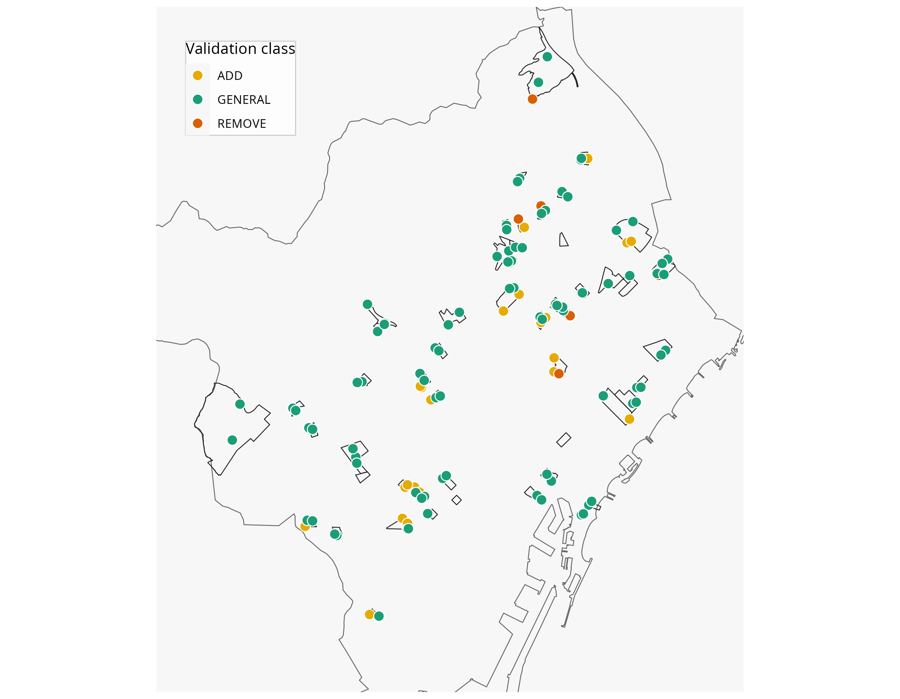

<!-- # Can OpenStreetMap Reliably Track Changes in Active Travel Infrastructure? Evidence from Barcelona with GSV Validation -->

<!-- ## Introduction -->

🔗 Part of the [ATRAPA database project](https://github.com/GEMOTT/atrapa_database)\

⬅️ [Back to project overview](https://github.com/GEMOTT/atrapa%20database) ➡️ [Next repo related: Electoral and socioeconomic data](https://github.com/GEMOTT/electoral-socioeconomic-data)

<!-- The relationship between the built environment and travel behaviour has been widely studied, with many studies identifying associations between environmental characteristics and travel patterns [@cerin_neighbourhood_2017; @ding_neighborhood_2011; @zhang_impact_2022]. However, most research relies on cross-sectional data, which cannot establish causality [@mccormack_search_2011; @coevering_multi-period_2015]. In contrast, studies that track changes in both travel behaviour and the built environment—such as longitudinal studies and natural experiments—offer stronger causal insights but remain relatively scarce [@karmeniemi_built_2018; @smith_systematic_2017; @tcymbal_effects_2020]. -->

<!-- One of the main challenges in expanding this area of research is the limited availability of consistent, time-series data on the built environment. While historical data on travel behaviour is often more accessible—through sources like censuses, surveys, and increasingly, crowdsourced platforms like Strava—comparable records of past urban infrastructure are much harder to obtain. Long-term records of active travel networks, though consistent and accessible historical data remains limited and varies across cities, which hinders broader or international comparisons. An alternative is to reconstruct historical built environment data manually using maps, satellite imagery, and planning records, but this process is highly resource-intensive and typically limited in scale. -->

<!-- The growing availability of Volunteered Geographic Information (VGI) presents new opportunities to overcome data limitations in built environment research. Among these sources, OpenStreetMap (OSM) stands out for providing open, editable, and historical data on various types of infrastructure, making it a promising tool for analysing urban transformations over time. However, its application in this context requires careful validation due to well-documented limitations in accuracy, completeness, and temporal consistency [@barron_comprehensive_2014]. -->

<!-- While OSM has been widely used for mapping infrastructure and supporting routing applications, its utility for analysing changes in infrastructure over time is less well established. This study seeks to evaluate how accurately historical OSM data reflects changes in active travel infrastructure—specifically bike lanes, pedestrian streets, and living streets. We propose and apply a semi-automated validation method that compares reported OSM changes against external reference sources, including street-level imagery (Google Street View), satellite imagery, and official municipal records. -->

<!-- Focusing on the city of Barcelona, our approach uses stratified sampling to ensure spatial and socio-demographic diversity. While the analysis is limited to one city, the proposed framework is designed to be scalable and transferable, offering a practical methodology for researchers and planners seeking to monitor infrastructure change over time using open data sources. -->

<!-- This study builds on recent efforts to assess OSM’s data quality and potential for infrastructure analysis, with particular attention to its capacity to represent change over time. -->

# Validating OpenStreetMap for detecting cycling-infrastructure change: A Barcelona pilot using Google Street View (2019–2023)

## Introduction

- Context: Urban transformations, such as new or upgraded bike lanes, can reshape mobility and health, but studying their effects requires reliable historical data.

- Problem: Standardised datasets of infrastructure change are rarely available across cities and years.

- Potential solution: Volunteered Geographic Information, especially OpenStreetMap (OSM), provides open and historical data on infrastructure, offering a promising way to track changes over time. 
However, the reliability of OSM data for detecting infrastructure change is uncertain and requires systematic validation.

- Aim: Determine whether OSM reliably reflects new or removed bike lanes in Barcelona using dated Google Street View as ground truth.

- Contribution: We benchmark OSM’s change detection (precision, recall, F1) and share a reusable validation workflow that others can apply; we also outline calibration as a next step.

## Data and methods

### Data sources

- OpenStreetMap (OSM): open, collaboratively mapped vector data with tags for cycling infra.

- Google Street View (GSV): geotagged, time-stamped street-level imagery. (Right now they’re just headings.)

### Methods

```{r}
#| label: 01-setup
#| include: false
# This chunk runs first, prepares packages and a tiny on-disk cache.

  library(sf); sf::sf_use_s2(FALSE)   # turn off spherical geometry; faster planar ops in UTM
  library(dplyr); library(tidyr); library(stringr)   # data wrangling
  library(knitr); library(kableExtra)                # tables in the report
  library(ggplot2); library(cowplot)                 # plotting
  library(leaflet)                                   # interactive maps
  library(osmdata); library(osmextract)              # get OSM data
  library(biscale)                                   # bivariate maps (e.g., density × centrality)
  library(readxl);                                   # read Excel
  library(DiagrammeR); library(DiagrammeRsvg);       # flowcharts, export to SVG
  library(rsvg);                                     # convert SVG → PNG
  library(openxlsx)                                  # write Excel
  library(htmltools)                                 # small HTML helpers for outputs
  # add others here if you use them anywhere in the doc

# ---- lightweight cache so heavy steps don't re-run every time ----
# Create a folder for intermediate results if missing.
proc_dir <- "data/processed"; if (!dir.exists(proc_dir)) dir.create(proc_dir, TRUE)
```

```{r}
#| label: 02-helpers-global
#| include: false
# otherwise run `build()`, save it, and return it.
# Usage example:
# result <- .cache("data/processed/thing.rds",
#                  build  = function(){ slow_code_here() },
#                  inputs = c("data/source1.gpkg", "data/source2.gpkg"))
.cache <- function(path, build, inputs = NULL, reuse = TRUE) {
  up_to_date <- file.exists(path) &&
    (is.null(inputs) || max(file.mtime(inputs)) <= file.mtime(path))
  if (reuse && up_to_date) return(readRDS(path))  # skip recomputation
  obj <- build()                                  # compute fresh
  saveRDS(obj, path)                               # save for next time
  obj
}

# Lowercase-safe accessor
.get_chr <- function(x, col){
  nm <- names(x); n <- nrow(x)
  if (col %in% nm) tolower(as.character(x[[col]])) else rep(NA_character_, n)
}

# Safer line normalizer (won’t choke on POINT / GEOMETRYCOLLECTION)
normalize_lines_safe <- function(x){
  if (!inherits(x, "sf") || !nrow(x)) return(x[0, ])
  x <- sf::st_make_valid(x)
  # pull out only the line components from any collections
  x <- suppressWarnings(sf::st_collection_extract(x, "LINESTRING", warn = FALSE))
  # keep only line-like
  keep <- sf::st_geometry_type(x) %in% c("LINESTRING","MULTILINESTRING")
  x <- x[keep, , drop = FALSE]
  if (!nrow(x)) return(x[0, ])
  # explode MULTILINESTRING → LINESTRING; drop empties
  x <- suppressWarnings(sf::st_cast(x, "LINESTRING"))
  x <- x[!sf::st_is_empty(x), , drop = FALSE]
  sf::st_make_valid(x)
}

# length filter for sf LINESTRINGs
len_ok <- function(x, min_len) {
  if (!inherits(x, "sf") || !nrow(x)) return(x)
  x[as.numeric(sf::st_length(x)) >= min_len, , drop = FALSE]
}

# normalise to lines in a working CRS (safe on collections/empties)
to_lines_work <- function(x, crs) {
  x |>
    sf::st_make_valid() |>
    sf::st_zm(drop = TRUE, what = "ZM") |>
    sf::st_transform(crs) |>
    suppressWarnings(sf::st_collection_extract("LINESTRING", warn = FALSE)) |>
    suppressWarnings(sf::st_cast("LINESTRING")) |>
    (\(y) y[!sf::st_is_empty(sf::st_geometry(y)), , drop = FALSE])()
}
```

```{r}
#| label: 3-flowchart-build
#| eval: false
#| include: false

dot <- grViz("
digraph {
  graph [rankdir=TB, splines=true, nodesep=0.5, ranksep=0.5]
  node [shape=box, style=\"rounded,filled\",
         fontsize=20, fontname=\"Helvetica, Arial\",
         color=\"#2f3b52\", fontcolor=\"#1f2937\",
         penwidth=1.2, fillcolor=\"#f7f9fc\", margin=0.06]  // smaller outer margin
   edge [color=\"#6b7280\", arrowsize=0.8]

  A [width=6, label=<
    <TABLE BORDER=\"0\" CELLBORDER=\"0\" CELLPADDING=\"6\">
      <TR><TD><B>OSM data extraction and preprocessing</B></TD></TR>
      <TR><TD>2019 (snapshot 2020-01-01)<BR/>2023 (snapshot 2024-01-01)</TD></TR>
    </TABLE>
  >]

  B [width=6, label=<
    <TABLE BORDER=\"0\" CELLBORDER=\"0\" CELLPADDING=\"6\">
      <TR><TD><B>Geometric differencing</B></TD></TR>
      <TR><TD> Detect <I>ADD</I>/<I>REMOVE </I> between 2019 → 2023 </TD></TR>
    </TABLE>
  >]

  C [width=6.5, label=<
    <TABLE BORDER=\"0\" CELLBORDER=\"0\" CELLPADDING=\"6\">
      <TR><TD><B>Sampling design</B></TD></TR>
      <TR><TD>density × centrality (3×3), length-weighted points</TD></TR>
    </TABLE>
  >]

  D [width=3.8, label=<
    <TABLE BORDER=\"0\" CELLBORDER=\"0\" CELLPADDING=\"6\">
      <TR><TD><B>GSV inspection</B></TD></TR>
      <TR><TD>2019 window: 2018–2020<BR/>2023 window: 2021–2025</TD></TR>
    </TABLE>
  >]

  E [width=2.5, label=<
    <TABLE BORDER=\"0\" CELLBORDER=\"0\" CELLPADDING=\"6\">
      <TR><TD><B>Classification</B></TD></TR>
      <TR><TD>TP / FP / FN</TD></TR>
    </TABLE>
  >]

  F [width=3.8, label=<
    <TABLE BORDER=\"0\" CELLBORDER=\"0\" CELLPADDING=\"6\">
      <TR><TD><B>Performance metrics</B></TD></TR>
      <TR><TD>Precision, Recall, F1<BR/></TD></TR>
    </TABLE>
  >]

  A -> B -> C -> D -> E -> F
}
")

dot

svg_txt <- export_svg(dot)
rsvg_svg(charToRaw(svg_txt), file = "figs/osm_gsv_flowchart.svg")
rsvg_png(charToRaw(svg_txt), file = "figs/osm_gsv_flowchart.png", width = 1800, height = 1000)
```

```{r}
#| label: 04-fig-workflow
#| fig-cap: "Analytical workflow showing the main steps for detecting and validating cycling-infrastructure changes in Barcelona (2019–2023)."
#| fig-align: center
#| echo: false
knitr::include_graphics("figs/osm_gsv_flowchart.png")
```

#### OSM data extraction and preprocessing

- Extraction: Download OSM linework for both years (snapshot dates: 2020-01-01 for 2019 and 2024-01-01 for 2023).

- CI selector:

    -   Keep segments with: `highway=cycleway` • `cycleway=*` or `cycleway:left/right/both=*` (lane/track/opposite/separate) • `bicycle_road=yes` • designated `path/footway/track` for bicycles.

    -   Normalize geometries; metric CRS; min-length filter; tolerance buffer to reduce sliver noise.

- Non-CI (general network): Base roads excluding all CI tags (strict complement).

#### Geometric differencing

- ADDED: CI present in OSM 2023, absent in OSM 2019.
- REMOVED: CI present in OSM 2019, absent in OSM 2023.
- Computed via buffered geometric differencing, dropping tiny fragments.

```{r}
#| label: 05-data-extraction-helpers
#| include: false

# Cycle infra selector (strict)
pick_cycle_strict <- function(x){
  stopifnot(inherits(x,"sf")); if (!nrow(x)) return(x)
  highway      <- .get_chr(x, "highway")
  bicycle      <- .get_chr(x, "bicycle")
  bicycle_road <- .get_chr(x, "bicycle_road")

  lane_cols <- c("cycleway","cycleway:both","cycleway:left","cycleway:right")
  lane_vals <- c("lane","track","opposite_lane","opposite_track","separate")

  n <- nrow(x); has_lane <- rep(FALSE, n)
  for (col in lane_cols) if (col %in% names(x)) {
    v <- .get_chr(x, col)
    has_lane <- has_lane | (!is.na(v) & v %in% lane_vals)
  }

  is_cycleway        <- !is.na(highway) & highway == "cycleway"
  is_designated_path <- (!is.na(highway) & highway %in% c("path","footway","track")) &
                        (!is.na(bicycle) & bicycle %in% c("designated","yes"))
  is_bicycle_road    <- !is.na(bicycle_road) & bicycle_road == "yes"

  keep <- is_cycleway | has_lane | is_designated_path | is_bicycle_road
  x[keep, , drop = FALSE]
}
```

```{r}
#| label: 06-paramenters-io
#| message: false
#| warning: false
#| include: false

# ---- params ----
city_tag <- "barcelona"
ver19    <- "19"
ver23    <- "23"
crs_work <- 25831
tol_m    <- 10
min_len  <- 10

# ---- raw paths ----
dir_city <- "data"
gpkg19   <- file.path(dir_city, paste0(city_tag, "_", ver19, "_lines.gpkg"))
gpkg23   <- file.path(dir_city, paste0(city_tag, "_", ver23, "_lines.gpkg"))
lyr19    <- paste0(city_tag, "_", ver19, "_lines")
lyr23    <- paste0(city_tag, "_", ver23, "_lines")
stopifnot(file.exists(gpkg19), file.exists(gpkg23))

l19 <- sf::st_read(gpkg19, layer = lyr19, quiet = TRUE)
l23 <- sf::st_read(gpkg23, layer = lyr23, quiet = TRUE)

# ---- cache: cleaned CI networks ----
rds_cyc19 <- file.path(proc_dir, sprintf("%s_%s_cyc_n.rds", city_tag, ver19))
rds_cyc23 <- file.path(proc_dir, sprintf("%s_%s_cyc_n.rds", city_tag, ver23))

cyc19_n <- .cache(
  rds_cyc19,
  build  = function() l19 |> pick_cycle_strict() |> sf::st_transform(crs_work) |> normalize_lines_safe(),
  inputs = gpkg19
)

cyc23_n <- .cache(
  rds_cyc23,
  build  = function() l23 |> pick_cycle_strict() |> sf::st_transform(crs_work) |> normalize_lines_safe(),
  inputs = gpkg23
)
```

```{r}
#| label: 07-perimeter
#| eval: false
#| include: false
# Run once to write the perimeter file; keep eval=FALSE if it's already saved.

perimeter_path  <- "data/barcelona_perimeter.gpkg"
perimeter_layer <- "barcelona_perimeter"

if (!file.exists(perimeter_path)) {
  bb <- osmdata::getbb("Barcelona, Spain")
  od <- osmdata::opq(bb) |>
    osmdata::add_osm_feature("boundary","administrative") |>
    osmdata::add_osm_feature("admin_level","8") |>
    osmdata::add_osm_feature("name","Barcelona") |>
    osmdata::osmdata_sf()

  perim <- od$osm_multipolygons
  if (is.null(perim) || nrow(perim) == 0) perim <- od$osm_polygons
  if ("wikidata" %in% names(perim) && any(perim$wikidata == "Q1492"))
    perim <- perim[perim$wikidata == "Q1492", ] else perim <- perim[which.max(sf::st_area(perim)), ]

  perim <- sf::st_make_valid(perim) |> sf::st_cast("MULTIPOLYGON") |> sf::st_set_crs(4326)
  dir.create("data", showWarnings = FALSE, recursive = TRUE)
  sf::st_write(perim, perimeter_path, layer = perimeter_layer, driver = "GPKG", append = FALSE, quiet = TRUE)
}

# Keep both CRS versions handy if you like:
city_perimeter_wgs  <- sf::st_read(perimeter_path, layer = perimeter_layer, quiet = TRUE) |> sf::st_transform(4326)  # for leaflet
city_perimeter_work <- sf::st_transform(city_perimeter_wgs, crs_work)  # for any metric ops
```

```{r}
#| label: 08-download-lines
#| eval: false
#| include: false
# Run once per version; keep eval=FALSE if files exist.

perimeter_path <- "data/barcelona_perimeter.gpkg"
stopifnot(file.exists(perimeter_path))
city_perimeter <- sf::st_read(perimeter_path, layer = "barcelona_perimeter", quiet = TRUE)
if (is.na(sf::st_crs(city_perimeter)$epsg) || sf::st_crs(city_perimeter)$epsg != 4326) {
  city_perimeter <- sf::st_transform(city_perimeter, 4326)
}

allowed_highway <- c(
  "living_street","pedestrian","cycleway","motorway","trunk","primary","secondary",
  "tertiary","unclassified","residential","motorway_link","trunk_link","primary_link",
  "secondary_link","tertiary_link","service","track","bus_guideway","escape","raceway","busway"
)

fetch_and_crop_data <- function(version, perimeter, output_file) {
  if (file.exists(output_file)) {
    message("↪ Skipping (exists): ", basename(output_file)); return(invisible(NULL))
  }
  lines_data <- tryCatch({
    oe_get(
      place   = "spain",
      version = version,
      layer   = "lines",
      boundary = st_bbox(perimeter), boundary_type = "clipsrc",
      extra_tags = c("cycleway","cycleway:left","cycleway:right","bicycle","route"),
      quiet = FALSE
    )
  }, error = function(e) { message("Error fetching ", version, ": ", e$message); return(NULL) })

  if (is.null(lines_data) || nrow(lines_data) == 0) {
    message("No data returned for version ", version); return(invisible(NULL))
  }

  is_line <- sf::st_geometry_type(lines_data) %in% c("LINESTRING","MULTILINESTRING")
  lines_data <- lines_data[is_line, ]
  if (nrow(lines_data) == 0) { message("No LINESTRINGs for version ", version); return(invisible(NULL)) }

  if ("highway" %in% names(lines_data)) {
    lines_data <- dplyr::filter(lines_data, highway %in% allowed_highway)
  }

  perim_valid <- sf::st_make_valid(perimeter)
  lines_data <- lines_data[sf::st_intersects(lines_data, perim_valid, sparse = FALSE), ]
  lines_data <- sf::st_intersection(lines_data, perim_valid)

  out_layer <- sub("\\.gpkg$", "", basename(output_file))
  sf::st_write(lines_data, output_file, layer = out_layer, driver = "GPKG", append = FALSE, quiet = TRUE)
  message("✓ Saved ", basename(output_file), " (", nrow(lines_data), " features)")
}

# fetch_and_crop_data("170101", city_perimeter, "data/barcelona_170101_lines.gpkg")
fetch_and_crop_data("200101", city_perimeter, "data/barcelona_19_lines.gpkg")
fetch_and_crop_data("240101", city_perimeter, "data/barcelona_23_lines.gpkg")
message("Done: Barcelona (files in data/)")
```

```{r}
#| label: 09-build-ci-change
#| message: false
#| warning: false
#| include: false

# union -> buffer is faster than buffer -> union
rds_buf19 <- file.path(proc_dir, sprintf("%s_%s_buf_tol%sm.rds", city_tag, ver19, tol_m))
rds_buf23 <- file.path(proc_dir, sprintf("%s_%s_buf_tol%sm.rds", city_tag, ver23, tol_m))

buf19 <- .cache(
  rds_buf19,
  build  = function() sf::st_buffer(sf::st_union(sf::st_geometry(cyc19_n)), tol_m),
  inputs = rds_cyc19
)
buf23 <- .cache(
  rds_buf23,
  build  = function() sf::st_buffer(sf::st_union(sf::st_geometry(cyc23_n)), tol_m),
  inputs = rds_cyc23
)

process_difference <- function(diff_geom, crs){
  if (length(diff_geom) == 0) return(sf::st_sf(geometry = sf::st_sfc(crs = crs)))
  g <- suppressWarnings(sf::st_collection_extract(diff_geom, "LINESTRING"))
  g <- suppressWarnings(sf::st_cast(g, "LINESTRING"))
  out <- sf::st_sf(geometry = g, crs = crs)
  out[as.numeric(sf::st_length(out)) > 0, , drop = FALSE]
}

rds_added   <- file.path(proc_dir, sprintf("%s_added_tol%sm_min%sm.rds",   city_tag, tol_m, min_len))
rds_removed <- file.path(proc_dir, sprintf("%s_removed_tol%sm_min%sm.rds", city_tag, tol_m, min_len))

added <- .cache(
  rds_added,
  build  = function(){
    diff <- sf::st_difference(sf::st_union(sf::st_geometry(cyc23_n)), buf19)
    process_difference(diff, sf::st_crs(cyc23_n)) |> len_ok(min_len)
  },
  inputs = c(rds_cyc23, rds_buf19)
)
removed <- .cache(
  rds_removed,
  build  = function(){
    diff <- sf::st_difference(sf::st_union(sf::st_geometry(cyc19_n)), buf23)
    process_difference(diff, sf::st_crs(cyc19_n)) |> len_ok(min_len)
  },
  inputs = c(rds_cyc19, rds_buf23)
)

message("CI nets — 2019 segs: ", nrow(cyc19_n),
        " | 2023 segs: ", nrow(cyc23_n),
        " | Added segs: ", nrow(added),
        " | Removed segs: ", nrow(removed))
```

```{r}
#| label: 10-built-nonci-network-2023
#| message: false
#| warning: false
#| include: false

suppressPackageStartupMessages({ library(sf); library(dplyr) })
sf::sf_use_s2(FALSE)  # planar ops for robust difference

# Check prerequisites
stopifnot(exists("l23"), exists("crs_work"), exists("cyc23_n"), exists("tol_m"))
if (!exists("proc_dir")) proc_dir <- "data/processed"
if (!dir.exists(proc_dir)) dir.create(proc_dir, TRUE)
if (!exists("city_tag")) city_tag <- "barcelona"
if (!exists("ver23"))    ver23    <- "23"
if (!exists("min_len"))  min_len  <- 10

# Helper for line hygiene
normalize_lines_safe <- function(x){
  if (!inherits(x,"sf") || !nrow(x)) return(x[0, ])
  x <- sf::st_make_valid(x)
  x <- suppressWarnings(sf::st_collection_extract(x, "LINESTRING", warn = FALSE))
  keep <- sf::st_geometry_type(x) %in% c("LINESTRING","MULTILINESTRING")
  x <- x[keep, , drop = FALSE]
  if (!nrow(x)) return(x[0, ])
  x <- suppressWarnings(sf::st_cast(x, "LINESTRING"))
  x[!sf::st_is_empty(sf::st_geometry(x)), , drop = FALSE]
}

# 1) Base roads
base_roads <- c(
  "trunk","primary","secondary","tertiary","unclassified",
  "residential","service","primary_link","secondary_link",
  "tertiary_link","living_street","pedestrian"
)

base23 <- l23 |>
  sf::st_transform(crs_work) |>
  dplyr::filter(.data$highway %in% base_roads) |>
  normalize_lines_safe()

stopifnot(inherits(base23,"sf"), nrow(base23) > 0)

# 2) Create a buffer around CI lines (handles perpendicular/crossing properly)
ci_geom <- sf::st_transform(cyc23_n, sf::st_crs(base23)) |> sf::st_geometry()
buf23 <- sf::st_buffer(sf::st_union(ci_geom), tol_m)
buf23 <- sf::st_make_valid(buf23)

# 3) Remove streets that overlap the buffer (even partially)
nonci23 <- sf::st_difference(base23, buf23)
nonci23 <- normalize_lines_safe(nonci23) # extra hygiene for line output

# 4) Remove empty/malformed geometries
nonci23 <- nonci23[lengths(sf::st_geometry(nonci23)) > 0, , drop = FALSE]
nonci23 <- sf::st_make_valid(nonci23)

# Optionally drop very short fragments
if (nrow(nonci23) && min_len > 0) {
  nonci23 <- nonci23[as.numeric(sf::st_length(nonci23)) >= min_len, , drop = FALSE]
}

# 5) WGS84 for mapping
general23_n <- nonci23 |>
  sf::st_transform(4326) |>
  sf::st_make_valid() |>
  sf::st_simplify(dTolerance = 2)

# 6) Save for cache
try(saveRDS(nonci23,   file.path(proc_dir, sprintf("%s_%s_nonci_work.rds", city_tag, ver23))), silent = TRUE)
try(saveRDS(general23_n, file.path(proc_dir, sprintf("%s_%s_general_nonci.rds", city_tag, ver23))), silent = TRUE)

# 7) Log
message("Non-CI 2023 built — rows: ", nrow(nonci23),
        " | km: ", round(sum(as.numeric(sf::st_length(nonci23)))/1000, 1))
```

```{r}
#| label: 11-ci-vs-nonci-map
#| echo: false
#| message: false
#| warning: false
#| include: true

suppressPackageStartupMessages({ library(sf); library(leaflet) })

# ---- colours ----
col_base  <- "#9CA3AF"  # grey
col_bike  <- "#1B9E77"  # green/teal
col_nonci <- "#E31A1C"  # red

# ---- helpers (WGS84 + LINES only; no recomputation) --------------------------
ensure_wgs_lines <- function(x){
  if (!inherits(x, "sf") || !nrow(x)) return(NULL)
  x <- sf::st_make_valid(x)
  keep <- sf::st_geometry_type(x, by_geometry = TRUE) %in% c("LINESTRING","MULTILINESTRING")
  x <- x[keep, , drop = FALSE]
  if (!nrow(x)) return(NULL)
  x <- suppressWarnings(sf::st_cast(x, "LINESTRING"))
  x <- x[!sf::st_is_empty(sf::st_geometry(x)), , drop = FALSE]
  if (!nrow(x)) return(NULL)
  sf::st_transform(x, 4326)
}

# ---- bring existing objects to WGS84 (NO rebuilding) -------------------------
# Non-CI: exactly what chunk 10 produced
stopifnot(exists("nonci23"), inherits(nonci23, "sf"))
nonci_wgs <- ensure_wgs_lines(nonci23)

# Optional context if already in memory
base_wgs <- if (exists("total23_n") && inherits(total23_n,"sf") && nrow(total23_n)) {
  # total23_n is already WGS in your pipeline
  ensure_wgs_lines(total23_n)
} else if (exists("base23") && inherits(base23,"sf") && nrow(base23)) {
  ensure_wgs_lines(base23)
} else NULL

bike_wgs <- if (exists("bike23_n") && inherits(bike23_n,"sf") && nrow(bike23_n)) {
  ensure_wgs_lines(bike23_n)     # already WGS in your pipeline, keep it consistent
} else if (exists("cyc23_n") && inherits(cyc23_n,"sf") && nrow(cyc23_n)) {
  ensure_wgs_lines(cyc23_n)
} else NULL

# ---- bounds from available layers --------------------------------------------
bboxes <- list(
  if (!is.null(base_wgs))  sf::st_bbox(base_wgs),
  if (!is.null(bike_wgs))  sf::st_bbox(bike_wgs),
  if (!is.null(nonci_wgs)) sf::st_bbox(nonci_wgs)
)
bboxes <- Filter(Negate(is.null), bboxes)

# ---- map ---------------------------------------------------------------------
m <- leaflet(options = leafletOptions(preferCanvas = TRUE)) %>%
  addMapPane("basePane",  zIndex = 410) %>%
  addMapPane("nonciPane", zIndex = 420) %>%
  addMapPane("bikePane",  zIndex = 430) %>%
  addProviderTiles("CartoDB.Positron", group = "Positron")

if (!is.null(base_wgs))
  m <- m %>% addPolylines(
    data = base_wgs, group = "All base (2023)",
    weight = 1, color = col_base, opacity = 0.5,
    options = pathOptions(pane = "basePane")
  )

if (!is.null(nonci_wgs))
  m <- m %>% addPolylines(
    data = nonci_wgs, group = "Non-CI (2023)",
    weight = 1, color = col_nonci, opacity = 1.0,
    options = pathOptions(pane = "nonciPane")
  )

if (!is.null(bike_wgs))
  m <- m %>% addPolylines(
    data = bike_wgs, group = "Bike (2023)",
    weight = 2, color = col_bike, opacity = 0.9,
    options = pathOptions(pane = "bikePane")
  )

m <- m %>% addLayersControl(
  baseGroups    = c("Positron"),
  overlayGroups = c("All base (2023)", "Bike (2023)", "Non-CI (2023)"),
  options = layersControlOptions(collapsed = TRUE)
)

# Fit to data if we have bounds
if (length(bboxes)) {
  xmin <- min(sapply(bboxes, `[[`, "xmin"))
  ymin <- min(sapply(bboxes, `[[`, "ymin"))
  xmax <- max(sapply(bboxes, `[[`, "xmax"))
  ymax <- max(sapply(bboxes, `[[`, "ymax"))
  m <- m %>% fitBounds(xmin, ymin, xmax, ymax)
}

m

# Fit bounds as in your code...
```


#### Sampling design

-   Stratified tracts: Pre-selected census tracts by centrality × density (3×3).

-   In sampled tracts, draw length-weighted points for ADD, REMOVE, and GENERAL (2023 non-CI network).

-   Validation point = midpoint of the sampled segment.

```{r}
#| label: 11-tracts-load
#| include: false
#| message: false
#| warning: false

rds_tracts_proc  <- file.path(proc_dir, "barcelona_tracts_proc_25831.rds")
gpkg_tracts_proc <- file.path(proc_dir, "barcelona_tracts_proc_25831.gpkg")

barcelona_tracts <- .cache(
  rds_tracts_proc,
  build = function(){

    # ---- load raw inputs ----
    tracts_geo <- readRDS("data/bcn-seccio-censal/BCN_seccion_censal_2015.rds")
    tracts_pop <- readRDS("data/pop/Population_Census_tract_2015_2022.rds")

    # Ensure expected ids exist
    stopifnot("CUSEC" %in% names(tracts_geo), all(c("GEOID","Year","Population") %in% names(tracts_pop)))

    # ---- coerce types + keep only needed years ----
    tracts_pop <- dplyr::mutate(tracts_pop, Year = as.character(Year))
    keep_years <- c("2015","2019","2022")
    tracts_pop <- dplyr::filter(tracts_pop, Year %in% keep_years)

    # ---- wide pop table ----
    tracts_pop_wide <- tidyr::pivot_wider(
      tracts_pop, names_from = Year, values_from = Population, names_prefix = "pop_"
    )

    # ---- join + geometry ----
    x <- dplyr::left_join(tracts_geo, tracts_pop_wide, by = c("CUSEC" = "GEOID")) |>
         dplyr::select(CUSEC, dplyr::starts_with("pop_"), geometry = dplyr::last_col())

    # ---- project once (UTM31N) ----
    x <- sf::st_transform(x, 25831)

    # ---- area + density (NA-safe) ----
    area_km2 <- as.numeric(sf::st_area(x)) / 1e6
    x <- dplyr::mutate(
      x,
      area_km2  = area_km2,
      dens_2015 = dplyr::if_else(area_km2 > 0, pop_2015 / area_km2, NA_real_),
      dens_2019 = dplyr::if_else(area_km2 > 0, pop_2019 / area_km2, NA_real_),
      dens_2022 = dplyr::if_else(area_km2 > 0, pop_2022 / area_km2, NA_real_)
    )

    # ---- distance to Plaça Catalunya (planar) ----
    pc_pt <- sf::st_sfc(sf::st_point(c(431870, 4581450)), crs = 25831)  # already in same CRS
    ctr   <- sf::st_point_on_surface(sf::st_geometry(x))
    x$dist_centre_km <- as.numeric(sf::st_distance(ctr, pc_pt)) / 1000

    # optional snapshot
    if (!file.exists(gpkg_tracts_proc)) {
      sf::st_write(x, gpkg_tracts_proc, layer = "tracts", quiet = TRUE, append = FALSE)
    }
    x
  },
  inputs = c("data/bcn-seccio-censal/BCN_seccion_censal_2015.rds",
             "data/pop/Population_Census_tract_2015_2022.rds")
)

```

```{r}
#| label: 12-tracts-stratify
#| message: false
#| warning: false
#| include: false
#| paged-print: false

barcelona_tracts <- barcelona_tracts |>
  mutate(
    dens_stratum = ntile(dens_2022, 3),
    cent_stratum = ntile(-dist_centre_km, 3),
    stratum_id = paste0("D", dens_stratum, "_C", cent_stratum)
  )

set.seed(123)
per_stratum <- 6  # try 3–6 depending on effort

sampled_tracts <- barcelona_tracts |> 
  group_by(stratum_id) |> 
  sample_n(size = min(per_stratum, n())) |> 
  ungroup() |>
  mutate(stratum = stratum_id)   # ← ADD THIS LINE
```

```{r}
#| label: 13-bivar-map-build
#| include: false

barcelona_tracts <- barcelona_tracts |> 
mutate(centrality_flipped = -dist_centre_km)
 
bb_bivar <- bi_class(barcelona_tracts, x = dens_2022, y = centrality_flipped, style = "quantile", dim = 3)
 
bivar_map <- ggplot() +
   geom_sf(data = bb_bivar, aes(fill = bi_class), color = "white", size = 0.1, show.legend = FALSE) +
   bi_scale_fill(pal = "DkBlue2", dim = 3) +
   geom_sf(data = sampled_tracts, fill = NA, color = "black", linewidth = 0.5) +
   labs(title = "") +
   bi_theme() +
   theme(plot.title = element_text(size = 12, hjust = 0.5))
 
 bivar_legend <- bi_legend(pal = "DkBlue2", dim = 3, xlab = "Higher Density", ylab = "More Central", size = 9) +
   theme(axis.title = element_text(size = 9), axis.text = element_blank(),
         plot.margin = margin(5, 5, 5, 5), panel.background = element_blank(), plot.background = element_blank())
 
 final_plot <- ggdraw() +
   draw_plot(bivar_map, 0, 0, 1, 1) +
   draw_plot(bivar_legend, x = 0.73, y = 0.03, width = 0.26, height = 0.26)
 
 ggsave("figs/stratified_sample_bivariate_map.png", final_plot, width = 8, height = 8, dpi = 300)
```

```{r}
#| label: 14-bivar-map-fig
#| fig-cap: "Stratified sampling bivariate map (density × centrality, 3×3) with selected validation tracts; inset shows the bivariate legend."
#| fig-align: center
#| echo: false
knitr::include_graphics("figs/stratified_sample_bivariate_map.png")
```

#### GSV inspection

-   Tolerance windows. 2019 condition: 2018–2020; 2023 condition: 2021–2025.

- Procedure. At each sampled point, inspect both windows; if either window is not verifiable, exclude the point from accuracy stats.

- Variables recorded (per year). verifiable_[year] (Y/N), presence_[year] (Y/N/NA), notes_[year] (free text).

#### Classification

- OSM-flagged ADD. TP if CI absent in 2019 and present in 2023; otherwise FP.

- OSM-flagged REMOVE. TP if CI present in 2019 and absent in 2023; otherwise FP.

- GENERAL points. Used to detect FN (true changes that OSM did not flag).

- Usable points. Only points with both years verifiable enter precision/recall.

```{r}
#| label: 15-validation-helpers
#| include: false
#| message: false
#| warning: false

# 1) One robust midpoint per line
points_on_lines <- function(x){
  if (!inherits(x,"sf") || !nrow(x))
    return(sf::st_sf(id = integer(0), geometry = sf::st_sfc(crs = sf::st_crs(x))))
  g <- sf::st_geometry(x)
  crs_in <- sf::st_crs(x)
  pts <- lapply(seq_len(nrow(x)), function(i){
    gi <- g[i]; if (sf::st_is_empty(gi)) return(sf::st_point())
    gi <- sf::st_make_valid(gi)
    gi1 <- try(suppressWarnings(sf::st_line_merge(gi)), silent = TRUE)
    if (inherits(gi1, "try-error") || !inherits(gi1, "sfc_LINESTRING")) {
      parts <- try(suppressWarnings(sf::st_cast(gi, "LINESTRING")), silent = TRUE)
      if (inherits(parts, "try-error") || length(parts) == 0) return(sf::st_point())
      gi1 <- parts[which.max(as.numeric(sf::st_length(parts)))]
    }
    p <- try(sf::st_line_sample(gi1, sample = 0.5), silent = TRUE)
    if (inherits(p, "try-error") || length(p) == 0) {
      p <- try(sf::st_point_on_surface(gi1), silent = TRUE)
      if (inherits(p, "try-error")) p <- sf::st_centroid(gi1)
    }
    p <- suppressWarnings(sf::st_cast(p, "POINT"))
    if (length(p) == 0 || !inherits(p[[1]], "sfg")) p <- sf::st_point()
    p[[1]]
  })
  sf::st_as_sf(data.frame(id = seq_len(nrow(x))),
               geometry = sf::st_sfc(pts, crs = crs_in))
}

# 2) Points -> lon/lat + GSV link
to_lonlat_tbl <- function(pts_sf){
  stopifnot(inherits(pts_sf, "sf"))
  if (!nrow(pts_sf))
    return(dplyr::tibble(lon=numeric(), lat=numeric(), gsv_link=character()))
  wgs <- sf::st_transform(pts_sf, 4326)
  xy  <- sf::st_coordinates(wgs)
  out <- sf::st_drop_geometry(wgs)
  out$lon <- xy[,1]; out$lat <- xy[,2]
  out$gsv_link <- paste0("https://www.google.com/maps/@?api=1&map_action=pano&viewpoint=",
                         out$lat, ",", out$lon)
  out
}

# 3) Columns for manual validation
add_validation_cols <- function(df){
  df$present_2019    <- NA
  df$present_2023    <- NA
  df$verifiable_2019 <- NA
  df$verifiable_2023 <- NA
  df$notes           <- NA_character_
  df
}

# 4) Bind-safe coercion
coerce_for_bind <- function(df){
  chr <- c("class","interval","gsv_link","notes","source")
  num <- c("lon","lat")
  log <- c("present_2019","present_2023","verifiable_2019","verifiable_2023")
  for (v in chr) if (v %in% names(df)) df[[v]] <- as.character(df[[v]])
  for (v in num) if (v %in% names(df)) df[[v]] <- as.numeric(df[[v]])
  for (v in log) if (v %in% names(df)) df[[v]] <- as.logical(df[[v]])
  df
}

# 5) Core sampler: **fixed cap per tract**
#    - Intersect candidate lines with each tract
#    - Drop tiny fragments
#    - Length-weighted sample up to n_per per tract
sample_lines_by_tract <- function(lines_sf, tracts_sf, n_per, replace = FALSE, min_len = 0){
  if (!inherits(lines_sf,"sf") || !nrow(lines_sf)) {
    out <- lines_sf[0, , drop = FALSE]
    out$tract_id <- character(0); out$stratum <- factor()[0]
    return(out)
  }
  L <- sf::st_transform(lines_sf, sf::st_crs(tracts_sf))
  hits  <- sf::st_intersects(tracts_sf, L)
  picks <- vector("list", nrow(tracts_sf))

  for (i in seq_len(nrow(tracts_sf))) {
    idx <- hits[[i]]; if (!length(idx)) next
    cand <- suppressWarnings(sf::st_intersection(L[idx, , drop = FALSE], tracts_sf[i, ]))
    cand <- suppressWarnings(sf::st_collection_extract(cand, "LINESTRING", warn = FALSE))
    cand <- cand[!sf::st_is_empty(cand), , drop = FALSE]
    if (min_len > 0)
      cand <- cand[as.numeric(sf::st_length(cand)) >= min_len, , drop = FALSE]
    if (!nrow(cand)) next

    # Up to n_per per **this** tract
    draw_with_replacement <- isTRUE(replace) && nrow(cand) < n_per
    k <- if (draw_with_replacement) n_per else min(n_per, nrow(cand))
    lens <- as.numeric(sf::st_length(cand)); lens[!is.finite(lens)] <- 0
    prob <- if (sum(lens) > 0) lens / sum(lens) else NULL

    piece <- cand[sample(seq_len(nrow(cand)), k, replace = draw_with_replacement, prob = prob), , drop = FALSE]
    piece$tract_id <- tracts_sf$tract_id[i]
    piece$stratum  <- tracts_sf$stratum[i]
    picks[[i]] <- piece
  }
  dplyr::bind_rows(picks)
}
```

```{r}
#| label: 16-validation-sampling
#| eval: true
#| echo: false
#| message: false
#| warning: false
#| include: false

# basic checks
stopifnot(exists("added"), exists("removed"), exists("l23"), exists("crs_work"))
stopifnot(exists("cyc19_n"), exists("cyc23_n"), exists("tol_m"))   # ← need these for PERSIST
stopifnot(exists("sampled_tracts"))

# ensure 'tract_id'
normalize_tract_id <- function(s){
  nm  <- names(s); nml <- tolower(nm)
  candidates <- c("tract_id","tractid","geoid","geoid10","geoid20","id","code","name","objectid","fid")
  hit <- which(nml %in% candidates)
  if (length(hit) > 0) s$tract_id <- as.character(s[[ nm[hit[1]] ]]) else s$tract_id <- sprintf("tract_%04d", seq_len(nrow(s)))
  s
}
sampled_tracts <- normalize_tract_id(sampled_tracts)
stopifnot("tract_id" %in% names(sampled_tracts))

# quotas (per tract) — GENERAL capped at 2; PERSIST small
PERTRACT_ADD     <- 2
PERTRACT_REM     <- 2
PERTRACT_GEN     <- 2
PERTRACT_PERSIST <- 1    # ← new
FORCE_QUOTA      <- FALSE
MIN_LEN_M        <- 10

# CRS + strata
tracts <- sf::st_transform(sampled_tracts, crs_work)
if (!"stratum" %in% names(tracts)) {
  tracts$stratum <- factor("all")
} else {
  tracts$stratum <- droplevels(as.factor(tracts$stratum))
}

# GENERAL pool (non-CI 2023)
if (exists("general23_n") && inherits(general23_n, "sf") && nrow(general23_n)) {
  noncycle23 <- sf::st_transform(general23_n, crs_work)
} else {
  noncycle23 <- l23 |>
    sf::st_transform(crs_work) |>
    pick_noncycle_strict() |>
    sf::st_make_valid()
  keep_lines <- sf::st_geometry_type(noncycle23, by_geometry = TRUE) %in% c("LINESTRING","MULTILINESTRING")
  noncycle23 <- noncycle23[keep_lines, , drop = FALSE]
  if (nrow(noncycle23)) {
    noncycle23 <- suppressWarnings(sf::st_cast(noncycle23, "LINESTRING"))
    noncycle23 <- noncycle23[!sf::st_is_empty(sf::st_geometry(noncycle23)), , drop = FALSE]
  }
}

# PERSIST pool (CI present in 2019 AND 2023; tolerant overlap)
persist <- sf::st_intersection(
  sf::st_geometry(sf::st_transform(cyc23_n, crs_work)),
  sf::st_buffer(sf::st_union(sf::st_geometry(sf::st_transform(cyc19_n, crs_work))), tol_m)
) |>
  sf::st_collection_extract("LINESTRING", warn = FALSE) |>
  sf::st_sf(crs = crs_work)
persist <- persist[!sf::st_is_empty(persist), , drop = FALSE]

# picks: strictly per-tract caps; no top-ups
added_by_tr    <- sample_lines_by_tract(added,      tracts, PERTRACT_ADD,     replace = FORCE_QUOTA, min_len = MIN_LEN_M)
removed_by_tr  <- sample_lines_by_tract(removed,    tracts, PERTRACT_REM,     replace = FORCE_QUOTA, min_len = MIN_LEN_M)
general_by_tr  <- sample_lines_by_tract(noncycle23, tracts, PERTRACT_GEN,     replace = FORCE_QUOTA, min_len = MIN_LEN_M)
persist_by_tr  <- sample_lines_by_tract(persist,    tracts, PERTRACT_PERSIST, replace = FORCE_QUOTA, min_len = MIN_LEN_M)

# convert to points (1 per line)
added_pts    <- points_on_lines(added_by_tr)    |> dplyr::mutate(class = "ADD")
removed_pts  <- points_on_lines(removed_by_tr)  |> dplyr::mutate(class = "REMOVE")
gen_pts      <- points_on_lines(general_by_tr)  |> dplyr::mutate(class = "GENERAL")
persist_pts  <- points_on_lines(persist_by_tr)  |> dplyr::mutate(class = "PERSIST")

# keep only points within tract boundaries
keep_in <- function(pts, tracts, eps = 0.5){
  if (!inherits(pts,"sf") || !nrow(pts)) return(pts)
  if (sf::st_crs(pts) != sf::st_crs(tracts)) pts <- sf::st_transform(pts, sf::st_crs(tracts))
  M <- sf::st_is_within_distance(pts, tracts, dist = eps, sparse = FALSE)
  pts[apply(M, 1, any), , drop = FALSE]
}
added_pts   <- keep_in(added_pts,   tracts)
removed_pts <- keep_in(removed_pts, tracts)
gen_pts     <- keep_in(gen_pts,     tracts)
persist_pts <- keep_in(persist_pts, tracts)

# sanity: one point per selected line
stopifnot(
  nrow(added_pts)    == nrow(added_by_tr),
  nrow(removed_pts)  == nrow(removed_by_tr),
  nrow(gen_pts)      == nrow(general_by_tr),
  nrow(persist_pts)  == nrow(persist_by_tr)
)

# tables for export
add_tbl  <- to_lonlat_tbl(added_pts)    |> dplyr::mutate(interval="2019→2023", source="ADD_FLAG",       class="ADD")     |> add_validation_cols() |> coerce_for_bind()
rem_tbl  <- to_lonlat_tbl(removed_pts)  |> dplyr::mutate(interval="2019→2023", source="REMOVE_FLAG",    class="REMOVE")  |> add_validation_cols() |> coerce_for_bind()
gen_tbl  <- to_lonlat_tbl(gen_pts)      |> dplyr::mutate(interval="2019→2023", source="NONCI_2023",     class="GENERAL") |> add_validation_cols() |> coerce_for_bind()
pers_tbl <- to_lonlat_tbl(persist_pts)  |> dplyr::mutate(interval="2019→2023", source="PERSIST_19_23",  class="PERSIST") |> add_validation_cols() |> coerce_for_bind()

# final stack
samples_tbl <- dplyr::bind_rows(add_tbl, rem_tbl, gen_tbl, pers_tbl)

# quick counts
cat("\nCounts (lines → points):\n")
print(rbind(
  ADD      = c(lines = nrow(added_by_tr),    pts = nrow(added_pts)),
  REMOVE   = c(lines = nrow(removed_by_tr),  pts = nrow(removed_pts)),
  GENERAL  = c(lines = nrow(general_by_tr),  pts = nrow(gen_pts)),
  PERSIST  = c(lines = nrow(persist_by_tr),  pts = nrow(persist_pts))
))

# --- Stratum sanity: are samples well distributed? ----------------------------
attach_stratum_to_pts <- function(pts, tracts){
  if (!inherits(pts,"sf") || !nrow(pts)) return(pts)
  p <- pts
  if (sf::st_crs(p) != sf::st_crs(tracts)) p <- sf::st_transform(p, sf::st_crs(tracts))
  sf::st_join(p, tracts[, c("tract_id","stratum")], left = TRUE, join = sf::st_within)
}

gen_pts_s  <- attach_stratum_to_pts(gen_pts,     tracts)
add_pts_s  <- attach_stratum_to_pts(added_pts,   tracts)
rem_pts_s  <- attach_stratum_to_pts(removed_pts, tracts)
pers_pts_s <- attach_stratum_to_pts(persist_pts, tracts)

by_stratum <- data.frame(
  STRATUM = levels(tracts$stratum),
  GENERAL = as.integer(table(factor(gen_pts_s$stratum,  levels(tracts$stratum)))),
  ADD     = as.integer(table(factor(add_pts_s$stratum,  levels(tracts$stratum)))),
  REMOVE  = as.integer(table(factor(rem_pts_s$stratum, levels(tracts$stratum)))),
  PERSIST = as.integer(table(factor(pers_pts_s$stratum,levels(tracts$stratum))))
)

cat("\nBy-stratum counts (POINTS):\n")
print(by_stratum)
```

```{r}
#| message: false
#| warning: false
#| include: false
#| paged-print: false
# attach stratum to pools (if not already)
pool_with_stratum <- function(lines, tracts){
  if (!"stratum" %in% names(lines)) {
    lines <- sf::st_join(lines, tracts[, c("tract_id","stratum")], left = TRUE)
  }
  lines
}
added_p  <- pool_with_stratum(added,   tracts)
removed_p<- pool_with_stratum(removed, tracts)

cat("\nPOOL availability (should be >0 to be sampleable):\n")
print(data.frame(STRATUM = levels(tracts$stratum),
                 ADD_POOL   = as.integer(table(factor(added_p$stratum,   levels(tracts$stratum)))),
                 REM_POOL   = as.integer(table(factor(removed_p$stratum, levels(tracts$stratum)))))
)
```

```{r}
#| label: 17-export-excel
#| echo: false
#| message: false
#| warning: false
#| eval: true

FILE <- "outputs/barcelona_samples_2019_2023.xlsx"

outdir  <- "outputs"
dir.create(outdir, showWarnings = FALSE, recursive = TRUE)

# Crea nom amb data i hora
timestamp <- format(Sys.time(), "%Y%m%d-%H%M")
outfile <- file.path(outdir, paste0(city_tag, "_samples_2019_2023_", timestamp, ".xlsx"))


# ensure uniform columns across sheets
if (!"source" %in% names(add_tbl)) add_tbl$source <- "ADD_FLAG"
if (!"source" %in% names(rem_tbl)) rem_tbl$source <- "REMOVE_FLAG"
if (!"source" %in% names(gen_tbl)) gen_tbl$source <- NA_character_

wb <- createWorkbook()

write_one <- function(df, sheet){
  # make sure these columns exist so relocate() can succeed
  if (!"gsv_link" %in% names(df)) df$gsv_link <- NA_character_
  if (!"source"  %in% names(df)) df$source   <- NA_character_

  df2 <- df %>%
    mutate(GSV = NA_character_) %>%
    # move only the columns that exist (no error if absent)
    relocate(any_of(c("GSV","source")), .after = gsv_link)

  addWorksheet(wb, sheet)
  writeData(wb, sheet, df2)

  if (nrow(df2) > 0) {
    link_col <- which(names(df2) == "GSV")
    writeFormula(
      wb, sheet,
      x = paste0('HYPERLINK("', df$gsv_link, '","Open GSV")'),
      startCol = link_col, startRow = 2
    )
  }
  addFilter(wb, sheet, row = 1, cols = 1:ncol(df2))
  setColWidths(wb, sheet, cols = 1:ncol(df2), widths = "auto")
  freezePane(wb, sheet, firstActiveRow = 2, firstActiveCol = 1)
}

write_one(add_tbl, "ADD")
write_one(rem_tbl, "REMOVE")
write_one(gen_tbl, "GENERAL")

if (file.exists(outfile)) {
  message("✔ Found existing Excel; not overwriting: ", normalizePath(outfile))
} else {
  saveWorkbook(wb, outfile, overwrite = FALSE)
  message("✅ Blank Excel created: ", normalizePath(outfile))
}
```

```{r}
#| label: 18-validation-points-fig
#| fig-cap: "Spatial distribution of validation points across the nine density–centrality strata in Barcelona (2019–2023)."
#| fig-align: center
#| echo: false

```

#### Performance metrics


- Precision = TP / (TP + FP)

- Recall = TP / (TP + FN)

- F1 = 2·Precision·Recall / (Precision + Recall)

- Notes. Precision is computed on OSM-flagged points (ADD/REMOVE); FN comes from GENERAL points. Report metrics by class and pooled, with 95% CIs.

<!-- ### Uncertainty & stratification -->

<!-- - 95% CIs for proportions: Wilson/score (prop.test(correct=FALSE)). -->

<!-- - By-stratum reporting (centrality × density); if strata imbalanced, compute design-weighted overall. -->

<!-- ### Sensitivity analyses -->

<!-- - Loose FN (ADD): count any verifiable present_2023==TRUE in GENERAL as FN_ADD (regardless of 2019). -->

<!-- - Alternative windows: tighten 2019 to calendar year; set 2023 to 2022–2024. -->

<!-- ### Inter-rater reliability -->

<!-- Double-code ~10–20% of points; report Cohen’s κ (+ % agreement) for presence per year. -->

<!-- #### Calibration -->

<!-- -   Raw OSM change-km were scaled by the validation metrics (precision and recall) to obtain error-adjusted estimates of added and removed cycle infrastructure. -->

<!-- -   Adjustments were computed separately for ADD and REMOVE classes, then aggregated to tract and city level -->

## Results

### OSM-derived change estimates

The OSM cycling network expanded from 214.1 km in 2019 to 263.9 km in 2023 (+49.7 km, ≈23%). Segment differencing suggests 63.4 km were added and 22.3 km removed (Table 1). Additions were concentrated in dense, central tracts—especially D3_C3 (36.1% of added km)—while removals were less frequent and clustered mainly in D1_C3 (61.0%) (Table 2).

```{r}
#| label: 19-change-fig
#| fig-cap: "Cycling-infrastructure changes detected in OpenStreetMap between 2019 and 2023 in Barcelona. Additions and removals are shown by type and spatial distribution."
#| fig-align: center
#| echo: false
knitr::include_graphics("figs/change_map.png")
```

```{r}
#| label: 20-results-setup
#| message: false
#| warning: false
#| include: false

# Parameters (keeps your values if already defined)
if (!exists("crs_work")) crs_work <- 25831
if (!exists("tol_m"))    tol_m    <- 10

# Helpers
len_km <- function(x) if (inherits(x,"sf") && nrow(x)) as.numeric(sum(sf::st_length(x)))/1000 else 0

# Geometry hygiene (prevents micro-slivers & odd empties)
prep_lines <- function(x, crs){
  x |>
    sf::st_make_valid() |>
    sf::st_zm(drop = TRUE, what = "ZM") |>
    sf::st_transform(crs) |>
    sf::st_set_precision(1e3) |>     # 1 mm precision in a meter CRS
    sf::st_snap_to_grid(1e-3) |>     # snap to that precision grid
    suppressWarnings(sf::st_cast("MULTILINESTRING")) |>
    sf::st_line_merge() |>
    suppressWarnings(sf::st_cast("LINESTRING"))
}

# Optional: gently snap 'a' toward 'b' to reduce pseudo-changes
snap_like <- function(a, b, tol){
  if (!requireNamespace("lwgeom", quietly = TRUE)) return(a)
  lwgeom::st_snap(a, b, tolerance = tol)
}
```

```{r}
#| label: 21-added-removed-ensure
#| message: false
#| warning: false
#| include: false

# Ensure 2019/2023 CI networks exist (use your objects if already built)
if (!exists("cyc19_n")) {
  src19 <- if (exists("cyc19")) cyc19 else if (exists("l19")) l19 else stop("Need cyc19 or l19")
  if (exists("pick_cycle_strict")) src19 <- pick_cycle_strict(src19)
  cyc19_n <- to_lines_work(src19, crs_work)
}
if (!exists("cyc23_n")) {
  src23 <- if (exists("cyc23")) cyc23 else if (exists("l23")) l23 else stop("Need cyc23 or l23")
  if (exists("pick_cycle_strict")) src23 <- pick_cycle_strict(src23)
  cyc23_n <- to_lines_work(src23, crs_work)
}

# Recompute only if missing
if (!exists("added") || !inherits(added,"sf")) {
  cyc19_buf <- sf::st_buffer(sf::st_geometry(cyc19_n), tol_m) |> sf::st_union()
  added <- sf::st_difference(sf::st_geometry(cyc23_n), cyc19_buf) |>
           sf::st_collection_extract("LINESTRING", warn = FALSE) |>
           sf::st_sf(crs = crs_work)
  added <- added[!sf::st_is_empty(added), , drop = FALSE]
}
if (!exists("removed") || !inherits(removed,"sf")) {
  cyc23_buf <- sf::st_buffer(sf::st_geometry(cyc23_n), tol_m) |> sf::st_union()
  removed <- sf::st_difference(sf::st_geometry(cyc19_n), cyc23_buf) |>
             sf::st_collection_extract("LINESTRING", warn = FALSE) |>
             sf::st_sf(crs = crs_work)
  removed <- removed[!sf::st_is_empty(removed), , drop = FALSE]
}

# Optional: drop micro-slivers
min_len_m <- 3
drop_tiny <- function(x, thr_m) if (!nrow(x)) x else x[as.numeric(sf::st_length(x)) >= thr_m, , drop = FALSE]
added   <- drop_tiny(added,   min_len_m)
removed <- drop_tiny(removed, min_len_m)
```

```{r}
#| label: 22-consistency-table
#| echo: false
#| message: false
#| warning: false

# assumes chunks 01 (len_km helper) and 02 (added/removed + cyc19_n/cyc23_n) ran
tot_2019   <- len_km(cyc19_n)
tot_2023   <- len_km(cyc23_n)
km_added   <- len_km(added)
km_removed <- len_km(removed)

consistency <- tibble::tibble(
  Metric = c("Total 2019 (km)", "Total 2023 (km)", "Net growth (km)",
             "Added (km)", "Removed (km)", "Added − Removed (km)",
             "Gap: (Added−Removed) − Net"),
  Value  = c(round(tot_2019,1), round(tot_2023,1), round(tot_2023 - tot_2019,1),
             round(km_added,1), round(km_removed,1), round(km_added - km_removed,1),
             round((km_added - km_removed) - (tot_2023 - tot_2019), 1))
)

knitr::kable(
  consistency,
  caption = "Table 1: Consistency between yearly totals and differencing estimates (2019–2023, Barcelona)",
  align = c("l","r")
)
```

```{r}
#| label: 23-strata-table
#| echo: false
#| message: false
#| warning: false

# ---- Ensure change layers exist (build if needed) ----------------------------
if (!exists("added") || !inherits(added, "sf") || !exists("removed") || !inherits(removed, "sf")) {
  stopifnot(exists("cyc19_n"), exists("cyc23_n"), exists("tol_m"))
  crs_work <- sf::st_crs(cyc23_n)
  cyc19_buf <- sf::st_buffer(sf::st_union(sf::st_geometry(cyc19_n)), tol_m)
  cyc23_buf <- sf::st_buffer(sf::st_union(sf::st_geometry(cyc23_n)), tol_m)
  added <- sf::st_difference(sf::st_geometry(cyc23_n), cyc19_buf) |>
           sf::st_collection_extract("LINESTRING", warn = FALSE) |>
           sf::st_sf(crs = crs_work)
  removed <- sf::st_difference(sf::st_geometry(cyc19_n), cyc23_buf) |>
             sf::st_collection_extract("LINESTRING", warn = FALSE) |>
             sf::st_sf(crs = crs_work)
  added   <- added[!sf::st_is_empty(added), , drop = FALSE]
  removed <- removed[!sf::st_is_empty(removed), , drop = FALSE]
}

# ---- Pick a tract layer & harmonise CRS -------------------------------------
tract_layer <- if (exists("tracts_work")) tracts_work else
               if (exists("tracts"))      tracts else
               if (exists("barcelona_tracts")) barcelona_tracts else
               stop("No tract layer found (tracts_work / tracts / barcelona_tracts).")

tracts_work <- sf::st_transform(tract_layer, sf::st_crs(added))

# tract id column (set explicitly if you prefer)
id_col <- dplyr::case_when(
  "tract_id"     %in% names(tracts_work) ~ "tract_id",
  "CUSEC"        %in% names(tracts_work) ~ "CUSEC",
  "codi_seccio"  %in% names(tracts_work) ~ "codi_seccio",
  TRUE ~ names(tracts_work)[1]
)

# ---- Faster length-by-tract using spatial index ------------------------------
length_by_tract <- function(geom, tr, id_col){
  if (!inherits(geom,"sf") || !nrow(geom)) {
    return(tr |> sf::st_drop_geometry() |>
             dplyr::transmute(tract_id = as.character(.data[[!!id_col]]), km = 0) |>
             dplyr::slice(0))
  }
  tr_id <- tr |> dplyr::select(all_of(id_col))
  idx   <- sf::st_intersects(tr_id, geom, sparse = TRUE)
  rows  <- which(lengths(idx) > 0)
  if (!length(rows)) {
    return(tr |> sf::st_drop_geometry() |>
             dplyr::transmute(tract_id = as.character(.data[[!!id_col]]), km = 0) |>
             dplyr::slice(0))
  }
  inter <- suppressWarnings(sf::st_intersection(tr_id[rows, ], geom))
  if (!nrow(inter)) {
    return(tr |> sf::st_drop_geometry() |>
             dplyr::transmute(tract_id = as.character(.data[[!!id_col]]), km = 0) |>
             dplyr::slice(0))
  }
  inter |>
    dplyr::mutate(tract_id = as.character(.data[[id_col]]),
                  km = as.numeric(sf::st_length(geometry))/1000) |>
    sf::st_drop_geometry() |>
    dplyr::group_by(tract_id) |>
    dplyr::summarise(km = sum(km, na.rm = TRUE), .groups = "drop")
}

add_tr <- length_by_tract(added,   tracts_work, id_col) |> dplyr::mutate(Change = "Added")
rem_tr <- length_by_tract(removed, tracts_work, id_col) |> dplyr::mutate(Change = "Removed")
tr_dist <- dplyr::bind_rows(add_tr, rem_tr)

tr_km <- tr_dist |>
  tidyr::pivot_wider(names_from = Change, values_from = km,
                     values_fill = list(km = 0), values_fn = list(km = sum)) |>
  dplyr::mutate(Added = dplyr::coalesce(Added, 0),
                Removed = dplyr::coalesce(Removed, 0))

# ---- Build tracts_plot (for strata) -----------------------------------------
tracts_plot <- tracts_work |>
  dplyr::mutate(tract_id = as.character(.data[[id_col]])) |>
  dplyr::left_join(tr_km, by = "tract_id") |>
  dplyr::mutate(Added = dplyr::coalesce(Added, 0), Removed = dplyr::coalesce(Removed, 0))

# ---- Create/fetch 'stratum' -------------------------------------------------
nm <- names(tracts_plot)
pick <- function(nm_vec, cands){ hit <- intersect(cands, nm_vec); if (length(hit)) hit[1] else NA_character_ }
dens_col <- pick(nm, c("density_class","dens_class","dens_cat","density_cat","density_q","dens_q","density","dens"))
cent_col <- pick(nm, c("centrality_class","centr_class","centr_cat","centrality_cat","centrality_q","centr_q","centrality","centr"))

if ("stratum" %in% nm) {
  tracts_plot <- tracts_plot %>% dplyr::mutate(stratum = as.character(stratum))
} else if (!is.na(dens_col) && !is.na(cent_col)) {
  tracts_plot <- tracts_plot %>%
    dplyr::mutate(
      density_class    = if (is.numeric(.data[[dens_col]])) dplyr::ntile(.data[[dens_col]], 3) else as.character(.data[[dens_col]]),
      centrality_class = if (is.numeric(.data[[cent_col]])) dplyr::ntile(.data[[cent_col]], 3) else as.character(.data[[cent_col]]),
      stratum = paste0("D", density_class, "_C", centrality_class)
    )
} else {
  tracts_plot <- tracts_plot %>% dplyr::mutate(stratum = "All")
}

# ---- Summarise & print ------------------------------------------------------
stratum_summary <- tracts_plot %>%
  sf::st_drop_geometry() %>%
  dplyr::group_by(stratum) %>%
  dplyr::summarise(Added_km = sum(Added, na.rm = TRUE),
                   Removed_km = sum(Removed, na.rm = TRUE),
                   .groups = "drop") %>%
  dplyr::arrange(stratum)

tot_added   <- sum(stratum_summary$Added_km,   na.rm = TRUE)
tot_removed <- sum(stratum_summary$Removed_km, na.rm = TRUE)

stratum_out <- stratum_summary %>%
  dplyr::mutate(
    Added_pct   = if (tot_added   > 0) sprintf("%.1f%%", 100*Added_km/tot_added)   else "0.0%",
    Removed_pct = if (tot_removed > 0) sprintf("%.1f%%", 100*Removed_km/tot_removed) else "0.0%"
  ) %>%
  dplyr::mutate(dplyr::across(c(Added_km, Removed_km), ~round(.x, 1)))

knitr::kable(
  stratum_out,
  caption = "Table 2: OSM-estimated additions and removals (2019–2023) by density × centrality stratum",
  align = c("l","r","r","r","r")
)
```

### Validation results

Validation covered 44 points across all nine density–centrality strata (largest D3_C3: 11/44). Among OSM-flagged changes with verifiable imagery (n=20; 15 ADD, 5 REMOVE), ADD performed well (precision 0.87 \[0.62–0.96\]; recall 1.00 \[0.77–1.00\]; F1 0.93), whereas REMOVE was weak (precision 0.20 \[0.04–0.62\]; recall 0.50 \[0.09–0.91\]; F1 0.29); we found one false negative (missed removal) and none for ADD. Pooled over classes: precision 0.70 \[0.48–0.85\], recall 0.93 \[0.70–0.99\], F1 0.80.

```{r}
#| label: 24-validation-stratum-summary
#| echo: false
#| message: false
#| warning: false

# ---- HELPERS ----
is_yes <- function(x){
  x <- tolower(str_trim(as.character(x)))
  x %in% c("yes","y","true","1","sí","si","s\u00ed")
}

safe_read <- function(path, sh){
  df <- read_xlsx(path, sheet = sh)
  names(df) <- trimws(names(df))
  stopifnot(all(c("present_2019","present_2023","verifiable_2019","verifiable_2023","stratum") %in% names(df)))
  df %>%
    mutate(
      present_2019    = tolower(str_trim(as.character(present_2019))),
      present_2023    = tolower(str_trim(as.character(present_2023))),
      verifiable_2019 = is_yes(verifiable_2019),
      verifiable_2023 = is_yes(verifiable_2023),
      stratum         = as.character(stratum)
    )
}

# ---- READ ----
add_tbl <- safe_read(FILE, "ADD")
rem_tbl <- safe_read(FILE, "REMOVE")
gen_tbl <- safe_read(FILE, "GENERAL")

# ---- BIND & FILTER (USABLE) ----
usable_tbl <- bind_rows(
  add_tbl %>% mutate(class = "ADD"),
  rem_tbl %>% mutate(class = "REMOVE"),
  gen_tbl %>% mutate(class = "GENERAL")
) %>%
  filter(verifiable_2019, verifiable_2023)

# ---- SUMMARY (stratum × class) ----
summary_stratum_class <- usable_tbl %>%
  count(stratum, class, name = "n") %>%
  pivot_wider(names_from = class, values_from = n, values_fill = 0)

# Ensure fixed column order and totals
wanted_cols <- c("stratum","REMOVE","ADD","GENERAL")
for (cc in setdiff(wanted_cols, names(summary_stratum_class))) {
  summary_stratum_class[[cc]] <- 0L
}
summary_stratum_class <- summary_stratum_class %>%
  select(all_of(wanted_cols)) %>%
  mutate(Total = REMOVE + ADD + GENERAL) %>%
  arrange(stratum)

# Totals row
summary_stratum_class_full <- bind_rows(
  summary_stratum_class,
  summarise(summary_stratum_class,
            stratum = "TOTAL",
            REMOVE = sum(REMOVE, na.rm = TRUE),
            ADD    = sum(ADD,    na.rm = TRUE),
            GENERAL= sum(GENERAL,na.rm = TRUE),
            Total  = sum(Total,  na.rm = TRUE))
)

# ---- TABLE (GFM-safe) ----
knitr::kable(
  summary_stratum_class_full,
  caption = "Table 3: Validation points by class and stratum (usable points)",
  align   = c("l","r","r","r","r"),
  digits  = 0
)
```

```{r}
#| label: 25-validation-metrics
#| echo: false
#| message: false
#| warning: false
#| paged-print: false

safe_read <- function(path, sh) {
  stopifnot(file.exists(path))
  df <- read_xlsx(path, sheet = sh)
  need <- c("present_2019","present_2023","verifiable_2019","verifiable_2023")
  stopifnot(all(need %in% names(df)))
  df %>%
    mutate(across(all_of(need), ~ tolower(str_trim(as.character(.x)))))
}

add <- safe_read(FILE, "ADD")
rem <- safe_read(FILE, "REMOVE")
gen <- safe_read(FILE, "GENERAL")

# Helper: Wilson CI via prop.test (for Supplementary table)
p_ci <- function(x, n){
  if (is.na(x) || is.na(n) || n == 0) return(c(NA_real_, NA_real_))
  ci <- suppressWarnings(prop.test(x, n, correct = FALSE)$conf.int)
  round(ci, 2)
}

# ---- confusion rules ----
# ADD: TP if absent in 2019 & present in 2023. FP if 2023=no OR (2019=yes & 2023=yes) (late mapping)
add_v <- add %>%
  filter(verifiable_2019 == "yes", verifiable_2023 == "yes") %>%
  mutate(
    tp = present_2019 == "no"  & present_2023 == "yes",
    fp = (present_2023 == "no") | (present_2019 == "yes" & present_2023 == "yes")
  )

# REMOVE: TP if present in 2019 & absent in 2023.
# FP if (2019=no & 2023=no) (2019 was wrong) OR (2019=yes & 2023=yes) (never removed)
rem_v <- rem %>%
  filter(verifiable_2019 == "yes", verifiable_2023 == "yes") %>%
  mutate(
    tp = present_2019 == "yes" & present_2023 == "no",
    fp = (present_2019 == "no" & present_2023 == "no") |
         (present_2019 == "yes" & present_2023 == "yes")
  )

# GENERAL → false negatives (missed changes)
gen_v <- gen %>%
  filter(verifiable_2019 == "yes", verifiable_2023 == "yes") %>%
  mutate(
    fn_add = present_2019 == "no"  & present_2023 == "yes",
    fn_rem = present_2019 == "yes" & present_2023 == "no"
  )

# ---- counts (with na.rm = TRUE) ----
n_add_usable <- nrow(add_v %>% filter(!is.na(present_2019), !is.na(present_2023)))
n_rem_usable <- nrow(rem_v %>% filter(!is.na(present_2019), !is.na(present_2023)))
n_gen_usable <- nrow(gen_v %>% filter(!is.na(present_2019), !is.na(present_2023)))

TP_add <- sum(add_v$tp, na.rm = TRUE); FP_add <- sum(add_v$fp, na.rm = TRUE)
FN_add <- sum(gen_v$fn_add, na.rm = TRUE)

TP_rem <- sum(rem_v$tp, na.rm = TRUE); FP_rem <- sum(rem_v$fp, na.rm = TRUE)
FN_rem <- sum(gen_v$fn_rem, na.rm = TRUE)

# ---- metrics ----
metric <- function(tp, fp, fn){
  p <- tp / (tp + fp)
  r <- tp / (tp + fn)
  f1 <- ifelse((p + r) > 0, 2*p*r/(p + r), NA_real_)
  list(precision = p, recall = r, f1 = f1)
}

m_add <- metric(TP_add, FP_add, FN_add)
m_rem <- metric(TP_rem, FP_rem, FN_rem)

# pooled (adds + removes)
TP_T <- TP_add + TP_rem; FP_T <- FP_add + FP_rem; FN_T <- FN_add + FN_rem
m_tot <- metric(TP_T, FP_T, FN_T)

# ---- main Results table (clean: P/R/F1; no CIs) ----
t_class <- tibble(
  Class     = c("ADD","REMOVE","Pooled"),
  `n (usable)` = c(n_add_usable, n_rem_usable, n_add_usable + n_rem_usable),
  TP        = c(TP_add, TP_rem, TP_T),
  FP        = c(FP_add, FP_rem, FP_T),
  FN_note   = c("from GENERAL", "from GENERAL", "from GENERAL"),
  Precision = sprintf("%.2f", c(m_add$precision, m_rem$precision, m_tot$precision)),
  Recall    = sprintf("%.2f", c(m_add$recall,    m_rem$recall,    m_tot$recall)),
  F1        = sprintf("%.2f", c(m_add$f1,        m_rem$f1,        m_tot$f1))
)

# ---- supplementary CIs table (optional) ----
add_prec_ci <- p_ci(TP_add, TP_add + FP_add)
add_rec_ci  <- p_ci(TP_add, TP_add + FN_add)
rem_prec_ci <- p_ci(TP_rem, TP_rem + FP_rem)
rem_rec_ci  <- p_ci(TP_rem, TP_rem + FN_rem)
tot_prec_ci <- p_ci(TP_T,   TP_T   + FP_T)
tot_rec_ci  <- p_ci(TP_T,   TP_T   + FN_T)

t_ci <- tibble(
  Class     = c("ADD","REMOVE","Pooled"),
  `Precision (95% CI)` = c(
    sprintf("%.2f [%0.2f–%0.2f]", m_add$precision, add_prec_ci[1], add_prec_ci[2]),
    sprintf("%.2f [%0.2f–%0.2f]", m_rem$precision, rem_prec_ci[1], rem_prec_ci[2]),
    sprintf("%.2f [%0.2f–%0.2f]", m_tot$precision, tot_prec_ci[1], tot_prec_ci[2])
  ),
  `Recall (95% CI)` = c(
    sprintf("%.2f [%0.2f–%0.2f]", m_add$recall, add_rec_ci[1], add_rec_ci[2]),
    sprintf("%.2f [%0.2f–%0.2f]", m_rem$recall, rem_rec_ci[1], rem_rec_ci[2]),
    sprintf("%.2f [%0.2f–%0.2f]", m_tot$recall, tot_rec_ci[1], tot_rec_ci[2])
  ),
  `F1` = sprintf("%.2f", c(m_add$f1, m_rem$f1, m_tot$f1))
)

# Comment this `gt()` out if you truly want CIs only in Supplementary.
# ---- single kable table: main + CIs ----

t_final <- t_class %>%
  select(Class, `n (usable)`, TP, FP, FN_note, Precision, Recall, F1) %>%
  left_join(
    t_ci %>% select(Class, `Precision (95% CI)`, `Recall (95% CI)`),
    by = "Class"
  ) %>%
  # Arrange CI columns next to their point estimates
  relocate(`Precision (95% CI)`, .after = Precision) %>%
  relocate(`Recall (95% CI)`, .after = Recall) %>%
  # Prettify the FN source column name with a line break
  rename(`FN<br/>(source)` = FN_note)

# --- Plain kable, same style as Table 3 (no kableExtra) ----------------------

# keep a clean header (no <br/> for GFM)
t_final_clean <- t_final %>%
  dplyr::rename(`FN (source)` = `FN<br/>(source)`) %>%
  dplyr::select(
    Class, `n (usable)`, TP, FP, `FN (source)`,
    Precision, `Precision (95% CI)`,
    Recall,    `Recall (95% CI)`,
    F1
  )

knitr::kable(
  t_final_clean,
  caption = "Table 4: Validation performance (usable points only)",
  align   = c("l","r","r","r","l","r","r","r","r","r"),
  digits  = 0
)
```


<!-- ### Error-adjusted change estimates -->

<!-- Calibrated totals after applying validation metrics. -->

<!-- Example table contrasting Raw vs Adjusted at city level (and possibly mean per tract). -->

<!-- Map of tracts showing adjusted changes (before vs after adjustment). -->

<!-- ### Spatial patterns -->

<!-- Highlight clusters of growth or underestimation. -->

<!-- Example: “Adjusted estimates show the largest growth in central tracts, while peripheral areas show smaller net additions once errors are corrected.” -->

## Supplements

### S1. Validation workbook

**Data:** [Download the validation workbook (Excel)](outputs/barcelona_samples_2019_2023.xlsx)

### S2. Interactive stratification map (density × centrality, 3×3) with sampled tracts

```{r}
#| label: 26-stratification-map-interactive
#| echo: false
# --- Leaflet map matching the static bivariate colours ---------------------

# 0) Ensure identical classes: reuse bb_bivar from your static pipeline
stopifnot("bi_class" %in% names(bb_bivar))

# 1) Fix geometry + CRS for leaflet
bb_bivar_ll <- bb_bivar |>
  sf::st_make_valid() |>
  sf::st_transform(4326)

# (optional) sampled tracts outlines
sampled_ll <- NULL
if (exists("sampled_tracts") && inherits(sampled_tracts, "sf") && nrow(sampled_tracts)) {
  sampled_ll <- sampled_tracts |> st_make_valid() |> st_transform(4326)
}

# 2) Build the exact same colour mapping used by bi_scale_fill(pal="DkBlue2", dim=3)
dim_bi  <- 3
cols    <- biscale::bi_pal("DkBlue2", dim_bi, preview = FALSE)
# Arrange to match the legend orientation (↑ y, → x) used in biscale
M       <- matrix(cols, nrow = dim_bi, byrow = TRUE)
M_flip  <- M[dim_bi:1, ]                            # flip rows so y increases upward

labs_df   <- expand.grid(x = 1:dim_bi, y = 1:dim_bi)
lab_names <- sprintf("%d-%d", labs_df$x, labs_df$y)
lab_cols  <- vapply(seq_len(nrow(labs_df)), function(i) M_flip[labs_df$y[i], labs_df$x[i]], "")
col_lu    <- setNames(lab_cols, lab_names)

# 3) Make sure bi_class is character (not factor), then map colours
bb_bivar_ll <- bb_bivar_ll |>
  mutate(bi_class_chr = as.character(bi_class),
         fill_col     = unname(col_lu[bi_class_chr]),
         fill_col     = ifelse(is.na(fill_col), "#00000000", fill_col))

# 4) Add a clean bivariate legend that matches the static one
add_bi_legend_leaflet <- function(map, pal = "DkBlue2", dim = 3,
                                  position = "bottomright",
                                  title = "Density × Centrality",
                                  xlab = "Higher Density →",
                                  ylab = "More Central ↑",
                                  box = 14, gap = 2) {
  cols  <- biscale::bi_pal(pal, dim, preview = FALSE)
  grid  <- matrix(cols, nrow = dim, byrow = TRUE)[dim:1, ]
  cells <- as.vector(t(grid))

  html <- tags$div(
    tags$style(HTML(paste0(
      ".bi-legend{background:#fff;padding:6px 8px;border-radius:6px;",
      "box-shadow:0 1px 4px rgba(0,0,0,.3);font-family:sans-serif}",
      ".bi-title{font-weight:600;margin-bottom:4px;font-size:12px}",
      ".bi-wrap{display:flex;align-items:center}",
      ".bi-grid{display:grid;grid-template-columns:repeat(", dim, ",", box, "px);",
      "grid-auto-rows:", box, "px;gap:", gap, "px;margin:0 6px}",
      ".bi-cell{width:", box, "px;height:", box, "px}",
      ".bi-y{writing-mode:vertical-rl;transform:rotate(180deg);font-size:11px;color:#444}",
      ".bi-x{text-align:center;font-size:11px;color:#444;margin-top:4px}"
    ))),
    tags$div(class = "bi-legend",
      tags$div(class = "bi-title", title),
      tags$div(class = "bi-wrap",
        tags$div(class = "bi-y", ylab),
        tags$div(class = "bi-grid",
          lapply(cells, function(clr) tags$div(class = "bi-cell",
                                               style = paste0("background:", clr, ";")))
        )
      ),
      tags$div(class = "bi-x", xlab)
    )
  )
  leaflet::addControl(map, html = html, position = position)
}

# 4) Build the leaflet map
m <- leaflet(options = leafletOptions(zoomControl = TRUE)) |>
  addProviderTiles("CartoDB.Positron", group = "Positron") |>
  addPolygons(data = bb_bivar_ll,
              weight = 0.5, color = "#ffffff", opacity = 1,
              fillColor = ~fill_col, fillOpacity = 0.9,
              smoothFactor = 0.2,
              label = ~paste0("Class: ", bi_class_chr))

if (!is.null(sampled_ll)) {
  m <- m |> addPolygons(data = sampled_ll, fill = FALSE, color = "black", weight = 1.2)
}

# 5) Add the same bi-legend as before (already working for you)
m <- add_bi_legend_leaflet(m, pal = "DkBlue2", dim = 3, position = "bottomright")
m
```

### S3. Interactive validation points map (with GSV links)

```{r}
#| label: 27-validation-map-points-interactive
#| echo: false
#| message: false
#| warning: false

suppressPackageStartupMessages(library(leaflet))

# ---- helper: prep points (WGS84 + lon/lat + popup) --------------------------
prep_pts <- function(x){
  if (!inherits(x,"sf") || !nrow(x)) return(NULL)
  w  <- sf::st_transform(x, 4326)
  xy <- sf::st_coordinates(w)
  good <- is.finite(xy[,1]) & is.finite(xy[,2])
  if (!any(good)) return(NULL)
  w   <- w[good, , drop = FALSE]
  xy  <- xy[good, , drop = FALSE]
  w$lon <- xy[,1]; w$lat <- xy[,2]
  w$gsv <- sprintf("https://www.google.com/maps/@?api=1&map_action=pano&viewpoint=%f,%f", xy[,2], xy[,1])
  w$popup <- paste0(
    "<b>", w$class, "</b>",
    "<br/>tract: ", w$tract_id,
    if ("stratum" %in% names(w)) paste0("<br/>stratum: ", w$stratum) else "",
    "<br/><a href='", w$gsv, "' target='_blank'>Open GSV</a>"
  )
  w
}

add_wgs <- prep_pts(added_pts)
rem_wgs <- prep_pts(removed_pts)
gen_wgs <- prep_pts(gen_pts)

# ---- Non-CI network: use EXACT object from chunk 10 -------------------------
# Expect 'nonci23' (work CRS) built in chunk 10. Only transform, do not rebuild.
stopifnot(exists("nonci23"), inherits(nonci23,"sf"))
# ---- Non-CI network: use EXACT object from chunk 10 -------------------------
# Expect 'nonci23' (work CRS) built in chunk 10. Only transform, do not rebuild.
stopifnot(exists("nonci23"), inherits(nonci23,"sf"))

gnet_wgs <- nonci23 |>
  sf::st_make_valid() |>
  sf::st_transform(4326)

# Keep LINES only (no points/polys/collections), cast & drop empties
keep <- sf::st_geometry_type(gnet_wgs, by_geometry = TRUE) %in%
          c("LINESTRING","MULTILINESTRING","GEOMETRYCOLLECTION")
gnet_wgs <- gnet_wgs[keep, , drop = FALSE]
if (nrow(gnet_wgs)) {
  gnet_wgs <- suppressWarnings(sf::st_collection_extract(gnet_wgs, "LINESTRING", warn = FALSE))
  gnet_wgs <- suppressWarnings(sf::st_cast(gnet_wgs, "LINESTRING"))
  gnet_wgs <- gnet_wgs[!sf::st_is_empty(sf::st_geometry(gnet_wgs)), , drop = FALSE]
}


# ---- bounds (prefer city_perimeter; include nonci as well) -------------------
get_bbox <- function(obj) if (inherits(obj,"sf") && nrow(obj)) sf::st_bbox(sf::st_transform(obj, 4326)) else NULL

bb <- NULL
if (exists("city_perimeter") && inherits(city_perimeter,"sf") && nrow(city_perimeter)) {
  bb <- get_bbox(city_perimeter)
} else {
  bbs <- list()
  if (!is.null(add_wgs) && nrow(add_wgs)) bbs <- c(bbs, list(sf::st_bbox(add_wgs)))
  if (!is.null(rem_wgs) && nrow(rem_wgs)) bbs <- c(bbs, list(sf::st_bbox(rem_wgs)))
  if (!is.null(gen_wgs) && nrow(gen_wgs)) bbs <- c(bbs, list(sf::st_bbox(gen_wgs)))
  if (inherits(gnet_wgs,"sf") && nrow(gnet_wgs)) bbs <- c(bbs, list(sf::st_bbox(gnet_wgs)))  # <- include non-CI
  if (!length(bbs) && exists("tracts") && inherits(tracts,"sf") && nrow(tracts)) {
    bbs <- list(get_bbox(tracts))
  }
  if (length(bbs)) {
    mins <- do.call(pmin, lapply(bbs, function(b) c(b$xmin,b$ymin)))
    maxs <- do.call(pmax, lapply(bbs, function(b) c(b$xmax,b$ymax)))
    bb <- structure(list(xmin=mins[1], ymin=mins[2], xmax=maxs[1], ymax=maxs[2]), class="bbox")
  } else {
    bb <- c(xmin = 2.05, ymin = 41.30, xmax = 2.25, ymax = 41.45)  # BCN-ish fallback
  }
}
bounds <- unname(c(bb["xmin"], bb["ymin"], bb["xmax"], bb["ymax"]))

# ---- colours -----------------------------------------------------------------
col_add_pt <- "#E6AB02"  # gold
col_rem_pt <- "#D95F02"  # orange-red
col_gen_pt <- "#1B9E77"  # teal
stroke     <- "#666666"

tract_stroke <- "#000000"
tract_fill   <- "#FFFFFF"

col_2019_net   <- "#666666"
col_added_net  <- "#D95F02"
col_removedNet <- "#FFFFFF"
col_removedHalo<- "#000000"
col_2023_net   <- "#1B9E77"
col_nonci      <- "red"

# ---- map ---------------------------------------------------------------------
m <- leaflet(options = leafletOptions(preferCanvas = TRUE)) %>%
  addProviderTiles("CartoDB.Positron", group = "Positron")

# Barcelona boundary (optional)
if (exists("city_perimeter") && inherits(city_perimeter,"sf") && nrow(city_perimeter)) {
  m <- m %>% addPolygons(
    data = sf::st_transform(city_perimeter, 4326),
    group = "Barcelona boundary",
    color = "#111827", weight = 1, opacity = 0.9,
    fillColor = "transparent", fillOpacity = 0,
    smoothFactor = 0.5
  )
}

# Tracts (optional)
# Area labels (compute in work CRS, then transform to WGS84)
if (exists("tracts") && inherits(tracts,"sf") && nrow(tracts)) {
  tract_centers <- sf::st_point_on_surface(sf::st_transform(tracts, crs_work)) |>
                   sf::st_transform(4326)
  m <- m %>%
    addCircleMarkers(
      data = tract_centers, group = "Area labels",
      radius = 0.1, stroke = FALSE, fillOpacity = 0,
      label = ~as.character(tract_id),
      labelOptions = labelOptions(
        noHide = TRUE, direction = "center",
        style = list(
          "background"="transparent","border"="none","box-shadow"="none","padding"="0px",
          "color"="rgba(0,0,0,0.25)","text-shadow"="none","pointer-events"="none"
        )
      )
    )
}


# ---- General (non-CI) network from chunk 10 ----------------------------------
if (inherits(gnet_wgs,"sf") && nrow(gnet_wgs))
  m <- m %>% addPolylines(data = gnet_wgs, group = "General (non-CI) net",
                          weight = 1, color = col_nonci, opacity = 1.0)

# Optional network context
if (exists("cyc19_n") && inherits(cyc19_n,"sf") && nrow(cyc19_n))
  m <- m %>% addPolylines(data = sf::st_transform(cyc19_n, 4326), group = "2019 net",
                          weight = 2, color = col_2019_net, opacity = 0.7)

if (exists("removed") && inherits(removed,"sf") && nrow(removed)) {
  m <- m %>% addPolylines(data = sf::st_transform(removed, 4326), group = "Removed net",
                          weight = 2.6, color = col_removedHalo, opacity = 0.18)
  m <- m %>% addPolylines(data = sf::st_transform(removed, 4326), group = "Removed net",
                          weight = 2.0, color = col_removedNet,  opacity = 1.0)
}

if (exists("added") && inherits(added,"sf") && nrow(added))
  m <- m %>% addPolylines(data = sf::st_transform(added, 4326), group = "Added net",
                          weight = 2, color = col_added_net, opacity = 0.95)

if (exists("cyc23_n") && inherits(cyc23_n,"sf") && nrow(cyc23_n))
  m <- m %>% addPolylines(data = sf::st_transform(cyc23_n, 4326), group = "2023 net",
                          weight = 2, color = col_2023_net, opacity = 0.6)

# Points
if (!is.null(add_wgs) && nrow(add_wgs) > 0)
  m <- m %>% addCircleMarkers(data = add_wgs, lng = ~lon, lat = ~lat, group = "ADD pts",
                              radius = 4, weight = 1, color = stroke,
                              fillColor = col_add_pt, fillOpacity = 0.95, popup = ~popup)

if (!is.null(rem_wgs) && nrow(rem_wgs) > 0)
  m <- m %>% addCircleMarkers(data = rem_wgs, lng = ~lon, lat = ~lat, group = "REMOVE pts",
                              radius = 4, weight = 1, color = stroke,
                              fillColor = col_rem_pt, fillOpacity = 0.95, popup = ~popup)

if (!is.null(gen_wgs) && nrow(gen_wgs) > 0)
  m <- m %>% addCircleMarkers(data = gen_wgs, lng = ~lon, lat = ~lat, group = "GENERAL pts",
                              radius = 4, weight = 1, color = stroke,
                              fillColor = col_gen_pt, fillOpacity = 0.95, popup = ~popup)

# Controls + legend
m %>%
  clearControls() %>%
  addLayersControl(
    baseGroups = c("Positron"),
    overlayGroups = c(
      "Barcelona boundary", "Tracts", "Area labels",
      "2019 net","Added net","Removed net","2023 net",
      "General (non-CI) net",
      "ADD pts","REMOVE pts","GENERAL pts"
    ),
    options = layersControlOptions(collapsed = TRUE)
  ) %>%
  hideGroup(c("2019 net","Area labels","Added net","Removed net","2023 net","General (non-CI) net")) %>%
  fitBounds(bounds[1], bounds[2], bounds[3], bounds[4]) %>%
  addLegend(position = "bottomright", title = "",
            colors = c(col_add_pt, col_rem_pt, col_gen_pt),
            labels = c("ADD points", "REMOVE points", "GENERAL points"),
            opacity = 1)

```

```{r}
#| label: 28-validation-map-points-static-built
#| eval: false
#| include: false
# Requires: added_pts, removed_pts, gen_pts (from sampling), and sampled_tracts or tracts
# Optionally: city_perimeter (to draw BCN boundary)

dir.create("figs", showWarnings = FALSE)

# helpers
as_wgs <- function(x){
  if (!inherits(x,"sf") || !nrow(x)) return(NULL)
  x <- sf::st_make_valid(x)
  x <- x[!sf::st_is_empty(sf::st_geometry(x)), , drop = FALSE]
  sf::st_transform(x, 4326)
}

# guards
if (!exists("added_pts"))   added_pts   <- NULL
if (!exists("removed_pts")) removed_pts <- NULL
if (!exists("gen_pts"))     gen_pts     <- NULL
tracts_use <- if (exists("sampled_tracts")) sampled_tracts else if (exists("tracts")) tracts else NULL

# perimeter (optional)
perim_wgs <- if (exists("city_perimeter")) as_wgs(city_perimeter) else NULL

# to WGS84
add_wgs <- if (!is.null(added_pts)   && nrow(added_pts)   > 0) as_wgs(added_pts)   else NULL
rem_wgs <- if (!is.null(removed_pts) && nrow(removed_pts) > 0) as_wgs(removed_pts) else NULL
gen_wgs <- if (!is.null(gen_pts)     && nrow(gen_pts)     > 0) as_wgs(gen_pts)     else NULL
trs_wgs <- if (!is.null(tracts_use)  && nrow(tracts_use)  > 0) as_wgs(tracts_use)  else NULL

# points + class
pts_list <- list(
  if (!is.null(add_wgs)) dplyr::mutate(add_wgs, class = "ADD"),
  if (!is.null(rem_wgs)) dplyr::mutate(rem_wgs, class = "REMOVE"),
  if (!is.null(gen_wgs)) dplyr::mutate(gen_wgs, class = "GENERAL")
)
pts_all <- do.call(dplyr::bind_rows, pts_list)

# ---------- OPTION A: zoom-to-points bbox (buffered), clamped to perimeter ----
make_zoom_bbox <- function(pts, perim = NULL, margin_m = 2000){
  if (is.null(pts) || !inherits(pts,"sf") || !nrow(pts)) return(NULL)
  p3857   <- sf::st_transform(pts, 3857)              # metric CRS
  buf     <- sf::st_buffer(sf::st_union(p3857), margin_m)
  bb_poly <- sf::st_as_sfc(sf::st_bbox(buf))          # bbox polygon in 3857
  bb4326  <- sf::st_transform(bb_poly, 4326)
  bb      <- sf::st_bbox(bb4326)
  if (!is.null(perim) && inherits(perim,"sf") && nrow(perim)){
    bp <- sf::st_bbox(perim)
    bb["xmin"] <- max(bb["xmin"], bp["xmin"])
    bb["ymin"] <- max(bb["ymin"], bp["ymin"])
    bb["xmax"] <- min(bb["xmax"], bp["xmax"])
    bb["ymax"] <- min(bb["ymax"], bp["ymax"])
  }
  bb
}

get_bbox <- function(obj) if (!is.null(obj) && inherits(obj,"sf") && nrow(obj)) st_bbox(obj) else NULL

bb <- if (!is.null(pts_all) && nrow(pts_all) > 0) make_zoom_bbox(pts_all, perim_wgs, margin_m = 2000) else NULL
if (is.null(bb)) bb <- get_bbox(perim_wgs)
if (is.null(bb)) bb <- get_bbox(trs_wgs)
if (is.null(bb)) bb <- c(xmin = 2.05, ymin = 41.30, xmax = 2.25, ymax = 41.45)

lims <- list(x = c(bb[["xmin"]], bb[["xmax"]]), y = c(bb[["ymin"]], bb[["ymax"]]))

# colours
cols <- c(ADD = "#E6AB02", REMOVE = "#D95F02", GENERAL = "#1B9E77")

p_val <- ggplot() +
  { if (!is.null(perim_wgs))
      geom_sf(data = perim_wgs, inherit.aes = FALSE,
              fill = NA, colour = "#666666", linewidth = 0.3, show.legend = FALSE) } +
  { if (!is.null(trs_wgs))
      geom_sf(data = trs_wgs, inherit.aes = FALSE,
              fill = NA, colour = "#222222", linewidth = 0.3, alpha = 0.4) } +
  # points on top
  { if (!is.null(pts_all) && nrow(pts_all) > 0)
      geom_sf(data = pts_all, aes(fill = class),
              colour = "white", shape = 21, size = 3.2, stroke = 0.5) } +
  scale_fill_manual(values = cols, name = "Validation class") +
  coord_sf(xlim = lims$x, ylim = lims$y, expand = 0) +
  theme_void() +
  theme(
    panel.background = element_rect(fill = "#F7F7F7", colour = NA),
    legend.position  = c(0.05, 0.95),
    legend.justification = c("left","top"),
    legend.background = element_rect(fill = scales::alpha("white", 0.8), colour = "#CCCCCC"),
    plot.margin = margin(5,5,5,5)
  )

ggsave("figs/validation_points_boundary.png", p_val, width = 9, height = 7, dpi = 300)
```

### S4. Interactive infrastructure change map (2019→2023)

```{r}
#| label: 29-infra-change-map-interactive
#| echo: false
#| message: false
#| warning: false

# ---- helper: force WGS84 LINESTRING and skip empties -------------------------
as_wgs_lines <- function(x){
  if (!inherits(x, "sf") || !nrow(x)) return(NULL)
  x <- sf::st_make_valid(x)
  keep <- sf::st_geometry_type(x) %in% c("LINESTRING","MULTILINESTRING")
  x <- x[keep, , drop = FALSE]
  if (!nrow(x)) return(NULL)
  x <- suppressWarnings(sf::st_cast(x, "LINESTRING"))
  x <- x[!sf::st_is_empty(sf::st_geometry(x)), , drop = FALSE]
  if (!nrow(x)) return(NULL)
  x <- sf::st_transform(x, 4326)
  x
}

as_wgs_poly <- function(x){
  if (!inherits(x, "sf") || !nrow(x)) return(NULL)
  x <- sf::st_make_valid(x)
  keep <- sf::st_geometry_type(x) %in% c("POLYGON","MULTIPOLYGON")
  x <- x[keep, , drop = FALSE]
  if (!nrow(x)) return(NULL)
  x <- sf::st_transform(x, 4326)
  x
}

# ---- colours -----------------------------------------------------------------
col_2019         <- "#7F7F7F"  # a bit lighter neutral for base 2019
col_added        <- "#E69F00"  # match ADD across figures (was #E6AB02 on points)
col_removed      <- "#FFFFFF"  # white line (erase look)
col_removed_halo <- "#000000"  # halo
col_2023         <- "#0072B2"  # blue (avoid green here)
col_nonci        <- "red"  # lighter background grey

alpha_2019  <- 0.65   # slightly lower so added/removed pop
alpha_added <- 0.95
alpha_2023  <- 0.60
alpha_nonci <- 0.40   # push further into background
alpha_halo  <- 0.25   # a bit stronger to support white line


# ---- prep layers safely ------------------------------------------------------
perim_wgs   <- if (exists("city_perimeter")) as_wgs_poly(city_perimeter) else NULL
cyc19_wgs   <- if (exists("cyc19_n"))  as_wgs_lines(cyc19_n)  else NULL
added_wgs   <- if (exists("added"))    as_wgs_lines(added)    else NULL
removed_wgs <- if (exists("removed"))  as_wgs_lines(removed)  else NULL
cyc23_wgs   <- if (exists("cyc23_n"))  as_wgs_lines(cyc23_n)  else NULL
nonci_wgs   <- if (exists("general23_n")) as_wgs_lines(general23_n) else NULL

# ---- bounds (prefer perimeter, else any layer, else BCN-ish fallback) --------
get_bbox <- function(obj) if (!is.null(obj) && inherits(obj,"sf") && nrow(obj)) sf::st_bbox(obj) else NULL
bb <- get_bbox(perim_wgs)
if (is.null(bb)) {
  cands <- Filter(Negate(is.null), list(get_bbox(cyc19_wgs), get_bbox(added_wgs),
                                        get_bbox(removed_wgs), get_bbox(cyc23_wgs),
                                        get_bbox(nonci_wgs)))
  if (length(cands)) {
    mins <- do.call(pmin, lapply(cands, function(b) c(b$xmin,b$ymin)))
    maxs <- do.call(pmax, lapply(cands, function(b) c(b$xmax,b$ymax)))
    bb <- structure(list(xmin=mins[1], ymin=mins[2], xmax=maxs[1], ymax=maxs[2]), class="bbox")
  } else {
    bb <- c(xmin = 2.05, ymin = 41.30, xmax = 2.25, ymax = 41.45)
  }
}
bounds <- unname(c(bb["xmin"], bb["ymin"], bb["xmax"], bb["ymax"]))

# ---- map ---------------------------------------------------------------------
m <- leaflet(options = leafletOptions(preferCanvas = TRUE)) %>%
  addProviderTiles("CartoDB.Positron", group = "Positron")

if (!is.null(perim_wgs))
  m <- m %>% addPolygons(data = perim_wgs, group = "Boundary",
                         weight = 1, color = "#222222", fill = FALSE, fillOpacity = 0)

if (!is.null(cyc19_wgs))
  m <- m %>% addPolylines(data = cyc19_wgs, group = "2019 CI",
                          weight = 2, color = col_2019, opacity = alpha_2019)

if (!is.null(removed_wgs)) {
  m <- m %>% addPolylines(data = removed_wgs, group = "Removed (19→23)",
                          weight = 2, color = col_removed_halo, opacity = alpha_halo)
  m <- m %>% addPolylines(data = removed_wgs, group = "Removed (19→23)",
                          weight = 2.5, color = col_removed, opacity = 1.0)
}

if (!is.null(added_wgs))
  m <- m %>% addPolylines(data = added_wgs, group = "Added (19→23)",
                          weight = 2, color = col_added, opacity = alpha_added)

if (!is.null(cyc23_wgs))
  m <- m %>% addPolylines(data = cyc23_wgs, group = "2023 CI",
                          weight = 2, color = col_2023, opacity = alpha_2023)

if (!is.null(nonci_wgs))
  m <- m %>% addPolylines(data = nonci_wgs, group = "General (non-CI) 2023",
                          weight = 1, color = col_nonci, opacity = alpha_nonci,
                          smoothFactor = 0.5)

m %>%
  addLayersControl(
    baseGroups = c("Positron"),
    overlayGroups = c("Boundary","2019 CI","Added (19→23)","Removed (19→23)","2023 CI","General (non-CI) 2023"),
    options = layersControlOptions(collapsed = TRUE)
  ) %>%
  hideGroup(c("2023 CI","General (non-CI) 2023")) %>%
  fitBounds(bounds[1], bounds[2], bounds[3], bounds[4]) %>%
  addLegend(
    position = "bottomright", title = "Layers",
    colors = c(col_2019, col_added, col_removed),
    labels = c("2019 CI","Added (19→23)","Removed (19→23)"),
    opacity = 1
  )
```

```{r}
#| label: 30-infra-change-map-static-built
#| eval: false
#| include: false
# Requires: cyc19_n, added, removed (built earlier), and optionally city_perimeter

dir.create("figs", showWarnings = FALSE)

# helpers
as_wgs <- function(x){
  if (!inherits(x,"sf") || !nrow(x)) return(NULL)
  x <- sf::st_make_valid(x)
  x <- x[!sf::st_is_empty(sf::st_geometry(x)), , drop = FALSE]
  sf::st_transform(x, 4326)
}

# prepare layers (WGS84)
perim_wgs   <- if (exists("city_perimeter")) as_wgs(city_perimeter) else NULL
cyc19_wgs   <- if (exists("cyc19_n"))  as_wgs(cyc19_n)  else NULL
added_wgs   <- if (exists("added"))    as_wgs(added)    else NULL
removed_wgs <- if (exists("removed"))  as_wgs(removed)  else NULL

# bounds
get_bbox <- function(obj) if (!is.null(obj) && inherits(obj,"sf") && nrow(obj)) st_bbox(obj) else NULL
bb <- get_bbox(perim_wgs)
if (is.null(bb)) {
  cands <- Filter(Negate(is.null), list(get_bbox(cyc19_wgs), get_bbox(added_wgs), get_bbox(removed_wgs)))
  if (length(cands)) {
    mins <- do.call(pmin, lapply(cands, function(b) c(b$xmin,b$ymin)))
    maxs <- do.call(pmax, lapply(cands, function(b) c(b$xmax,b$ymax)))
    bb <- structure(list(xmin=mins[1], ymin=mins[2], xmax=maxs[1], ymax=maxs[2]), class="bbox")
  } else {
    bb <- c(xmin = 2.05, ymin = 41.30, xmax = 2.25, ymax = 41.45)
  }
}
lims <- list(x = c(bb[["xmin"]], bb[["xmax"]]), y = c(bb[["ymin"]], bb[["ymax"]]))

# colours
col_2019  <- "#7F7F7F"
col_added <- "#E69F00"
col_white <- "#FFFFFF"
col_halo  <- "#000000"

# legend colours
leg_cols <- c(
  "2019 CI"                = col_2019,
  "Added (19→23)"          = col_added,
  "Removed (white + halo)" = col_white   # CHANGED: label mentions halo
)

p <- ggplot() +
  # perimeter (no legend)
  { if (!is.null(perim_wgs)) geom_sf(
      data = perim_wgs, inherit.aes = FALSE,
      fill = NA, colour = "#222222", linewidth = 0.2, show.legend = FALSE) } +
  # 2019 network
  { if (!is.null(cyc19_wgs)) geom_sf(
      data = cyc19_wgs, aes(color = "2019 CI"),
      linewidth = 0.4, alpha = 0.85) } +
  # added
  { if (!is.null(added_wgs)) geom_sf(
      data = added_wgs, aes(color = "Added (19→23)"),
      linewidth = 0.6, alpha = 0.95) } +   # CHANGED: slightly thicker
  # removed: thicker/stronger halo + white line with legend label
  { if (!is.null(removed_wgs)) geom_sf(
      data = removed_wgs, inherit.aes = FALSE,
      colour = col_halo, linewidth = 1.2, alpha = 0.28, show.legend = FALSE) } +  # CHANGED: wider halo + higher alpha
  { if (!is.null(removed_wgs)) geom_sf(
      data = removed_wgs, aes(color = "Removed (white + halo)"),
      linewidth = 0.7, alpha = 1.00) } +
  scale_color_manual(
    values = leg_cols, breaks = names(leg_cols),
    guide = guide_legend(
      title = "Layers",
      override.aes = list(linewidth = 1.8)   # CHANGED: bigger legend stroke
    )
  ) +
  coord_sf(xlim = lims$x, ylim = lims$y, expand = 0) +
  theme_void() +
  theme(
    panel.background = element_rect(fill = "#F7F7F7", colour = NA),
    legend.position = "inside",
    legend.position.inside = c(0.02, 0.98),
    legend.justification = c("left","top"),
    legend.background = element_rect(fill = scales::alpha("white", 0.85), colour = "#CCCCCC"),
    legend.key = element_rect(fill = "#D9D9D9", colour = NA),   # CHANGED: darker key so white line is visible
    plot.margin = margin(5,5,5,5)
  )

ggsave("figs/change_map.png", p, width = 9, height = 7, dpi = 300)

```

<!-- <!-- ## References --> 
