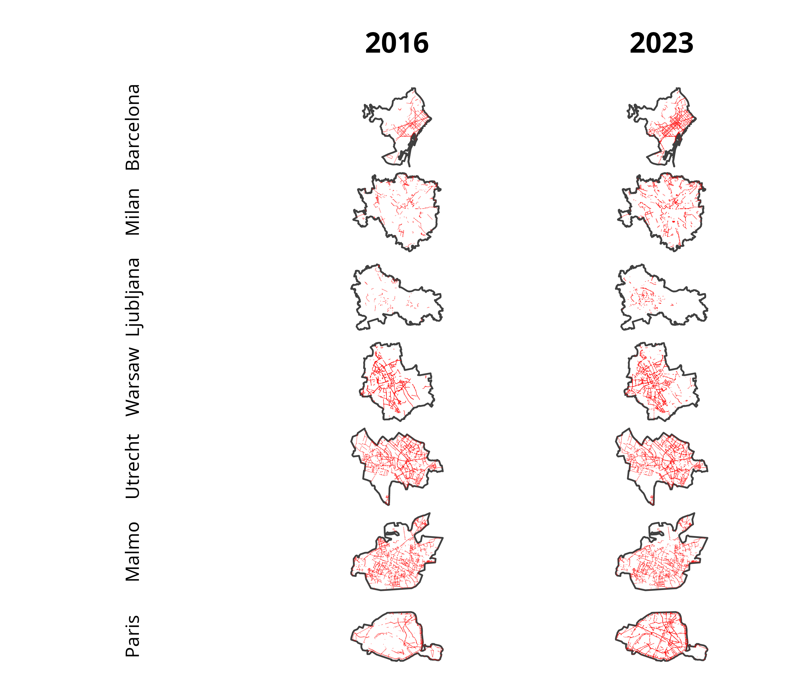
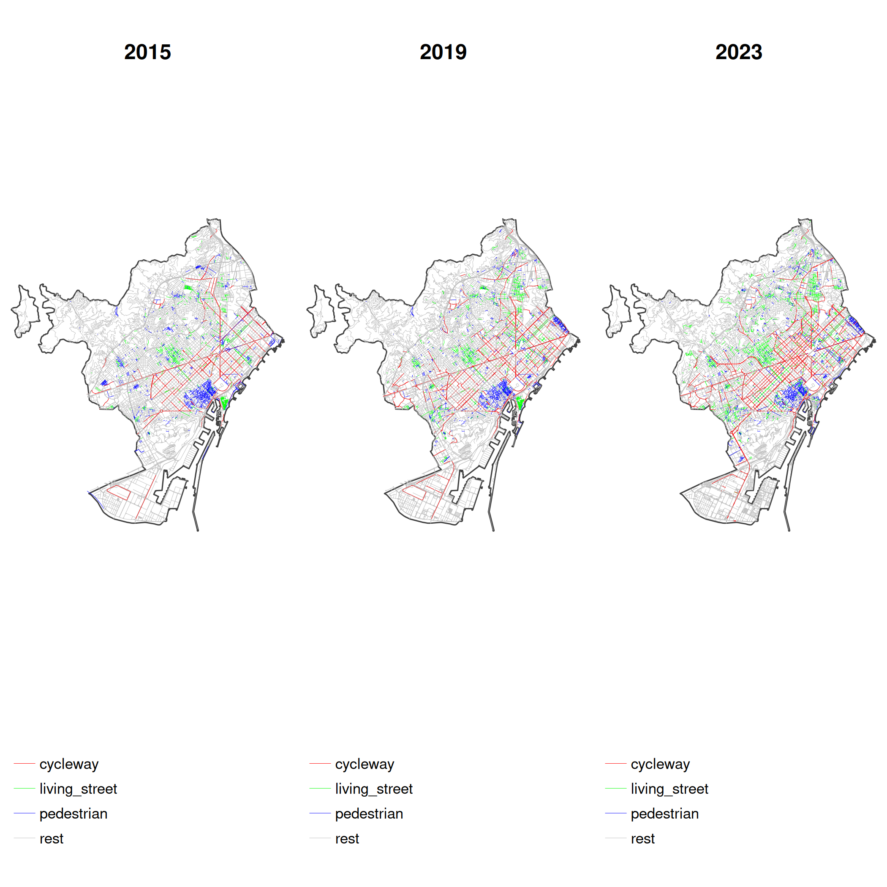
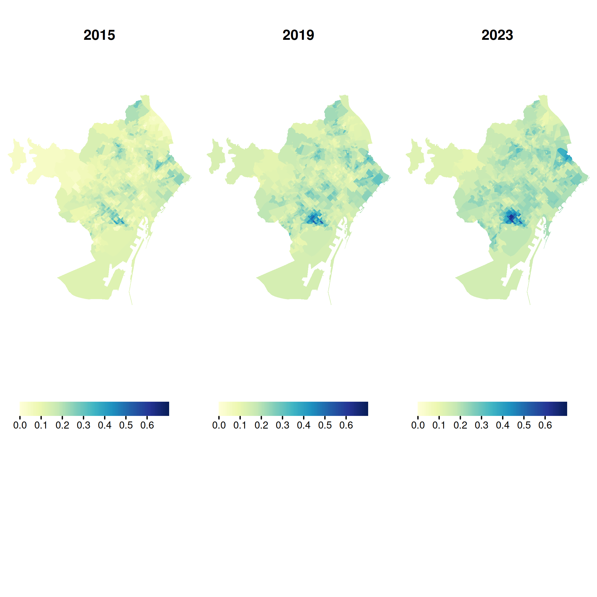
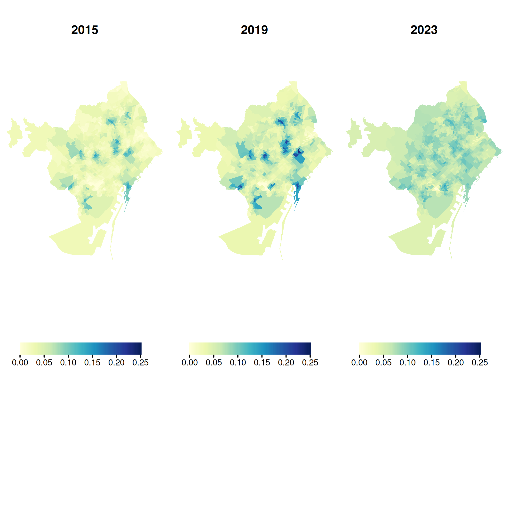
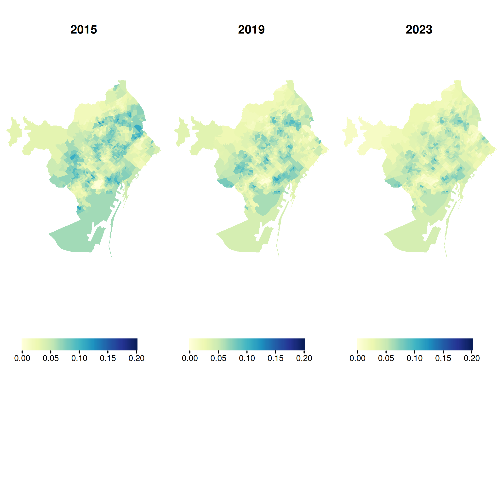

🔗 Part of the [ATRAPA database project](https://github.com/GEMOTT/atrapa_database)\
⬅️ [Back to project overview](https://github.com/GEMOTT/atrapa%20database) ➡️ [Next repo related: Electoral and socioeconomic data](https://github.com/GEMOTT/electoral-socioeconomic-data)

# Can OpenStreetMap Reliably Track Changes in Active Travel Infrastructure? A Multi-City Validation Across Seven European Cities

## Introduction

The relationship between the built environment and travel behaviour has been widely studied, with many studies identifying associations between environmental characteristics and travel patterns [@cerin_neighbourhood_2017; @ding_neighborhood_2011; @zhang_impact_2022]. However, most research relies on cross-sectional data, which cannot establish causality [@mccormack_search_2011; @van_de_coevering_multi-period_2015]. In contrast, studies that track changes in both travel behaviour and the built environment—such as longitudinal studies and natural experiments—offer stronger causal insights but remain relatively scarce [@karmeniemi_built_2018; @smith_systematic_2017; @tcymbal_effects_2020].

One of the main challenges in expanding this area of research is the limited availability of consistent, time-series data on the built environment. While historical data on travel behaviour is often more accessible—through sources like censuses, surveys, and increasingly, crowdsourced platforms like Strava—comparable records of past urban infrastructure are much harder to obtain. Some national road datasets—such as those in Sweden, the Netherlands, Finland, Denmark, and Norway—include long-term records of active travel networks, though consistent and accessible historical data remains limited and varies across countries, which hinders broader or international comparisons. An alternative is to reconstruct historical built environment data manually using maps, satellite imagery, and planning records, but this process is highly resource-intensive and typically limited in scale.

The growing availability of Volunteered Geographic Information (VGI) presents new opportunities to overcome data limitations in built environment research. Among these sources, OpenStreetMap (OSM) stands out for providing open, editable, and historical data on various types of infrastructure, making it a promising tool for analysing urban transformations over time. However, its application in this context requires careful validation due to well-documented limitations in accuracy, completeness, and temporal consistency [@barron_comprehensive_2014; @zielstra_comparative_nodate].

While OSM has been widely used to assess infrastructure coverage and routing potential, its reliability for capturing historical transformations—especially in pedestrian-oriented infrastructure—remains unclear. This study aims to evaluate the extent to which historical OSM data can reliably capture urban transformations in active travel infrastructure—such as bike lanes, pedestrian streets, and living streets—across multiple European cities. We develop and apply a semi-automated validation method that compares reported changes in OSM to external reference sources, including street-level and satellite imagery as well as official records. The analysis focuses on seven cities selected for their relevance to a broader research initiative and uses stratified sampling to reflect socio-demographic and spatial diversity. While the present study is limited to these cases, the framework is designed to be scalable and transferable, offering a practical tool for researchers and planners seeking to monitor infrastructure change over time.

This study builds on recent efforts to assess OSM’s data quality and potential for infrastructure analysis, with particular attention to its capacity to represent change over time.

<!-- ## Literature review -->

<!-- OSM is often used to study transport infrastructure—especially cycling networks—but few studies examine how these networks change over time. A countrywide assessment in Denmark found that neither OSM nor the official GeoDanmark dataset alone provided complete coverage; feature-level conflation was necessary to improve reliability, especially in rural areas [@viero_how_2025]. Viero et al. also introduced BikeDNA, an open-source tool that validates OSM cycling data with attention to network topology, local completeness, and spatial variation [@viero_bikedna_2024]. Similarly, Ferster et al. compared OSM with municipal datasets in six Canadian cities and found high agreement in total network length, though accuracy varied by infrastructure type—especially for newer or inconsistently tagged features [@ferster_developing_2023]. These studies underscore both the promise and the limitations of OSM for cycling infrastructure research. -->

<!-- In contrast, pedestrian networks—especially pedestrianized and living streets—have received significantly less attention in OSM validation studies. While some efforts have focused on sidewalks or routing networks (e.g. @zielstra_using_2012; https://wiki.openstreetmap.org/wiki/OpenSidewalks), few have assessed whether OSM reliably represents pedestrianized streets (e.g., highway=pedestrian) or living streets (highway=living_street), or whether these features accurately reflect real-world transformations over time. These types of infrastructure are increasingly relevant for sustainable mobility but pose unique challenges for mapping and validation due to tagging ambiguity and definitional variation across contexts [@national_technical_university_of_athens_greece_utilizing_2022; @omar_crowdsourcing_2022]. -->

<!-- Taken together, these studies demonstrate that OSM is a promising yet uneven source for analyzing changes in the built environment. However, most existing research focuses on static comparisons, routing applications, or cycling-specific infrastructure—often within single cities or countries. Very few studies assess OSM’s ability to capture infrastructure transformations over time, particularly for underrepresented networks like pedestrian and living streets. Our study addresses this gap by developing a validation framework that compares reported OSM transformations to multiple external sources—Google Street View, and satellite imagery—across seven European cities. In doing so, we assess the temporal completeness, spatial variation, and overall reliability of OSM as a longitudinal dataset for tracking changes in active travel infrastructure. -->

## Data and Method

### Data Sources

-   OpenStreetMap (OSM) snapshots: 2015, 2019, 2023
-   Google Street View (GSV) imagery
-   Satellite imagery

### Sampling Strategy

- Unit: census tracts (~60 per city)
- Sampling: stratified random based on:
  + Urban form: center, middle, periphery
  + Socio-demographics: income level or population density

### Change Detection in OSM

- Extract infrastructure from OSM for 2015, 2019, 2023
  + Focus tags: highway=cycleway, cycleway=*, highway=pedestrian, highway=living_street
- Compare time periods:
  + Period 1: 2015–2019
  + Period 2: 2019–2023
- Identify changes:
  + Additions
  + Removals
  + Reclassifications
  
### Validation Strategy
#### OSM-Reported Changes (False Positives)
- Validate all reported changes using:
  + GSV for visual confirmation
  + Satellite imagery for layout verification
- Label each as:
  + ✅ Confirmed
  + ❌ False Positive
  +❓ Uncertain

#### Missed Changes (False Negatives)
- Sample ~100 street segments per city from within census tract sample
- For each segment, check imagery to see if:
  + Infrastructure exists in reality
  + But is missing from OSM

### Evaluation Metrics

- Accuracy = Confirmed OSM changes / All OSM-reported changes
- Completeness = Confirmed OSM changes / (Confirmed + Missed changes)
- SCI (Spatial Completeness Index) = Variation in completeness across tracts (e.g., standard deviation)

### Inclusion Criteria

- Include city/period/type only if:
  + Completeness ≥ 80%
  + SCI ≤ 15%
- Based on prior studies:
  + Hochmair et al. (2014), Barron et al. (2014), Elwood & Goodchild (2013)

#### Example Evaluation Table by Interval and Infrastructure Type

| City      | Interval  | Type           | Completeness | SCI    | Accuracy | Decision       |
|-----------|-----------|----------------|--------------|--------|----------|----------------|
| Barcelona | 2015–2019 | Bike Lanes     | 88% ✅       | 9% ✅  | 91% ✅   | ✅ Include     |
| Barcelona | 2015–2019 | Pedestrian     | 84% ✅       | 12% ✅ | 87% ✅   | ✅ Include     |
| Barcelona | 2015–2019 | Living Streets | 72% ❌       | 18% ❌ | 78% ❌   | ❌ Exclude     |
| Paris     | 2019–2023 | Bike Lanes     | 78% ❌       | 14% ✅ | 82% ✅   | ⚠️ Conditional |
| Paris     | 2019–2023 | Pedestrian     | 83% ✅       | 17% ❌ | 85% ✅   | ⚠️ Conditional |
| Warsaw    | 2015–2019 | Bike Lanes     | 70% ❌       | 10% ✅ | 75% ❌   | ❌ Exclude     |
| Milan     | 2019–2023 | Bike Lanes     | 90% ✅       | 11% ✅ | 89% ✅   | ✅ Include     |

## Results

<!-- Similar studies: -->

<!-- Using OpenStreetMap Point-of-Interest Data to Model Urban Change—A Feasibility Study: DOI: 10.1371/journal.pone.0212606 -->

<!-- Using OpenStreetMap to Inventory Bicycle Infrastructure: A Comparison with Open Data from Cities: DOI: 10.1080/15568318.2018.1519746 -->

<!-- How Good Is Open Bicycle Infrastructure Data? A Countrywide Case Study of Denmark: DOI: 10.1111/gean.12400 -->

<!-- BikeDNA: A Tool for Bicycle Infrastructure Data & Network Assessment: DOI: 10.1177/23998083231184471 -->

<!-- By addressing these aspects, we aim to help researchers and practitioners effectively use OSM while critically assessing its suitability for tracking infrastructure changes over time [@koukoletsos_assessing_2012]. -->

<!-- -   Aim: Develop a dataset capturing changes in the built environment that support active travel in Barcelona, Milan, Ljubljana, Warsaw, Utrecht, Malmö, and Paris. -->

<!-- -   Key Elements: -->

<!--     -   Cycleways -->

<!--     -   Pedestrian & living streets -->

<!--     -   Pavement widenings/extensions (more challenging to track) -->

<!-- -   Data Sources: Official Open Data and OpenStreetMap (OSM). -->

<!-- | Aspect | Official Open Data | OSM | -->

<!-- |-----------------------|-----------------------|--------------------------| -->

<!-- | **Accessibility** | Harder to obtain (data often not preserved) | Easy access with `osmextract` | -->

<!-- | **Data Completeness** | More complete, validated | Potential gaps | -->

<!-- | **Geographical Consistency** | Consistent within cities | More uniform across countries | -->

<!-- ## Data Collection Process -->

<!-- -   Official Open Data: -->

<!--     -   Limited progress in obtaining historical data so far. -->

<!--     -   Cycle lanes in Barcelona and pedestrian streets in Paris and Milan. -->

<!--     -   Potential access to historical backups in Barcelona. -->

<!-- -   OSM Data Extraction: -->

<!--     -   Collected data on cycleways, pedestrian streets, and living streets from 2015 onwards. -->

<!--     -   We aim to cross-validate the data with official data from Barcelona. -->

<!-- ## Preliminary Visuals -->

<!-- #### OSM Cycling Networks Across 7 ATRAPA Cities (2016–2023) -->

```{r include=FALSE}
#remotes::install_github("ropensci/osmextract")
library(osmdata)
library(osmextract)
library(sf)
library(tidyverse)
library(tmap)
library(grid)
library(gridExtra)
library(spdep)
```

```{r boundaries}
#| eval: false
#| include: false
# Get the boundary data for each city at the city, neighbourhood and census section levels  

# Define the cities with their English names
cities <- list(
  "Barcelona" = "Barcelona, Spain",
  "Milan" = "Milano, Italy",
  "Ljubljana" = "Ljubljana, Slovenia",
  "Warsaw" = "Warszawa, Poland",
  "Utrecht" = "Utrecht, Netherlands",
  "Malmo" = "Malmö, Sweden",
  "Paris" = "Paris, France"
)

# Create the data directory if it doesn't exist
if (!dir.exists("data/street-level")) {
  dir.create("data/street-level")
}

for (english_name in names(cities)) {
  city <- cities[[english_name]]
  try({
    # Get the bounding box
    bbox <- getbb(city, format_out = "polygon")
    if (is.null(bbox)) {
      warning(paste("Bounding box for", city, "not found"))
      next
    }
    
    # Query for the city's boundary with admin_level 8
    city_boundary <- opq(bbox = bbox) |>
      add_osm_feature(key = "boundary", value = "administrative") |>
      add_osm_feature(key = "name", value = gsub(",.*", "", city), value_exact = FALSE) |>
      add_osm_feature(key = "admin_level", value = "8") |>
      osmdata_sf()
    
    if (is.null(city_boundary$osm_multipolygons)) {
      warning(paste("Boundary for", city, "not found. Query returned no results."))
      next
    }
    
    city_perimeter <- city_boundary$osm_multipolygons
    
    # Ensure only one observation
    city_perimeter <- city_perimeter[1, ]
    
    # Convert to MULTIPOLYGON if necessary
    city_perimeter <- st_cast(city_perimeter, "MULTIPOLYGON")
    
    # Check and fix invalid geometries
    if (!all(st_is_valid(city_perimeter))) {
      city_perimeter <- st_make_valid(city_perimeter)
    }
    
    # Create city-specific directory if it doesn't exist
    city_dir <- paste0("data/street-level/", tolower(english_name))
    if (!dir.exists(city_dir)) {
      dir.create(city_dir)
    }
    
    # Write to GeoPackage (overwrite if exists) using the English name
    st_write(city_perimeter, paste0(city_dir, "/", tolower(english_name), "_perimeter.gpkg"), layer = english_name, driver = "GPKG", append = FALSE)
    
    message(paste("Successfully wrote perimeter for", english_name))
  }, silent = FALSE)
}

# Test boundaries
# # Function to read and plot a city's boundary using tmap
# plot_city_boundary_tmap <- function(city_name) {
#   file_path <- paste0("data/", tolower(city_name), "/", tolower(city_name), "_perimeter.gpkg")
#   
#   if (!file.exists(file_path)) {
#     warning(paste("File not found for", city_name))
#     return(NULL)
#   }
#   
#   city_boundary <- st_read(file_path)
#   
#   # Plot with tmap
#   tm_shape(city_boundary) +
#     tm_borders(col = "blue") +
#     tm_fill(col = "lightblue", alpha = 0.5) +
#     tm_layout(main.title = paste("Boundary of", city_name))
# }
# 
# # Test with a single city (replace "Barcelona" with any other city)
# plot_city_boundary_tmap("Barcelona")
```

```{r infras}
#| eval: false
#| include: false
# Get the OSM infrastructture data
# Define vectortranslate options
my_vectortranslate <- c(
  "-select", "osm_id,highway", 
  "-where", "highway IN ('living_street', 'pedestrian', 'cycleway', 'motorway', 'trunk', 'primary', 'secondary', 'tertiary', 'unclassified', 'residential', 'motorway_link', 'trunk_link', 'primary_link', 'secondary_link', 'tertiary_link', 'service', 'track', 'bus_guideway', 'escape', 'raceway', 'busway')")

# Define a list of cities with their corresponding region and subregion
cities <- list(
  "Barcelona" = c("Barcelona", "Cataluña", "Spain"),
  "Milan" = c("Milan", "Nord-Ovest", "Milan"),
  "Ljubljana" = c("Ljubljana", "Central Slovenia", "Ljubljana"),
  "Warsaw" = c("Warsaw", "Masovian", "Warsaw"),
  "Utrecht" = c("Utrecht", "Utrecht", "Netherlands"),
  "Malmo" = c("Malmo", "Skane", "Malmö"),
  "Paris" = c("Paris", "Ile-de-France", "Paris")
)

for (english_name in names(cities)) {
  city_info <- cities[[english_name]]
  city <- city_info[1]
  region <- city_info[2]
  subregion <- city_info[3]
  
  try({
    # Define file path for the perimeter
    perimeter_path <- paste0("data/street-level/", tolower(english_name), "/", tolower(english_name), "_perimeter.gpkg")
    
    # Read the perimeter from GeoPackage
    if (file.exists(perimeter_path)) {
      city_perimeter <- st_read(perimeter_path, layer = tolower(english_name))
      
      # Ensure CRS is WGS 84 (EPSG:4326)
      if (st_crs(city_perimeter) != 4326) {
        message(paste("Transforming CRS for", english_name, "to WGS 84"))
        city_perimeter <- st_transform(city_perimeter, 4326)
      }
      
    } else {
      warning(paste("Perimeter file for", english_name, "not found"))
      next
    }
    
    # Create city-specific directory if it doesn't exist
    city_dir <- paste0("data/street-level/", tolower(english_name))
    if (!dir.exists(city_dir)) {
      dir.create(city_dir, recursive = TRUE)
    }

    # Function to fetch and crop data
    fetch_and_crop_data <- function(area, version, perimeter, output_file) {
      lines_data <- tryCatch({
        oe_get(area, version = version, vectortranslate_options = my_vectortranslate, quiet = FALSE)
      }, error = function(e) {
        message(paste("Error fetching", version, "lines for", english_name, ":", e$message))
        return(NULL)
      })
      
      if (!is.null(lines_data) && nrow(lines_data) > 0) {
        # Crop lines that are strictly within the perimeter
        lines_data <- st_intersection(lines_data, perimeter)
        
        if (nrow(lines_data) > 0) {
          st_write(lines_data, output_file, layer = gsub(".gpkg", "", basename(output_file)), driver = "GPKG", append = FALSE)
        } else {
          message(paste("No lines remaining after cropping for", english_name, "(", version, ")"))
        }
      } else {
        message(paste("No data found for", english_name, "(", version, ")"))
      }
    }

    # Fetch and crop 170101 data
    fetch_and_crop_data(region, "170101", city_perimeter, paste0(city_dir, "/", tolower(english_name), "_170101_lines.gpkg"))

    # Fetch and crop 240101 data
    fetch_and_crop_data(subregion, "240101", city_perimeter, paste0(city_dir, "/", tolower(english_name), "_240101_lines.gpkg"))

    message(paste("Successfully processed and cropped data for", english_name))
  }, silent = FALSE)
}
```

```{r mapcycall}
#| eval: false
#| include: false

# Plot a figure with infras for all cities

# Define the list of cities
cities <- list(
  "Barcelona" = "Barcelona, Spain",
  "Milan" = "Milan, Italy",
  "Ljubljana" = "Ljubljana, Slovenia",
  "Warsaw" = "Warszawa, Poland",
  "Utrecht" = "Utrecht, Netherlands",
  "Malmo" = "Malmo, Sweden",
  "Paris" = "Paris, France"
)

# Initialize lists to store tmap objects
map_objects_2016 <- list()
map_objects_2023 <- list()

# Loop through each city and create maps
for (city in names(cities)) {

  # Define file paths
  perimeter_path <- paste0("data/street-level/", tolower(city), "/", tolower(city), "_perimeter.gpkg")
  lines_170101_path <- paste0("data/street-level/", tolower(city), "/", tolower(city), "_170101_lines.gpkg")
  lines_240101_path <- paste0("data/street-level/", tolower(city), "/", tolower(city), "_240101_lines.gpkg")

  # Read the perimeter
  perimeter <- st_read(perimeter_path, layer = tolower(city), quiet = TRUE)

  # Read and filter cycleway lines
  lines_170101 <- st_read(lines_170101_path, quiet = TRUE) |> filter(highway == "cycleway")
  lines_240101 <- st_read(lines_240101_path, quiet = TRUE) |> filter(highway == "cycleway")

  # Create tmap objects
  map_objects_2016[[city]] <- tm_shape(perimeter) +
    tm_borders() +
    tm_shape(lines_170101) +
    tm_lines(col = "red", col_alpha = 0.5, lwd = 0.3) +
    tm_layout(frame = FALSE)

  map_objects_2023[[city]] <- tm_shape(perimeter) +
    tm_borders() +
    tm_shape(lines_240101) +
    tm_lines(col = "red", col_alpha = 0.5, lwd = 0.3) +
    tm_layout(frame = FALSE)
}

# Convert tmap objects to grobs
grob_maps_2016 <- lapply(map_objects_2016, tmap_grob)
grob_maps_2023 <- lapply(map_objects_2023, tmap_grob)

# Create column titles
title_blank <- textGrob("")  # Empty space for alignment
title_2016 <- textGrob("2016", gp = gpar(fontsize = 12, fontface = "bold"))
title_2023 <- textGrob("2023", gp = gpar(fontsize = 12, fontface = "bold"))

# Create row titles (city names)
row_labels <- lapply(names(cities), function(city) textGrob(city, rot = 90, gp = gpar(fontsize = 8)))

# Open a new plotting page to avoid clipping
grid.newpage()

# Arrange maps with column and row titles
cyc_all <- grid.arrange(
  title_blank, title_2016, title_2023,
  row_labels[[1]], grob_maps_2016[[1]], grob_maps_2023[[1]],
  row_labels[[2]], grob_maps_2016[[2]], grob_maps_2023[[2]],
  row_labels[[3]], grob_maps_2016[[3]], grob_maps_2023[[3]],
  row_labels[[4]], grob_maps_2016[[4]], grob_maps_2023[[4]],
  row_labels[[5]], grob_maps_2016[[5]], grob_maps_2023[[5]],
  row_labels[[6]], grob_maps_2016[[6]], grob_maps_2023[[6]],
  row_labels[[7]], grob_maps_2016[[7]], grob_maps_2023[[7]],
  nrow = 8, ncol = 3
)

# Save the layout as a PNG file
ggsave("figs/cyc_all.png", plot = cyc_all, dpi = 600)
```

```{r}
#| eval: false
#| include: false
#| out-width: 100%
# plot the image

```

\newpage

### OSM data Barcelona

```{r include=FALSE}
#| eval: false
#| include: false


# Get the infras data 
## Define vectortranslate options
my_vectortranslate <- c(
  "-select", "osm_id, highway", 
  "-where", "highway IN ('living_street', 'pedestrian', 'cycleway', 'motorway', 'trunk', 'primary', 'secondary', 'tertiary', 'unclassified', 'residential', 'motorway_link', 'trunk_link', 'primary_link', 'secondary_link', 'tertiary_link', 'service', 'track', 'bus_guideway', 'escape', 'raceway', 'busway')")

## Load perimeter and get both years infras using osmextract
barcelona_perimeter <- st_read("data/street-level/barcelona/raw/0301040100_TermeMunicipal_UNITATS_ADM.shp")

# Define the file path to the downloaded .osm.pbf file
# local_osm_file <- "data/street-level/milan/nord-ovest-170101.osm.pbf"  # Replace with actual path

# Load the file into R
# Load the file into R
# milan_lines_170101 <- oe_read(
#   file_path = local_osm_file,
#   vectortranslate_options = my_vectortranslate,
#   quiet = FALSE,
#   boundary = milan_perimeter,
#   boundary_type = "clipsrc"
# )
# 
# st_write(milan_lines_170101, "data/milan/milan_lines_170101_2.gpkg", append=FALSE)

barcelona_160101_lines = oe_get("Spain", version = "160101", vectortranslate_options = my_vectortranslate, quiet = FALSE, boundary = barcelona_perimeter, boundary_type = "clipsrc") 

barcelona_200101_lines = oe_get("Spain", version = "200101", vectortranslate_options = my_vectortranslate, quiet = FALSE, boundary = barcelona_perimeter, boundary_type = "clipsrc")  
  
barcelona_240101lines = oe_get("Cataluña", version = "230101", vectortranslate_options = my_vectortranslate, quiet = FALSE, boundary = barcelona_perimeter, boundary_type = "clipsrc")

barcelona_240101lines$geometry

# Save data
st_write(barcelona_160101_lines, "data/street-level/barcelona/barcelona_160101_lines.gpkg", append=TRUE)
st_write(barcelona_200101_lines, "data/street-level/barcelona/barcelona_200101_lines.gpkg", append=TRUE)
st_write(barcelona_lines_240101, "data/street-level/barcelona/barcelona_240101_lines.gpkg", append=TRUE)
```

#### Road network by type

```{r}
#| echo: false
#| message: false
#| warning: false

# Plot the OSM networks


# Define file paths for Barcelona
city <- "barcelona"
perimeter_path <- paste0("data/street-level/", city, "/", city, "_perimeter.gpkg")
lines_160101_path <- paste0("data/street-level/", city, "/", city, "_160101_lines.gpkg")
lines_200101_path <- paste0("data/street-level/", city, "/", city, "_200101_lines.gpkg")
lines_240101_path <- paste0("data/street-level/", city, "/", city, "_240101_lines.gpkg")

# Read the perimeter
perimeter <- st_read(perimeter_path, layer = city, quiet = TRUE)

# Read and filter networks for 2016
lines_160101 <- st_read(lines_160101_path, quiet = TRUE)
lines_160101 <- lines_160101 |>
  mutate(highway_type = case_when(
    highway == "cycleway" ~ "cycleway",
    highway == "pedestrian" ~ "pedestrian",
    highway == "living_street" ~ "living_street",
    TRUE ~ "rest"
  ))

# Read and filter networks for 2016
lines_200101 <- st_read(lines_200101_path, quiet = TRUE)
lines_200101 <- lines_200101 |>
  mutate(highway_type = case_when(
    highway == "cycleway" ~ "cycleway",
    highway == "pedestrian" ~ "pedestrian",
    highway == "living_street" ~ "living_street",
    TRUE ~ "rest"
  ))

# Read and filter networks for 2023
lines_240101 <- st_read(lines_240101_path, quiet = TRUE)
lines_240101 <- lines_240101 |>
  mutate(highway_type = case_when(
    highway == "cycleway" ~ "cycleway",
    highway == "pedestrian" ~ "pedestrian",
    highway == "living_street" ~ "living_street",
    TRUE ~ "rest"
  ))

# Define a color palette
highway_colors <- c("cycleway" = "red", 
                    "pedestrian" = "blue", 
                    "living_street" = "green", 
                    "rest" = "gray")

# Plot for 2015
map_2015 <- tm_shape(perimeter) +
            tm_borders() +
            tm_shape(lines_160101) +
            tm_lines(col = "highway_type",
                     col.scale = tm_scale(values = highway_colors), 
                     lwd = 0.3,
                     col.legend = tm_legend(title = "",
                                            frame = FALSE)) +
            tm_layout(frame = FALSE) +
            tm_title("2015", 
                     fontface = "bold",
                     size = 1,
                     position = tm_pos_in("center", "top"))


# Plot for 2019
map_2019 <- tm_shape(perimeter) +
            tm_borders() +
            tm_shape(lines_200101) +
            tm_lines(col = "highway_type",
                     col.scale = tm_scale(values = highway_colors), 
                     lwd = 0.3,
                     col.legend = tm_legend(
                                            title = "",
                                            frame = FALSE)) +
            tm_layout(frame = FALSE) +
            tm_title("2019",  
                     fontface = "bold",
                     size = 1,
                     position = tm_pos_in("center", "top"))

# Plot for 2023
map_2023 <- tm_shape(perimeter) +
            tm_borders() +
            tm_shape(lines_240101) +
            tm_lines(col = "highway_type",
                     col.scale = tm_scale(values = highway_colors), 
                     lwd = 0.3,
                     col.legend = tm_legend(title = "",
                                            frame = FALSE)) +
            tm_layout(frame = FALSE) +
            tm_title("2023", 
                     fontface = "bold",
                     size = 1,
                     position = tm_pos_in("center", "top"))

# Display the maps side by side
barcelona_network_all <- tmap_arrange(map_2015, map_2019, map_2023, ncol = 3)

tmap_save(barcelona_network_all, filename = "figs/barcelona_network_all.png", dpi = 300)
```

```{r}
#| echo: false
#| out-width: 100%
# plot the image

```

<!-- #### Indicators at the census tract level -->

<!-- To assess the impact of sustainable travel interventions, we will calculate the following indicators: -->

<!-- -   Length of cycleways / Total Road Network Length -->

<!-- -   Length of pedestrian and living streets / Total Road Network Length -->

<!-- -   Length of pavement extensions / Total Road Network Length -->

<!-- These indicators will provide valuable insights into the distribution and availability of infrastructure designed to promote sustainable travel within urban areas. -->

<!-- -   Cycleway Proportion of Total Network -->

```{r}
#| eval: false
#| message: false
#| warning: false
#| include: false
#| paged-print: false

# Get the indicators

# Read in the census tracts (polygon data) and line network for both years
barcelona_tracts <- st_read("data/street-level/barcelona/barcelona_census_tracts.gpkg", quiet = TRUE)

barcelona_network_2015 <- st_read("data/street-level/barcelona/barcelona_160101_lines.gpkg", quiet = TRUE)
barcelona_network_2019 <- st_read("data/street-level/barcelona/barcelona_200101_lines.gpkg", quiet = TRUE)
barcelona_network_2023 <- st_read("data/street-level/barcelona/barcelona_240101_lines.gpkg", quiet = TRUE)

# Ensure both datasets are in the same coordinate reference system (CRS)
barcelona_network_2015 <- st_transform(barcelona_network_2015, st_crs(barcelona_tracts))
barcelona_network_2019 <- st_transform(barcelona_network_2019, st_crs(barcelona_tracts))
barcelona_network_2023 <- st_transform(barcelona_network_2023, st_crs(barcelona_tracts))

calculate_cycleway_ratios <- function(barcelona_tracts, barcelona_network) {
  # Filter the network to select only cycle lanes
  cycleway_network <- barcelona_network |>
    filter(highway == "cycleway")

  # Aggregate cycle lanes length per census tract
  cycleway_aggregated <- cycleway_network |>
    st_join(barcelona_tracts, join = st_intersects) |>
    group_by(SEC_CENS) |>
    summarise(cycleway_length = sum(as.numeric(st_length(geom))), .groups = "drop") |>  # Convert to numeric
    st_drop_geometry()

  # Aggregate total network length per census tract
  network_aggregated <- barcelona_network |>
    st_join(barcelona_tracts, join = st_intersects) |>
    group_by(SEC_CENS) |>
    summarise(total_length = sum(as.numeric(st_length(geom))), .groups = "drop") |>  # Convert to numeric
    st_drop_geometry()

  # Compute cycleway ratio
  indicator_data <- left_join(cycleway_aggregated, network_aggregated, by = "SEC_CENS") |>
    mutate(cycleway_ratio = cycleway_length / total_length)

  # Join the data back to the original census tracts
  tracts_with_indicator <- left_join(barcelona_tracts, indicator_data, by = "SEC_CENS") |>
    mutate(cycleway_ratio = replace_na(cycleway_ratio, 0))  # Replace NA with 0 safely

  # Compute spatial neighbors (Queen contiguity)
  nb <- poly2nb(tracts_with_indicator, queen = TRUE)
  listw <- nb2listw(nb, style = "W")  # Row-standardized weights

  # Compute spatially lagged cycle lanes ratio
  tracts_with_indicator <- tracts_with_indicator |>
    mutate(cycleway_ratio_smooth = lag.listw(listw, cycleway_ratio, NAOK = TRUE))

  return(tracts_with_indicator)
}

# Compute the cycle lanes ratio for each year and rename columns
barcelona_tracts_with_ratios_2015_sf <- calculate_cycleway_ratios(barcelona_tracts, barcelona_network_2015) 

barcelona_tracts_with_ratios_2019_sf <- calculate_cycleway_ratios(barcelona_tracts, barcelona_network_2019) 

barcelona_tracts_with_ratios_2023_sf <- calculate_cycleway_ratios(barcelona_tracts, barcelona_network_2023) 

# Drop the geometry column
barcelona_tracts_with_ratios_2015 <- barcelona_tracts_with_ratios_2015_sf |> 
  st_drop_geometry() |> 
  mutate(census_tract_id = paste(DISTRICTE, SEC_CENS, sep = "_")) |> 
  select(census_tract_id, cycleway_length, total_length, cycleway_ratio, cycleway_ratio_smooth) |> 
  rename(cycleway_length_2015 = cycleway_length, total_length_2015 = total_length, cycleway_ratio_2015 = cycleway_ratio, cycleway_ratio_smooth_2015 = cycleway_ratio_smooth)

barcelona_tracts_with_ratios_2019 <- barcelona_tracts_with_ratios_2019_sf |> 
  st_drop_geometry() |> 
  mutate(census_tract_id = paste(DISTRICTE, SEC_CENS, sep = "_")) |> 
  select(census_tract_id, cycleway_length, total_length, cycleway_ratio, cycleway_ratio_smooth) |> 
  rename(cycleway_length_2019 = cycleway_length, total_length_2019 = total_length, cycleway_ratio_2019 = cycleway_ratio, cycleway_ratio_smooth_2019 = cycleway_ratio_smooth)

barcelona_tracts_with_ratios_2023 <- barcelona_tracts_with_ratios_2023_sf |> 
  st_drop_geometry() |> 
  mutate(census_tract_id = paste(DISTRICTE, SEC_CENS, sep = "_")) |> 
  select(census_tract_id, cycleway_length, total_length, cycleway_ratio, cycleway_ratio_smooth) |> 
  rename(cycleway_length_2023 = cycleway_length, total_length_2023 = total_length, cycleway_ratio_2023 = cycleway_ratio, cycleway_ratio_smooth_2023 = cycleway_ratio_smooth)

barcelona_tracts_with_cycleway_ratios <- barcelona_tracts_with_ratios_2015 |>  # Start with 2015 data
  left_join(barcelona_tracts_with_ratios_2019, by = "census_tract_id") |>  # Join 2019 data by SEC_CENS
  left_join(barcelona_tracts_with_ratios_2023, by = "census_tract_id")  # Join 2023 data by SEC_CENS

# Function to create a map
create_map <- function(data, year) {
  tm_shape(data) +
     tm_polygons(
    lwd = 0.01,
    col = "white",
    fill = "cycleway_ratio_smooth",
    fill.scale = tm_scale_continuous(
      values = "brewer.yl_gn_bu", 
      limits = c(0, 0.7)
    ),
    fill.legend = tm_legend(
      title = "",
      orientation = "landscape",
      frame = FALSE,
      width = 15,
      height = 15,
      position = tm_pos_out("center", "bottom")
    )
  ) +  
  tm_layout(
    frame = FALSE, 
    component.autoscale = FALSE
  ) + 
  tm_title(
    year, 
    fontface = "bold",
    size = 1,
    position = tm_pos_in("center", "top"))
}

# Create maps for 2019 and 2023
map_2015 <- create_map(barcelona_tracts_with_ratios_2015_sf, "2015")
map_2019 <- create_map(barcelona_tracts_with_ratios_2019_sf, "2019")
map_2023 <- create_map(barcelona_tracts_with_ratios_2023_sf, "2023")
# 
# map_diff <- tm_shape(barcelona_tracts_smoothed_diff) +
#   tm_polygons(
#     lwd = 0.01,
#     col = "white",
#     fill = "diff_cycleway_ratio",
#     fill.scale = tm_scale_continuous(
#       values = "brewer.rd_bu", 
#       limits = c(-0.45,0.45),
#       midpoint = NA),
#       fill.legend = tm_legend(title = "",
#         orientation = "landscape",
#         frame = FALSE,
#         width = 15,
#         height = 15,
#         position = tm_pos_in("center")
#     )
#   ) +   
#   tm_layout(
#     frame = FALSE, 
#     component.autoscale = FALSE
#   ) + 
#   tm_title(
#     "Difference", 
#     fontface = "bold"
#   )

# Arrange all three maps side by side
barcelona_cycleway_ratios_15_19_23 = tmap_arrange(map_2015, map_2019, map_2023, ncol = 3)

# Save the layout as a PNG file
tmap_save(barcelona_cycleway_ratios_15_19_23, "figs/barcelona_cycleway_ratios_15_19_23.png", dpi = 300)
```

```{r}
#| eval: false
#| include: false
#| out-width: 100%
# plot the image

```

\newpage

<!-- -   Living Street Proportion of Total Network -->

```{r}
#| eval: false
#| message: false
#| warning: false
#| include: false
#| paged-print: false

# Get the indicators
calculate_livingstreet_ratios <- function(barcelona_tracts, barcelona_network) {
  # Filter the network to select only cycle lanes
  livingstreet_network <- barcelona_network |>
    filter(highway == "living_street")

  # Aggregate cycle lanes length per census tract
  livingstreet_aggregated <- livingstreet_network |>
    st_join(barcelona_tracts, join = st_intersects) |>
    group_by(SEC_CENS) |>
    summarise(livingstreet_length = sum(as.numeric(st_length(geom))), .groups = "drop") |>  # Convert to numeric
    st_drop_geometry()

  # Aggregate total network length per census tract
  network_aggregated <- barcelona_network |>
    st_join(barcelona_tracts, join = st_intersects) |>
    group_by(SEC_CENS) |>
    summarise(total_length = sum(as.numeric(st_length(geom))), .groups = "drop") |>  # Convert to numeric
    st_drop_geometry()

  # Compute livingstreet ratio
  indicator_data <- left_join(livingstreet_aggregated, network_aggregated, by = "SEC_CENS") |>
    mutate(livingstreet_ratio = livingstreet_length / total_length)

  # Join the data back to the original census tracts
  tracts_with_indicator <- left_join(barcelona_tracts, indicator_data, by = "SEC_CENS") |>
    mutate(livingstreet_ratio = replace_na(livingstreet_ratio, 0))  # Replace NA with 0 safely

  # Compute spatial neighbors (Queen contiguity)
  nb <- poly2nb(tracts_with_indicator, queen = TRUE)
  listw <- nb2listw(nb, style = "W")  # Row-standardized weights

  # Compute spatially lagged cycle lanes ratio
  tracts_with_indicator <- tracts_with_indicator |>
    mutate(livingstreet_ratio_smooth = lag.listw(listw, livingstreet_ratio, NAOK = TRUE))

  return(tracts_with_indicator)
}

# Compute the cycle lanes ratio for each year and rename columns
barcelona_tracts_with_ratios_2015_sf <- calculate_livingstreet_ratios(barcelona_tracts, barcelona_network_2015) 

barcelona_tracts_with_ratios_2019_sf <- calculate_livingstreet_ratios(barcelona_tracts, barcelona_network_2019) 

barcelona_tracts_with_ratios_2023_sf <- calculate_livingstreet_ratios(barcelona_tracts, barcelona_network_2023) 

# Drop the geometry column
barcelona_tracts_with_ratios_2015 <- barcelona_tracts_with_ratios_2015_sf |> 
  st_drop_geometry() |> 
  mutate(census_tract_id = paste(DISTRICTE, SEC_CENS, sep = "_")) |> 
  select(census_tract_id, livingstreet_length, livingstreet_ratio, livingstreet_ratio_smooth) |> 
  rename(livingstreet_length_2015 = livingstreet_length, livingstreet_ratio_2015 = livingstreet_ratio, livingstreet_ratio_smooth_2015 = livingstreet_ratio_smooth)

barcelona_tracts_with_ratios_2019 <- barcelona_tracts_with_ratios_2019_sf |> 
  st_drop_geometry() |> 
  mutate(census_tract_id = paste(DISTRICTE, SEC_CENS, sep = "_")) |> 
  select(census_tract_id, livingstreet_length, livingstreet_ratio, livingstreet_ratio_smooth) |> 
  rename(livingstreet_length_2019 = livingstreet_length, livingstreet_ratio_2019 = livingstreet_ratio, livingstreet_ratio_smooth_2019 = livingstreet_ratio_smooth)

barcelona_tracts_with_ratios_2023 <- barcelona_tracts_with_ratios_2023_sf |> 
  st_drop_geometry() |> 
  mutate(census_tract_id = paste(DISTRICTE, SEC_CENS, sep = "_")) |> 
  select(census_tract_id, livingstreet_length, livingstreet_ratio, livingstreet_ratio_smooth) |> 
  rename(livingstreet_length_2023 = livingstreet_length, livingstreet_ratio_2023 = livingstreet_ratio, livingstreet_ratio_smooth_2023 = livingstreet_ratio_smooth)

barcelona_tracts_with_livingstreet_ratios <- barcelona_tracts_with_ratios_2015 |>  # Start with 2015 data
  left_join(barcelona_tracts_with_ratios_2019, by = "census_tract_id") |>  # Join 2019 data by SEC_CENS
  left_join(barcelona_tracts_with_ratios_2023, by = "census_tract_id")  # Join 2023 data by SEC_CENS

# Function to create a map
create_map <- function(data, year) {
  tm_shape(data) +
     tm_polygons(
    lwd = 0.01,
    col = "white",
    fill = "livingstreet_ratio_smooth",
    fill.scale = tm_scale_continuous(
      values = "brewer.yl_gn_bu", 
      limits = c(0, 0.25)
    ),
    fill.legend = tm_legend(
      title = "",
      orientation = "landscape",
      frame = FALSE,
      width = 15,
      height = 15,
      position = tm_pos_out("center", "bottom")
    )
  ) +  
  tm_layout(
    frame = FALSE, 
    component.autoscale = FALSE
  ) + 
  tm_title(
    year, 
    fontface = "bold",
    size = 1,
    position = tm_pos_in("center", "top"))
}

# Create maps for 2019 and 2023
map_2015 <- create_map(barcelona_tracts_with_ratios_2015_sf, "2015")
map_2019 <- create_map(barcelona_tracts_with_ratios_2019_sf, "2019")
map_2023 <- create_map(barcelona_tracts_with_ratios_2023_sf, "2023")

# Arrange all three maps side by side
barcelona_livingstreet_ratios_15_19_23 <- tmap_arrange(map_2015, map_2019, map_2023, ncol = 3)

# Save the layout as a PNG file
tmap_save(barcelona_livingstreet_ratios_15_19_23, "figs/barcelona_livingstreet_ratios_15_19_23.png", dpi = 300)
```

```{r}
#| eval: false
#| include: false
#| out-width: 100%
# plot the image

```

\newpage

<!-- -   Pedestrian Street Proportion of Total Network -->

```{r}
#| eval: false
#| message: false
#| warning: false
#| include: false
#| paged-print: false

# Get the indicators
calculate_pedestrian_ratios <- function(barcelona_tracts, barcelona_network) {
  # Filter the network to select only cycle lanes
  pedestrian_network <- barcelona_network |>
    filter(highway == "pedestrian")

  # Aggregate cycle lanes length per census tract
  pedestrian_aggregated <- pedestrian_network |>
    st_join(barcelona_tracts, join = st_intersects) |>
    group_by(SEC_CENS) |>
    summarise(pedestrian_length = sum(as.numeric(st_length(geom))), .groups = "drop") |>  # Convert to numeric
    st_drop_geometry()

  # Aggregate total network length per census tract
  network_aggregated <- barcelona_network |>
    st_join(barcelona_tracts, join = st_intersects) |>
    group_by(SEC_CENS) |>
    summarise(total_length = sum(as.numeric(st_length(geom))), .groups = "drop") |>  # Convert to numeric
    st_drop_geometry()

  # Compute pedestrian ratio
  indicator_data <- left_join(pedestrian_aggregated, network_aggregated, by = "SEC_CENS") |>
    mutate(pedestrian_ratio = pedestrian_length / total_length)

  # Join the data back to the original census tracts
  tracts_with_indicator <- left_join(barcelona_tracts, indicator_data, by = "SEC_CENS") |>
    mutate(pedestrian_ratio = replace_na(pedestrian_ratio, 0))  # Replace NA with 0 safely

  # Compute spatial neighbors (Queen contiguity)
  nb <- poly2nb(tracts_with_indicator, queen = TRUE)
  listw <- nb2listw(nb, style = "W")  # Row-standardized weights

  # Compute spatially lagged cycle lanes ratio
  tracts_with_indicator <- tracts_with_indicator |>
    mutate(pedestrian_ratio_smooth = lag.listw(listw, pedestrian_ratio, NAOK = TRUE))

  return(tracts_with_indicator)
}

# Compute the cycle lanes ratio for each year and rename columns
barcelona_tracts_with_ratios_2015_sf <- calculate_pedestrian_ratios(barcelona_tracts, barcelona_network_2015) 

barcelona_tracts_with_ratios_2019_sf <- calculate_pedestrian_ratios(barcelona_tracts, barcelona_network_2019) 

barcelona_tracts_with_ratios_2023_sf <- calculate_pedestrian_ratios(barcelona_tracts, barcelona_network_2023) 

# Drop the geometry column
barcelona_tracts_with_ratios_2015 <- barcelona_tracts_with_ratios_2015_sf |> 
  st_drop_geometry() |> 
  mutate(census_tract_id = paste(DISTRICTE, SEC_CENS, sep = "_")) |> 
  select(census_tract_id, pedestrian_length, pedestrian_ratio, pedestrian_ratio_smooth) |> 
  rename(pedestrian_length_2015 = pedestrian_length, pedestrian_ratio_2015 = pedestrian_ratio, pedestrian_ratio_smooth_2015 = pedestrian_ratio_smooth)

barcelona_tracts_with_ratios_2019 <- barcelona_tracts_with_ratios_2019_sf |> 
  st_drop_geometry() |> 
  mutate(census_tract_id = paste(DISTRICTE, SEC_CENS, sep = "_")) |> 
  select(census_tract_id, pedestrian_length, pedestrian_ratio, pedestrian_ratio_smooth) |> 
  rename(pedestrian_length_2019 = pedestrian_length, pedestrian_ratio_2019 = pedestrian_ratio, pedestrian_ratio_smooth_2019 = pedestrian_ratio_smooth)

barcelona_tracts_with_ratios_2023 <- barcelona_tracts_with_ratios_2023_sf |> 
  st_drop_geometry() |> 
  mutate(census_tract_id = paste(DISTRICTE, SEC_CENS, sep = "_")) |> 
  select(census_tract_id, pedestrian_length, pedestrian_ratio, pedestrian_ratio_smooth) |> 
  rename(pedestrian_length_2023 = pedestrian_length, pedestrian_ratio_2023 = pedestrian_ratio, pedestrian_ratio_smooth_2023 = pedestrian_ratio_smooth)

barcelona_tracts_with_pedestrian_ratios <- barcelona_tracts_with_ratios_2015 |>  # Start with 2015 data
  left_join(barcelona_tracts_with_ratios_2019, by = "census_tract_id") |>  # Join 2019 data by SEC_CENS
  left_join(barcelona_tracts_with_ratios_2023, by = "census_tract_id")  # Join 2023 data by SEC_CENS


# Function to create a map
create_map <- function(data, year) {
  tm_shape(data) +
     tm_polygons(
    lwd = 0.01,
    col = "white",
    fill = "pedestrian_ratio_smooth",
    fill.scale = tm_scale_continuous(
      values = "brewer.yl_gn_bu", 
      limits = c(0, 0.2)
    ),
    fill.legend = tm_legend(
      title = "",
      orientation = "landscape",
      frame = FALSE,
      width = 15,
      height = 15,
      position = tm_pos_out("center", "bottom")
    )
  ) +  
  tm_layout(
    frame = FALSE, 
    component.autoscale = FALSE
  ) + 
  tm_title(
    year, 
    fontface = "bold",
    size = 1,
    position = tm_pos_in("center", "top"))
}

# Create maps for 2019 and 2023
map_2015 <- create_map(barcelona_tracts_with_ratios_2015_sf, "2015")
map_2019 <- create_map(barcelona_tracts_with_ratios_2019_sf, "2019")
map_2023 <- create_map(barcelona_tracts_with_ratios_2023_sf, "2023")

# Arrange all three maps side by side
barcelona_pedestrian_ratios_15_19_23 <- tmap_arrange(map_2015, map_2019, map_2023, ncol = 3)

# Save the layout as a PNG file
tmap_save(barcelona_pedestrian_ratios_15_19_23, "figs/barcelona_pedestrian_ratios_15_19_23.png", dpi = 300)
```

```{r}
#| eval: false
#| include: false
#| out-width: 100%
# plot the image

```

```{r}
#| eval: false
#| include: false

barcelona_tracts_with_all_ratios <- barcelona_tracts_with_cycleway_ratios |>  # Start with 2015 data
  left_join(barcelona_tracts_with_livingstreet_ratios, by = "census_tract_id") |>  # Join 2019 data by SEC_CENS
  left_join(barcelona_tracts_with_pedestrian_ratios, by = "census_tract_id")  

# Save the data
st_write(barcelona_tracts_with_all_ratios, "data/area-level/barcelona/barcelona_indicators.gpkg", append = FALSE)
```

\newpage

# References
