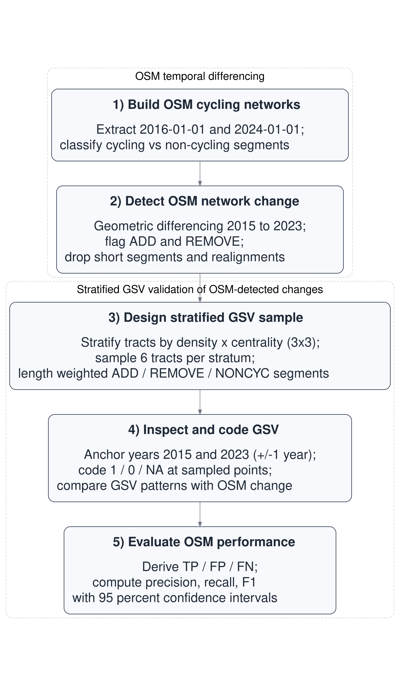
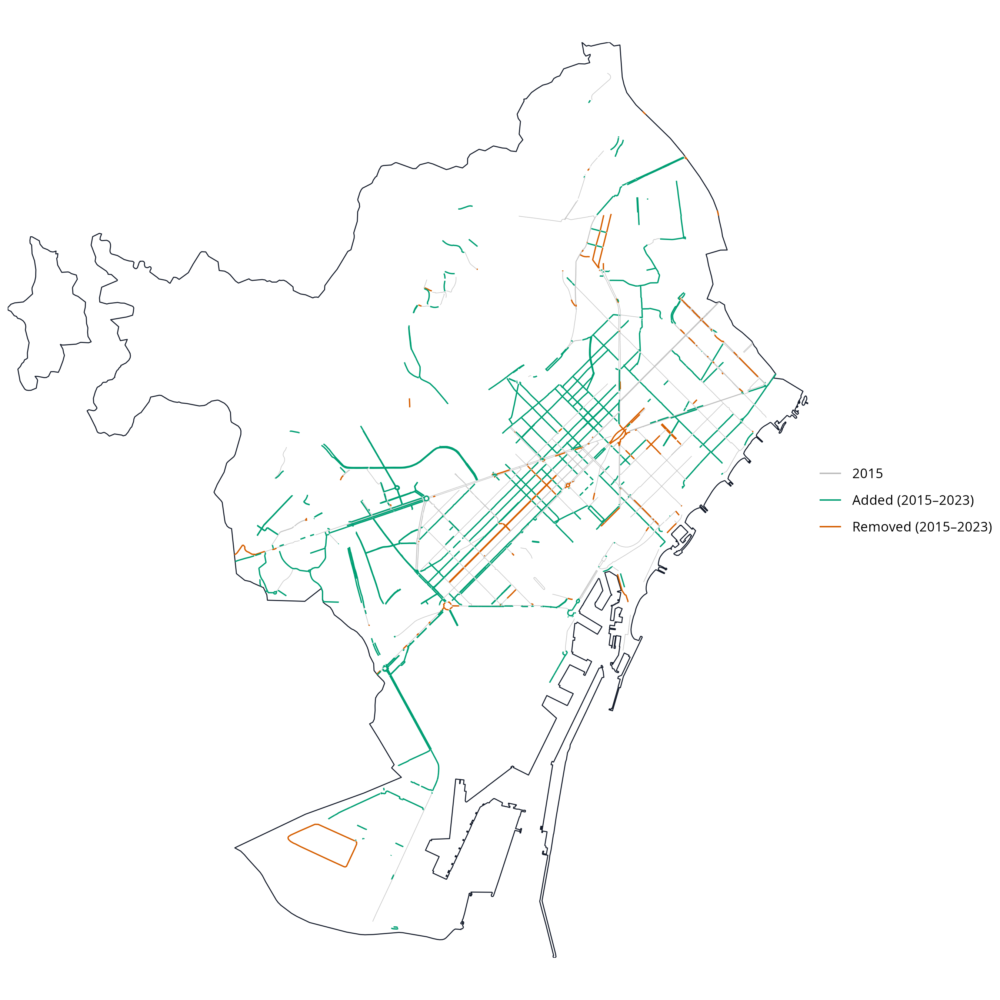

```{r}
#| include: false
source(here::here("R/00_setup.R"))
source(here::here("R/utils_core.R"))
source(here::here("R/utils_ci.R"))
source(here::here("R/utils_validation.R"))
source(here::here("R/01_osm_download.R"))
source(here::here("R/02_ci_networks.R"))
source(here::here("R/03_change_detection.R"))
source(here::here("R/04_noncyc_network.R"))
source(here::here("R/05_tracts_strata.R"))
source(here::here("R/06_sampling_points.R"))
source(here::here("R/07_export_excel.R"))
source(here::here("R/08_results_general.R"))
source(here::here("R/09_results_validation.R"))
source(here::here("R/10_maps.R"))

# Generates workflow diagram used in the manuscript
source(here::here("R/99_workflow_diagram.R"))
```


## Introduction

<!-- 1) The need for reliable longitudinal cycling-infrastructure data -->

In recent years, many cities worldwide have expanded their cycling-infrastructure network in pursuit of cleaner, healthier and more equitable mobility [@szell_growing_2022; @buehler_cycling_2021]. Reliable data on how these networks evolve are essential for evidence-based planning and robust longitudinal research [@hirsch_obtaining_2016]. Such data enable researchers and policymakers to examine how infrastructure change relates to mode choice, safety and equity [@houde_ride_2018; @prince_cycling_2025].

<!-- 2) Measurement gaps and their consequences -->

Yet longitudinal infrastructure data are often incomplete or inconsistent. Official inventories are rarely maintained systematically across years, and field audits, although precise, are resource-intensive and difficult to replicate at scale [@winters_mapping_2025; @dai_street_2024]. In the absence of consistent data, researchers and policymakers must rely on fragmented sources, increasing the risk of exposure misclassification and biased impact estimates [@batomen_pedaling_2026]. As a result, comparable evidence on cycling-infrastructure change remains limited, constraining both robust research and informed policy development [@houde_ride_2018].

<!-- 3) OSM as a solution -->

The growing availability of Volunteered Geographic Information (VGI) offers new opportunities to address these data gaps [@goodchild_citizens_2007]. Among such sources, OpenStreetMap (OSM) stands out for providing open, editable, and time-stamped spatial data on a wide range of urban features, making it a valuable resource for reconstructing historical infrastructure networks and studying urban infrastructure change over time [@minghini_openstreetmap_2019; @zhang_using_2019].

<!-- 4) Some issues in OSM (general, especially temporal uncertainty) -->

Early comparisons with **official** datasets suggest that OSM can achieve good positional accuracy and substantial agreement in mapped features [@haklay_how_2010; @girres_quality_2010]. However, its use for longitudinal change analysis remains more uncertain. OSM data quality varies across space and time, and edits may reflect not only real-world changes but also evolving mapping practices, including delayed or retrospective updates [@barron_comprehensive_2014; @senaratne_review_2017; @minghini_openstreetmap_2019]. In addition, tagging practices and compliance can vary across local contexts, introducing further heterogeneity in how features are represented [@almendros-jimenez_analyzing_2018]. This uncertainty in timing can influence analytical results when historical OSM snapshots are used as proxies for real-world change [@schmidl_approach_2021; @juhasz_towards_2021].

<!-- 5) Cycling-specific issues -->

<!-- 5.1 Why cycling infra is hard to map in OSM -->

Cycling infrastructure poses additional challenges because some facilities, particularly on-street cycle lanes, are represented as attributes of road segments rather than as independent geometries. This makes them less visually distinct, harder to map consistently, and more prone to omission or incorrect tagging [@hochmair_assessing_2015; @ferster_developing_2023]. <!-- 5.2 Studies using OSM for cycling infra inventories (static) --> Despite these challenges, empirical comparisons with reference datasets suggest that OSM can provide useful cycling-infrastructure inventories in many contexts, although agreement varies across cities and infrastructure types and depends on consistent tagging practices [@ferster_using_2020]. Evidence also suggests that OSM bicycle-infrastructure data quality varies spatially, particularly outside dense urban cores [@viero_how_2025].

<!-- 5.3 Studies using OSM histories for cycling change/growth (historical) -->

Importantly, recent work has shown the value of OSM histories for measuring cycling-infrastructure network growth at scale, providing a scalable alternative when consistent historical **official datasets** are unavailable [@bres_analysis_2023; @winters_mapping_2025]. At the same time, these studies highlight that observed changes can reflect both real-world infrastructure change and improvements in mapping and tagging.

<!-- 6) Validation need + why GSV + methodological gap -->

For this reason, OSM-derived changes require independent validation. To assess whether changes detected from historical OSM snapshots reflect real on-street changes, an external source of evidence is needed. Street-level imagery, including Google Street View (GSV), has increasingly been used to audit and validate built-environment features remotely [@rundle_using_2011; @askari_validating_2025; @hanibuchi_virtual_2019]. However, to our knowledge, no study has yet provided a **transparent,** reproducible end-to-end workflow that combines OSM snapshot differencing, probability-based stratified sampling, and GSV-based verification to quantify precision and recall of cycling-infrastructure change.

<!-- 7) This study’s contribution -->

**Building on this gap, this study aims to quantify the temporal accuracy of OSM-derived cycling-infrastructure change.** Using Barcelona over the 2015–2023 period as a case study, we implement a reproducible open-source workflow that combines longitudinal snapshot differencing with probability-based stratified validation against historical GSV imagery. The selected time window aligns with a broader research project examining infrastructure change across policy-relevant governance periods, although the present paper focuses exclusively on methodological validation. Detection performance is evaluated using precision, recall, and F1 scores. By integrating change detection and external validation within a transparent **end-to-end workflow with fully reproducible computational components and structured manual validation**, the study provides a transferable basis for assessing the reliability of OSM-derived measures of infrastructure change.

<!-- The analysis was conducted within a broader project examining public responses to built-environment sustainable-travel interventions across European cities. -->

## Data and methods

### Study setting

Barcelona is a large, dense Mediterranean city in northeastern Spain (around 1.7 million inhabitants within the municipal boundary) with an extensive and evolving cycling network. Between 2015 and 2023, the city experienced substantial cycling-infrastructure expansion, generating measurable network change over time. These dynamics make Barcelona a suitable case for evaluating OSM-based network reconstruction, change detection, and validation procedures.

### Data sources

Three data sources were used:

- OpenStreetMap (OSM). Dated OSM extracts for Barcelona were retrieved for 1 January 2016 and 1 January 2024 using the `osmextract` R package. These annual Geofabrik snapshots were used as proxies for baseline and follow-up network conditions.

- Google Street View (GSV). Historical Street View panoramas were used to manually validate a sample of OSM-detected cycling-infrastructure additions and removals. Imagery corresponding as closely as possible to the baseline and follow-up reference periods was used for validation.

- Census and boundary data. Census-tract boundaries (2015) and resident population counts (2022) were obtained from official statistical sources and used to design a stratified validation sample based on population density and centrality.

### Methods

The analysis follows a five-step reproducible workflow (@fig-workflow)**, implemented as a single pipeline from OSM-based change detection to GSV-based validation. Steps 1–2 detect cycling-infrastructure change, while Steps 3–5 evaluate these detections using stratified GSV validation**.

```{r}
#| label: fig-workflow
#| echo: false
#| fig-align: center
#| out-width: "60%"
#| fig-cap: Five-step workflow for OSM-based change detection and GSV validation. Steps 1–2 reconstruct cycling-infrastructure networks and detect change from historical OSM snapshots, while Steps 3–5 evaluate these detections using stratified GSV validation.



```

**Step 1. Build OSM cycling-infrastructure network**

We constructed baseline and follow-up cycling-infrastructure networks from the dated OSM extracts described above, representing proxy conditions for 2015 and 2023. From each extract, we derived a core cycling-infrastructure network intended to represent bicycle-specific, physically visible infrastructure encoded by the segment geometry. A segment was classified as cycling infrastructure if either (i) it was mapped as a dedicated cycleway (`highway = cycleway`), or (ii) it was a street segment carrying explicit cycleway tags indicating a lane or track. In the second case, we searched `cycleway`-related keys (e.g., `cycleway`, `cycleway:left`, `cycleway:right`, `cycleway:both`, and other `cycleway:*` variants) and retained segments where any value matched {`lane`, `track`, `opposite_lane`, `opposite_track`} [@openstreetmap_contributors_bicycle_nodate]. Values were matched case-insensitively and, where multiple values were present, a segment was retained if any value matched the set above. **This definition focuses on infrastructure that is physically visible and consistently identifiable in both OSM and street-level imagery, and therefore excludes more ambiguous or lightly designated forms of provision.**

To reduce duplication from parallel OSM representations of the same facility (e.g., a dedicated cycle track mapped as a separate geometry while a cycle lane is also tagged on the adjacent carriageway), we applied a no-double-counting (NDC) rule. Specifically, on-road cycle-lane segments were excluded when they overlapped with nearby dedicated cycling infrastructure, defined as cases where at least 20 m of the lane segment and at least 50% of its length fell within a 15 m buffer around dedicated cycling geometries. The 15 m proximity threshold reflects typical spatial offsets between carriageway-centreline representations and adjacent segregated cycle tracks in dense urban settings, while remaining conservative enough to avoid conflating distinct facilities on opposite sides of wide corridors. The additional requirements of a minimum 20 m overlap and at least 50% segment inclusion ensure that exclusions reflect substantive parallel representation rather than incidental geometric proximity.

**Step 2. Detect OSM network change**

Cycling-infrastructure change between the baseline and follow-up networks was detected using geometric differencing in a projected CRS. First, each network was dissolved and buffered by 10 m to accommodate minor geometric misalignments and small positional edits. This tolerance absorbs small positional shifts introduced by re-digitisation or geometry refinement, while remaining conservative relative to typical urban carriageway widths. **Smaller buffers increase sensitivity to geometric noise, whereas larger buffers may merge nearby but distinct infrastructure segments.**

Additions were defined as segments present in the 2023 proxy network but absent from the buffered 2015 proxy network; removals were defined analogously as segments present in the 2015 proxy network but absent from the buffered 2023 proxy network. Resulting fragments shorter than 10 m were discarded **to remove small artefacts arising from geometric differencing. Lower thresholds increase sensitivity to short fragments but may introduce noise, whereas higher thresholds reduce noise at the cost of potentially excluding short but real infrastructure segments.**

To avoid counting positional edits in OSM as real infrastructure change, we flagged likely realignments as cases where an added segment lay within 15 m of a corresponding removed segment, reflecting small shifts in mapped geometry rather than substantive infrastructure modification. These cases were excluded from the validation evaluation pool. The 15 m proximity threshold served a distinct purpose from the differencing buffer: it was intended to capture cases where added and removed fragments likely represent the same infrastructure feature that has been re-drawn, split, or slightly shifted in OSM rather than physically removed and rebuilt. **Lower thresholds retain more candidate removals but risk including geometric edits, whereas higher thresholds exclude more such artefacts at the cost of potentially removing true changes.**

**The influence of these parameter choices on detected changes was assessed through sensitivity analyses reported in Supplement S5.**

To define control locations and support the identification of false negatives, we constructed a non-cycling comparison pool (NONCYC) consisting of general street segments that did not meet the cycling-infrastructure tagging criteria. NONCYC candidates were restricted to standard road classes (`highway` $\in$ {`primary`, `secondary`, `tertiary`, `unclassified`, `residential` and corresponding link classes, `living_street`, `pedestrian`}). To avoid sampling road segments that overlap or lie immediately adjacent to cycling infrastructure, we removed any NONCYC candidate geometries located within 10 m of cycling infrastructure in either reference year (2015 proxy or 2023 proxy). Resulting fragments shorter than 10 m were discarded.

**Step 3. Design stratified GSV sample**

**The validation relies on manual inspection, as currently available programmatic access to Street View imagery does not provide systematic access to historical imagery across time points required for longitudinal analysis.**

To evaluate the accuracy of OSM-detected cycling-infrastructure changes, we designed a stratified GSV validation across Barcelona’s 1,063 census tracts (2015; @fig-strata-validation a). Population density was calculated as the 2022 resident population per square kilometre for each tract, using official census counts and tract area. Centrality was operationalised as a simple, reproducible proxy for inner vs outer areas, measured via Euclidean distance to Plaça Catalunya. Each variable was divided into terciles, and their combination produced nine density--centrality strata (D1_C1 to D3_C3). From each stratum, six tracts were randomly selected (total $n = 54$).

Within each sampled tract, we attempted to sample up to two OSM-detected additions, two removals, and one NONCYC control segment. Segments were sampled with probability proportional to their length, so longer segments were more likely to be selected than shorter fragments. Candidate segments were split at census-tract boundaries before sampling so that segment length (and therefore sampling probability) was calculated only within each tract.

Each sampled segment was converted to a single validation point located at its mid-length position (@fig-strata-validation b). Points were linked to the nearest available GSV panorama and exported to a structured coding workbook (see Supplement [S1](#s1-workbook)). The same points were also provided in an interactive map with direct Street View links (Supplement [S2](#s2-interactive-maps)).

```{r}
#| label: fig-strata-validation
#| echo: false
#| fig-align: center
#| fig-width: 8
#| fig-height: 4
#| out-width: 100%
#| layout-ncol: 2
#| fig-cap: "Outputs used in the validation design: (a) Bivariate tract stratification; (b) Validation points by type."
#| fig-subcap:
#| - ""
#| - ""

knitr::include_graphics(c(
  "../figs/stratified_sample_bivariate_map.png",
  "../figs/validation_points_map.png"
))
```

**Step 4. Inspect and code GSV**

Each validation site was independently coded by two trained coders following a standardised protocol (Supplement [S3](#s3-gsv-protocol)). Coders assessed whether cycling infrastructure was present in a baseline and follow-up period corresponding to the OSM reference snapshots. When the nearest panorama did not provide a clear view of the sampled location, coders were permitted to adjust the Street View position slightly along the same street segment, provided that the original sampled point remained visible and spatially identifiable. For each site and period, coders recorded infrastructure presence/absence and the month of the imagery used.

Because GSV imagery availability varies across locations and years, coders prioritised imagery as close as possible to the reference dates. For the baseline period, coders attempted 2016 and 2015 first (using 2014 only as a fallback when required); for the follow-up period, coders attempted 2024 and 2023 first (using 2022 only as a fallback when required). When multiple candidate years were available, the observation closest in time to the reference date was selected to define **the final baseline and follow-up values**.

Sites were coded as missing when available imagery did not allow a clear determination of cycling-infrastructure presence for the reference period (e.g., obscured views, roadworks, or ambiguous visual evidence). Missing observations were excluded from accuracy analyses requiring **final baseline and follow-up values**. Intercoder agreement was assessed on usable sites, and any discrepancies were resolved through reconciliation to produce a **final dataset** for analysis.

**Step 5. Evaluate OSM performance**

Using the adjudicated baseline and follow-up GSV codes, we evaluated whether OSM snapshot differencing correctly identified additions and removals of cycling infrastructure. For segments flagged as additions, a true positive (TP) corresponded to a 0→1 transition between baseline and follow-up, whereas a false positive (FP) corresponded to no change (0→0) or persistence of cycling infrastructure (1→1). For segments flagged as removals, a TP corresponded to a 1→0 transition, whereas an FP corresponded to no change (1→1) or no cycling infrastructure in either period (0→0). NONCYC control locations were used to identify false negatives (FN), defined as cycling-infrastructure changes visible in GSV but not detected by OSM differencing. Examples of TP additions and removals are shown in @fig-gsv-examples.

```{r}
#| label: fig-gsv-examples
#| echo: false
#| message: false
#| warning: false
#| fig-align: center
#| fig-asp: 1
#| fig-cap: "Examples of true positive changes identified during GSV validation: (a) 2015 baseline without cycling infrastructure; (b) 2023 follow-up showing a newly implemented segregated cycle track (0 → 1); (c) 2015 baseline with a cycle track; (d) 2023 follow-up showing its removal following street redesign (1 → 0)."
#| fig-cap-location: bottom
#| fig-pos: "htbp"
#| layout-ncol: 2
#| out-width: "100%"
#| paged-print: false
#| fig-subcap:
#| - ""
#| - ""
#| - ""
#| - ""

library(magick)

imgs <- c(
  "../figs/addition-2015.png",
  "../figs/addition-2023.png",
  "../figs/removal-2015.png",
  "../figs/removal-2023.png"
)

out_dir <- "../figs/_framed"
dir.create(out_dir, showWarnings = FALSE, recursive = TRUE)

framed <- file.path(out_dir, basename(imgs))

invisible(mapply(function(infile, outfile) {
  image_read(infile) |>
    image_border("white", "18x18") |>
    image_extent("+10+10", color = "white") |>
    image_write(outfile)
}, imgs, framed))

knitr::include_graphics(framed)

# read framed images
im <- image_read(framed)

# choose a common panel size (use the smallest width/height across panels)
info <- image_info(im)
w <- min(info$width)
h <- min(info$height)

# make every panel exactly w × h (preserve aspect, pad with white)
im2 <- lapply(im, \(x)
  x |>
    image_resize(paste0(w, "x", h, "^")) |>
    image_extent(paste0(w, "x", h), gravity = "center", color = "white")
) |> image_join()

# 2×2 grid
top <- image_append(im2[1:2])
bot <- image_append(im2[3:4])
fig3 <- image_append(c(top, bot), stack = TRUE)
```

Validation performance was summarised using standard classification metrics based on the final reconciled validation dataset (Supplement [S4](#s4-joined-results)). Precision, recall and the F1 score were computed as:

$$\text{Precision}=\frac{TP}{TP+FP},\quad
\text{Recall}=\frac{TP}{TP+FN},\quad
F_1=\frac{2\cdot \text{Precision}\cdot \text{Recall}}{\text{Precision}+\text{Recall}}.$$ Pooled metrics were computed by first aggregating TP, FP and FN across addition and removal events, and then calculating precision, recall and the F1 score from these pooled counts. For precision and recall, 95% confidence intervals were computed using Wilson score intervals for the corresponding numerators and denominators, which provide stable coverage for proportions, particularly with small sample sizes or extreme values.

All data processing, change detection, sampling, and validation procedures were implemented in an open-source R workflow. Code availability is detailed in the [Data and code availability](#s1-code) section.

## Results

### Network change detected from OSM (2015–2023)

Between 2015 and 2023, the OSM-derived cycling-infrastructure network in Barcelona increased from 130.7 to 235.7 km, corresponding to a net growth of 105.0 km, an 80.3 % increase (@fig-changes). Network lengths were calculated as the summed length of cycling-infrastructure line geometries in OSM, without collapsing parallel or spatially separated facilities into a single corridor-level measure (e.g., cycle tracks on both sides of a street). Geometric differencing identified 127.1 km of added and 24.9 km of removed cycling infrastructure, yielding a net change of 102.2 km. The small discrepancy (−2.8 km) reflects minor geometric artefacts introduced by the buffering, dissolving, and fragment-filtering steps used in the differencing procedure, and indicates good internal consistency between aggregate network totals and change estimates (@tbl-consistency).

```{r}
#| label: tbl-consistency
#| tbl-cap: "Consistency between yearly totals and differencing estimates (2015–2023, Barcelona)"
#| echo: false

knitr::kable(
  consistency,
  align = c("l","r")
)

```

**As an external consistency check, we compared OSM-derived network length over time with official municipal data for Barcelona. OSM estimates indicate an increase from 130.7 km to 235.7 km between 2015 and 2023, while the official data show a comparable increase from 133.0 km to 234.0 km over the same period. This close agreement suggests that the OSM-derived estimates capture the overall growth pattern observed in the official record. The comparison is used as an aggregate consistency check, while the GSV-based validation remains the basis for assessing whether detected additions and removals correspond to visible on-street changes. Official municipal data were obtained from the Área Metropolitana de Barcelona for 2015 and from the Barcelona Open Data portal for 2023 [@amb2015_carril_bici; @bcn2023_carril_bici].**

**Given the reliance on geometric parameters in Step 2, we assessed robustness to geometric parameter choices, we conducted sensitivity checks varying the differencing buffer (5 m, 10 m, 15 m), minimum segment length (5 m, 10 m, 20 m), and realignment threshold (10 m, 15 m, 20 m). Net change estimates remained broadly stable across configurations, varying within approximately 8% of the baseline. Detected additions showed limited variation across parameter settings, whereas estimated removals were more sensitive, particularly to the realignment threshold. Across all configurations, additions consistently exceeded removals. Full results are provided in Supplement S5.**

OSM-detected additions were unevenly distributed across the city. Low-density strata (D1_C1, D1_C2 and D1_C3) accounted for 60.0 % of all added length, with particularly large gains in low-density peripheral (D1_C1) and low-density central (D1_C3) areas (@tbl-distribution-strata). Additions were also substantial in medium-density central tracts (D2_C3) and high-density central tracts (D3_C3), indicating that expansion was not confined to the urban periphery. In contrast, removals were limited in total length and were more unevenly distributed, with the largest shares observed in low-density central areas (D1_C3; 37.7 %) and low-density peripheral areas (D1_C1; 28.8 %), while all other strata each accounted for less than 12 % of removed length.

```{r}
#| label: tbl-distribution-strata
#| echo: false
#| tbl-cap: "OSM-estimated additions and removals (2015–2023) by density × centrality stratum. Totals may differ slightly from the aggregate city-level estimates because change segments are split at census-tract boundaries before aggregation."

knitr::kable(
  stratum_out_full,
  col.names = c("Stratum",
                "Definition",
                "Added (km)",
                "Removed (km)",
                "Added (%)",
                "Removed (%)"),
  align = c("l","l", "r","r","r","r"),
  digits  = 1
)

```

```{r}
#| label: fig-changes
#| echo: false
#| fig-align: center
#| out-width: 100%
#| fig-cap: "OSM-detected cycling-infrastructure changes in Barcelona, 2015–2023."



```

### Validation of OSM-detected changes using GSV

Of the 105 sampled sites (39 additions, 6 removals and 50 non-cycling control sites), 86 (82%) provided usable GSV panoramas for both the baseline and follow-up periods, yielding 33 additions, 5 removals and 48 non-cycling control sites for analysis (@tbl-summary_stratum). **These validation points correspond to a sample drawn from a total of 946 OSM-detected change segments (850 additions and 96 removals) in the filtered evaluation dataset (after excluding short fragments and likely realignments). From this pool, 45 change segments (39 additions and 6 removals) were sampled for validation, corresponding to approximately 4.8% of all eligible change candidates. The final number of usable validation observations is lower due to the requirement for valid GSV imagery in both reference periods.** These validation points were distributed across all density–centrality strata, reflecting the stratified sampling design and the spatial availability of candidate change segments within the sampled tracts.

```{r}
#| label: tbl-summary_stratum
#| tbl-cap: "Validation points by class and stratum (usable points only)"
#| echo: false

knitr::kable(
  summary_stratum_class_full,
  col.names = c("Stratum", 
                "Definition", 
                "Add", 
                "Remove", 
                "NONCYC", 
                "Total"),
  align   = c("l","l","r","r","r","r"),
  digits  = 0
)

```

Initial intercoder agreement on the binary presence/absence coding was 92% (79/86). The remaining 7 cases were resolved by consensus, and the **final** baseline and follow-up values were used in the accuracy analysis.

@tbl-validation summarises the validation outcomes. CI reflect sampling uncertainty in the GSV validation and are wider for classes with fewer usable sites. For additions, OSM shows high recall (0.96, 95 % CI \[0.82–0.99\]) and good precision (0.82, 95 % CI \[0.66–0.91\]), indicating that most real additions were detected, although some false positives remain. For removals, recall is 1.00 but with a very wide confidence interval due to the small sample size (n = 5), while precision is very poor (0.20, 95 % CI \[0.04–0.62\]), suggesting that most OSM-detected removals do not correspond to true infrastructure loss. When pooling additions and removals, overall precision is 0.74, recall is 0.97, and the F1 score is 0.84, reflecting strong sensitivity to change but more limited specificity, particularly for removals.

```{r}
#| label: tbl-validation
#| echo: false
#| warning: false
#| tbl-cap: Validation metrics for OSM-inferred cycling-infrastructure changes (Barcelona, 2015–2023)

knitr::kable(
  t_class,
  align = c("l","r","r","r","r","r","r","r"),
  booktabs = TRUE
) |>
  kableExtra::kable_styling(
    full_width = FALSE,
    latex_options = c("hold_position", "scale_down")
  ) |>
  kableExtra::column_spec(1, width = "1.8cm") |>
  kableExtra::footnote(
    general = "ADD and REMOVE refer to segments present only in 2023 or 2015, respectively; Pooled combines both change types. Only change events are included (n = 33 + 5 = 38); NONCYC sites are used to identify false negatives and are not counted as observations. Confidence intervals are Wilson score intervals.",
    general_title = "Note:",
    footnote_as_chunk = TRUE,
    threeparttable = TRUE
  )
```

## Discussion

<!-- Positioning the Study and Methodological Contribution -->

This study quantified the temporal accuracy of OSM-derived cycling-infrastructure change in Barcelona (2015–2023) by combining longitudinal snapshot differencing with stratified GSV validation. To date, the available literature has either validated OSM cycling infrastructure cross-sectionally against reference datasets [@ferster_using_2020; @hochmair_assessing_2015], used OSM snapshots to measure cycling-network growth at scale without externally validating whether detected changes reflect on-street infrastructure change [@winters_mapping_2025], or applied street-level imagery to audit built-environment features independently of OSM [@rundle_using_2011]. By designing and implementing a transparent end-to-end workflow combining historical network reconstruction, geometric differencing, stratified spatial sampling, and independent visual verification, we produce reproducible **computational outputs and transferable validation-based accuracy estimates** (precision, recall, and F1 score) for cycling-infrastructure change detection. Our workflow therefore provides a practical calibration strategy for longitudinal research using OSM when authoritative year-on-year inventories are unavailable.

**As an additional external consistency check, we compared the temporal evolution of OSM-derived network length with official municipal data for Barcelona, one of the relatively few cities where consistent historical infrastructure data are available. The two sources show a broadly similar pattern of network growth over the study period, providing aggregate-level support for the plausibility of the OSM-derived estimates. This comparison is specific to the Barcelona case, while the proposed workflow is designed for application in contexts where such longitudinal official data are not available.**

<!-- Differential Performance for Additions and Removals -->

Overall, OSM performed well in detecting cycling-infrastructure additions, but performance was substantially weaker for removals. Although recall remained high for both change types, precision for removals was very low, **although estimates are based on a small number of validated cases. This suggests that many** apparent removals detected through snapshot differencing do not correspond to actual on-street cycling-infrastructure loss. These results highlight that OSM-derived removals must be carefully verified before estimating net changes in the cycling-infrastructure network.

<!-- Why Removals Are Over-Detected: Representation vs Reality -->

To understand this asymmetry, it is important to consider how OSM records change over time. Because OSM objects can be split, merged, re-tagged, deleted, or recreated [@minghini_openstreetmap_2019], structural edits between snapshots may produce apparent removals without corresponding physical change on the street. This is especially likely for removals, as segments may disappear from a snapshot when they are re-drawn with new geometries, reclassified under different tags, or merged into adjacent features, even though the underlying infrastructure remains in place. Additions, in contrast, require the introduction of new geometries or tags and may therefore more often correspond to genuinely new on-street features. OSM-based differencing can therefore over-detect removals when edits reflect changes in representation rather than physical interventions. This is consistent with the nature of OSM as a continuously edited VGI resource, in which objects are routinely revised rather than fixed as in a static dataset [@goodchild_citizens_2007].

<!-- Practical Implications: OSM as a Screening Tool -->

From a practical perspective, for cities that lack consistently maintained inventories, OSM snapshot differencing can function as a screening tool for identifying likely infrastructure additions at scale, with targeted imagery checks providing an efficient quality-control layer. This matters because practitioners often need to monitor delivery (corridor completion, network coverage growth) and to allocate limited auditing resources; virtual audits have repeatedly been shown to reduce the burden of in-person observation while remaining usable for built-environment measurement [@rundle_using_2011]. Our results suggest that OSM-derived additions can be treated as generally informative, but apparent removals should not be interpreted as “rollback” without independent verification.

<!-- Implications for Longitudinal Causal Inference -->

Beyond planning practice, these measurement characteristics also have implications for longitudinal research designs. Studies evaluating cycling interventions often rely on the timing and location of network changes to define exposure, treatment, and control conditions at the street or neighborhood level. When removals are over-detected, analyses can be substantially distorted, and even net growth can be biased in settings where apparent removals are more frequent than in Barcelona. More importantly, misclassifying segments as removed could bias estimates in longitudinal designs that depend on staggered implementation and upgrades. In this context, the observed precision values can be used to inform calibration of snapshot-differenced estimates. For example, scaling raw OSM change counts by change-specific precision (approximately 0.8 for additions and 0.2 for removals in the Barcelona case) provides an approximate adjustment for false positives when estimating net growth from OSM alone. However, calibration of removals remains uncertain due to the small number of validated removal cases and should be interpreted as indicative rather than definitive.

<!-- Contribution to the Temporal Validity of VGI -->

At a broader conceptual level, this study contributes to efforts to assess the temporal validity of OSM and other forms of VGI. Longitudinal applications of OSM require attention to how edits, reclassification, and representation changes may be expressed as apparent cycling-infrastructure change. The approach presented here provides a practical way to distinguish true interventions from mapping artefacts, supporting more robust use of OSM histories in transport, health, and urban studies.

## Generalisability and limitations

<!-- Transfer Conditions for the Workflow -->

The workflow developed in this study is designed to be transferable to other cities where historical OSM extracts are available and street-level imagery coverage is sufficient for validation. **Reproducibility is full for the computational components, while the validation stage relies on structured manual interpretation of imagery following a standardised protocol.** The main requirements are (i) consistent OSM snapshots for two reference years, (ii) a spatial sampling frame (e.g., census tracts or equivalent small areas), and (iii) imagery that allows adjudication of infrastructure presence at both time points.

<!-- Methodological and Contextual Limitations -->

Several limitations should be acknowledged. First, the **overall validation sample was relatively small (n = 86 usable sites), particularly for removals,** resulting in wide confidence intervals for removal-specific metrics. This reflects the scarcity of eligible removal candidates in the OSM-detected change pool under our cycling infrastructure definition and differencing rules, and the removal pool was further reduced by realignment filtering and incomplete GSV coverage for both reference periods. Sensitivity checks increasing the number of sampled tracts and candidate segments yielded only marginal gains in removal sites, indicating that removal sample size was constrained by event availability rather than by the sampling strategy. **In addition, while the sampling design follows a stratified approach across tracts with target quotas per tract (up to two additions, two removals, and one NONCYC segment), the final allocation is constrained by the availability of eligible change segments and usable GSV imagery. As a result, the validation sample reflects a structured but feasibility-constrained allocation rather than a strictly proportional or representative subset of all detected changes. This leads to imbalances across classes, particularly for removals, and implies that the reported metrics should be interpreted as conditional on the sampled validation set rather than as population-level estimates.**

Second, GSV imagery dates vary within each anchor year and across locations, occasionally creating minor temporal mismatches with the OSM reference snapshots. This variability can blur the exact timing of change and may lead to a small number of misclassifications when cycling infrastructure was built, modified, or removed close to the snapshot dates. **Third, the validation relies on GSV as an observational reference rather than a direct measure of ground truth, which introduces additional sources of uncertainty. Coverage is not uniform across space, and the requirement for imagery at both time points restricts the set of usable validation locations, potentially introducing selection bias towards better-covered areas. In addition, the visibility and interpretability of cycling infrastructure vary by type (e.g., segregated lanes versus painted or shared facilities), which may affect coding consistency. As such, the reported precision and recall should be interpreted as agreement conditional on observable locations rather than as a direct measure of absolute ground truth accuracy.**

**Fourth, the construction of the NONCYC control pool may influence the interpretation of recall. NONCYC candidates were generated from general street segments after excluding or cutting portions located within the tolerance buffer around cycling infrastructure in either reference year. This design provides a clearer and more interpretable non-cycling comparison pool, but it may reduce the likelihood of identifying false negatives near already mapped cycling facilities. As a result, recall estimates should be interpreted as conditional on the sampling framework rather than as a comprehensive measure of missed cycling-infrastructure changes across the full street network.**

Fifth, although inter-rater agreement was high, subtle interpretive differences, such as deciding whether a facility meets the definition of cycling infrastructure, remain possible, especially for borderline or mixed designs.

**Sixth, the definition of cycling infrastructure used in this study is based on a specific set of OSM tags intended to provide a consistent representation of clearly defined, physically visible infrastructure. However, the way these tags are applied in practice may vary across cities. For example, facilities that would fall within our definition (e.g. painted lanes) may in some cases be represented using tags such as `cycleway=shared_lane`, which are excluded from our filter. This leads to context-dependent under-detection of cycling infrastructure. As a result, while the framework itself is transferable, the magnitude of underestimation may vary across contexts, with implications for completeness and cross-city comparability.**

Seventh, Barcelona likely represents a relatively well-mapped OSM context, given the concentration of OSM contributors and higher mapped completeness in many European and high-income urban areas; future research should assess how this workflow performs in lower-activity contexts and where mapping practices and tag usage may evolve differently [@herfort_spatio-temporal_2023].

**Finally, while the proposed workflow is conceptually scalable, its application to much larger validation samples (e.g., thousands of sites) would face practical limitations. The validation relies on manual inspection of historical GSV imagery, which is time-intensive to scale. Importantly, currently available programmatic access options (e.g., the Google Street View API) do not provide systematic access to historical imagery across time points, which limits the feasibility of fully automated large-scale validation. These limitations should be considered when extending the approach to larger study areas or higher-resolution validation designs.**

## Conclusions

This study quantified the accuracy of OSM for detecting longitudinal cycling-infrastructure change by implementing and validating a reproducible snapshot-differencing framework in Barcelona (2015–2023). Using probability-based stratified GSV validation, we estimated precision, recall, and F1 scores for OSM-detected additions and removals.

The results indicate that OSM-detected additions are generally reliable, whereas apparent removals identified through snapshot differencing often do not correspond to on-street cycling-infrastructure loss. This asymmetry suggests that OSM histories can be informative for tracking network expansion, but inferred removals should not be interpreted without independent verification or calibration.

By producing quantitative accuracy estimates within a transparent, transferable workflow, this study provides a practical basis for calibrating OSM-derived measures of cycling-infrastructure change and for accounting for measurement error in longitudinal evaluations. More broadly, the findings support the responsible use of OSM and other VGI sources for urban change analysis, while underscoring the need to validate temporal change signals before drawing substantive policy or behavioural inferences.

## Data and code availability {.unnumbered}

The full reproducible workflow (R scripts and documentation) used in this study will be made publicly available in an online repository upon acceptance.

## Supplements {.unnumbered}

The supplementary materials (S1–S4) are provided as separate files and are included with the peer-review submission.

### S1. Raw validation workbook (XLSX) {#s1-workbook .unnumbered}

<!-- [S1_raw_validation_workbook.xlsx](../supplements/S1_raw_validation_workbook.xlsx) -->

Contains the sampled segments and coding sheets completed independently by the two coders prior to reconciliation.

### S2. Interactive maps (HTML) {#s2-interactive-maps .unnumbered}

<!-- [S2_infra_change_map.html](../supplements/S2_infra_change_map.html)\ -->

<!-- [S2_validation_points_map.html](../supplements/S2_validation_points_map.html) -->

Two standalone interactive HTML visualisations:

- validation points with direct Google Street View links;
- OSM change-detection map showing additions and removals.

The maps support zooming, panning, layer toggling, and inspection of individual validation points and network segments. They can be opened locally in any modern web browser (an internet connection is required to load basemap tiles).

### S3. Google Street View validation protocol (PDF) {#s3-gsv-protocol .unnumbered}

<!-- [S3_GSV_validation_protocol.pdf](../supplements/S3_GSV_validation_protocol.pdf) -->

Details the standardised coding procedure, imagery selection rules, and reconciliation process.

### S4. Final adjudicated validation results (XLSX) {#s4-joined-results .unnumbered}

<!-- [S4_adjudicated_validation_results.xlsx](../supplements/S4_adjudicated_validation_results.xlsx) -->

Provides the reconciled validation dataset used to compute precision, recall, and F1 scores.

### S5. Sensitivity analysis of change-detection parameters (XLSX) {#s5-sensitivity .unnumbered}

Provides the results of sensitivity checks for key geometric parameters used in the OSM change-detection workflow, including the differencing buffer, minimum segment length, and realignment threshold.

The table reports the total length of detected additions, removals, and net change under alternative parameter settings, along with deviations from the baseline configuration.

The baseline scenario corresponds to the default parameter configuration used in the analysis (10 m differencing buffer, 10 m minimum segment length, and 15 m realignment threshold). Values are computed on the filtered evaluation dataset (after excluding short fragments and likely realignments) and therefore differ from the raw network-level change estimates reported in Table 1.

## Declaration of Generative AI and AI-assisted technologies in the writing process {.unnumbered}

During the preparation of this manuscript the authors used ChatGPT (version 5.2) to support language editing and improve readability. All content was subsequently reviewed and edited by the authors, who take full responsibility for the final manuscript.

## References {.unnumbered}
