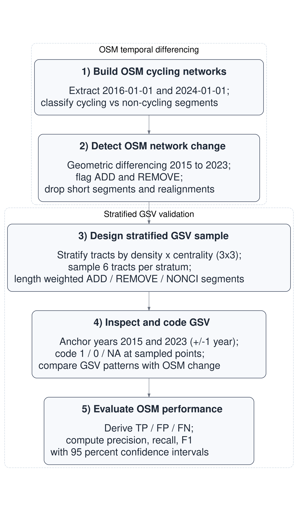
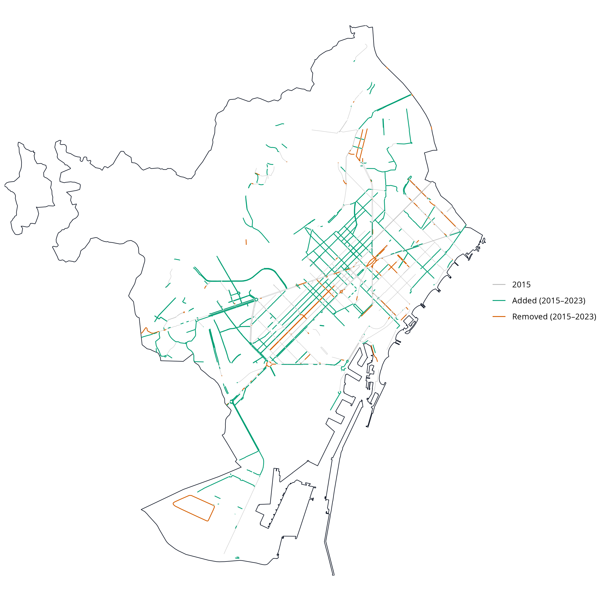
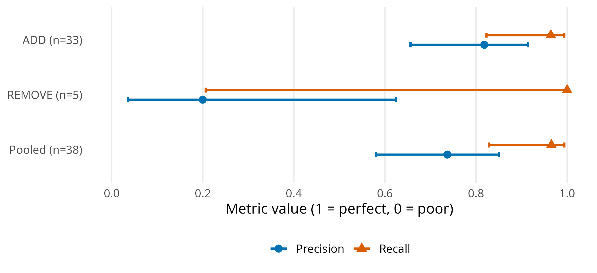

```{r}
#| include: false
source("../R/00_setup.R")
source("../R/utils_core.R")
source("../R/utils_ci.R")
source("../R/utils_validation.R")
source("../R/01_osm_download.R")
source("../R/02_ci_networks.R")
source("../R/03_change_detection.R")
source("../R/04_noncyc_network.R")
source("../R/05_tracts_strata.R")
source("../R/06_sampling_points.R")
source("../R/07_export_excel.R")
source("../R/08_results_general.R")
source("../R/09_results_validation.R")
source("../R/10_maps.R")

# Generates workflow diagram used in the manuscript
#source("../R/99_workflow_diagram.R")
```

## Introduction

<!-- 1) The need for reliable longitudinal cycling-infrastructure data -->

In recent years, many cities worldwide have expanded their cycling networks in pursuit of cleaner, healthier and more equitable mobility [@szell_growing_2022; @buehler_cycling_2021]. Reliable data on how these networks evolve are essential for evidence-based planning and robust longitudinal research [@hirsch_obtaining_2016]. Such data enable researchers and policymakers to examine how infrastructure change relates to mode choice, safety and equity [@houde_ride_2018; @prince_cycling_2025].

<!-- 2) Measurement gaps and their consequences -->

Yet longitudinal infrastructure data are often incomplete or inconsistent. Official inventories are rarely maintained systematically across years, and field audits, although precise, are resource-intensive and difficult to replicate at scale [@winters_mapping_2025; @dai_street_2024]. In the absence of consistent data, researchers and policymakers must rely on fragmented sources, increasing the risk of exposure misclassification and biased impact estimates [@batomen_pedaling_2026]. As a result, comparable evidence on cycling-infrastructure change remains limited, constraining both robust research and informed policy development [@houde_ride_2018].

<!-- 3) OSM as a solution -->

The growing availability of Volunteered Geographic Information (VGI) offers new opportunities to address these data gaps [@goodchild_citizens_2007]. Among such sources, OpenStreetMap (OSM) stands out for providing open, editable, and time-stamped spatial data on a wide range of urban features, making it a valuable resource for reconstructing historical infrastructure networks and studying urban infrastructure change over time [@minghini_openstreetmap_2019; @zhang_using_2019].

<!-- 4) Some issues in OSM (general, especially temporal uncertainty) -->

Early comparisons with authoritative datasets suggest that OSM can achieve good positional accuracy and substantial agreement in mapped features [@haklay_how_2010; @girres_quality_2010]. However, its use for longitudinal change analysis remains more uncertain. OSM data quality varies across space and time, and edits may reflect not only real-world changes but also evolving mapping practices, including delayed or retrospective updates [@barron_comprehensive_2014; @senaratne_review_2017; @minghini_openstreetmap_2019].
In addition, tagging practices and compliance can vary across local contexts, introducing further heterogeneity in how features are represented [@almendros-jimenez_analyzing_2018].
This uncertainty in timing can influence analytical results when historical OSM snapshots are used as proxies for real-world change [@schmidl_approach_2021; @juhasz_towards_2021].

<!-- 5) Cycling-specific issues -->

<!-- 5.1 Why cycling infra is hard to map in OSM -->

Cycling infrastructure poses additional challenges because some facilities, particularly on-street cycle lanes, are represented as attributes of road segments rather than as independent geometries. This makes them less visually distinct, harder to map consistently, and more prone to omission or incorrect tagging [@hochmair_assessing_2015; @ferster_developing_2023]. <!-- 5.2 Studies using OSM for cycling infra inventories (static) --> Despite these challenges, empirical comparisons with reference datasets suggest that OSM can provide useful cycling-infrastructure inventories in many contexts, although agreement varies across cities and infrastructure types and depends on consistent tagging practices [@ferster_using_2020]. Evidence also suggests that OSM bicycle-infrastructure data quality varies spatially, particularly outside dense urban cores [@viero_how_2025].

<!-- 5.3 Studies using OSM histories for cycling change/growth (historical) -->

Importantly, recent work has shown the value of OSM histories for measuring cycling-network growth at scale, providing a scalable alternative when consistent historical official datasets are unavailable [@bres_analysis_2023; @winters_mapping_2025]. At the same time, these studies highlight that observed changes can reflect both real-world infrastructure change and improvements in mapping and tagging, reinforcing the need for independent validation.

<!-- 6) Validation need + why GSV + methodological gap -->

Taken together, these limitations indicate that OSM-derived changes require independent validation. To assess whether changes detected from historical OSM snapshots reflect real on-street changes, an external source of evidence is needed. Street-level imagery, including Google Street View (GSV), has increasingly been used to audit and validate built-environment features remotely [@rundle_using_2011; @askari_validating_2025; @hanibuchi_virtual_2019]. However, to our knowledge, no study has yet provided a fully reproducible end-to-end workflow that combines OSM snapshot differencing, probability-based stratified sampling, and GSV-based verification to quantify precision and recall of cycling-infrastructure change.

<!-- 7) This study’s contribution -->

This study addresses this gap by developing and applying a reproducible, open-source workflow implemented in R with two objectives. First, we infer cycling-infrastructure additions and removals in Barcelona (2015–2023) using temporal differencing of dated OSM snapshots. Second, we quantify the accuracy of these OSM-inferred changes using a stratified random validation against historical Google Street View imagery, estimating precision, recall, and F1 scores. By integrating change detection and external validation within a transparent computational pipeline, the study contributes a transferable urban data science framework for monitoring infrastructure transformation using VGI. This work was conducted within a broader project examining public responses to built-environment sustainable-travel interventions across European cities.

## Data and methods

### Data sources

Three data sources were used:

- **OpenStreetMap (OSM).** Dated OSM extracts for Barcelona were retrieved for 1 January 2016 and 1 January 2024 using the `osmextract` R package [@gilardi_osmextract_2025]. These dates correspond to the annual 1 January snapshots distributed via Geofabrik, and were used as proxies for end-of-2015 and end-of-2023 network conditions, respectively.

- **Google Street View (GSV).** Historical Street View panoramas were used to manually validate a sample of OSM-detected cycling-infrastructure additions and removals. Validation locations were linked to the nearest available Street View panoramas and inspected using the GSV interface.

- **Census and boundary data.** Census-tract boundaries (2015) and resident population counts (2022) were obtained from official statistical sources and used to design the stratified validation sample based on population density and centrality.

### Study setting: Barcelona

Barcelona is a large, dense Mediterranean city (around 1.7 million inhabitants) with an extensive and evolving cycling network. It experienced substantial cycling-infrastructure expansion during the study period, making it a suitable pilot case to test OSM-based network reconstruction, change detection, and GSV validation. The 2015–2023 window was selected to align with municipal electoral cycles (2015 and 2023 elections), providing policy-relevant before-and-after snapshots while keeping the focus on methodological validation rather than policy evaluation.

### Methods (workflow overview)

The analysis followed a five-step reproducible workflow (@fig-workflow) with two main components: (i) temporal differencing of dated OSM extracts to detect additions and removals of cycling infrastructure, and (ii) stratified GSV validation to check a sample of these detected changes. 

```{r}
#| label: fig-workflow
#| echo: false
#| fig-align: center
#| out-width: 50%
#| fig-cap: Main workflow steps.



```

### Step-by-step workflow

#### OSM temporal differencing

**Step 1. Build OSM cycling networks**

We constructed baseline and follow-up cycling-infrastructure networks from OSM extracts dated 1 January 2016 and 1 January 2024, used as proxy networks for conditions in 2015 and 2023, respectively. The 2015–2023 window was selected to align with relevant municipal electoral cycles and to reflect a policy-relevant period of cycling-network expansion.

From each extract, we derived a core cycling-infrastructure network intended to represent bicycle-specific, physically visible infrastructure encoded by the segment geometry, while reducing duplication arising from alternative OSM representations. A segment was classified as cycling infrastructure if either (i) it was mapped as a dedicated cycleway (`highway = cycleway`), or (ii) it was a street segment carrying explicit cycleway tags indicating a lane or track. In the second case, we searched `cycleway`-related keys (e.g., `cycleway`, `cycleway:left`, `cycleway:right`, `cycleway:both`, and other `cycleway:*` variants) and retained segments where any value matched {`lane`, `track`, `opposite_lane`, `opposite_track`} [@openstreetmap_contributors_bicycle_nodate]. Values were matched case-insensitively and, where multiple values were present, a segment was retained if any value matched the set above.

To reduce duplication from parallel OSM representations of the same facility (e.g., a dedicated cycle track mapped as a separate geometry while a cycle lane is also tagged on the adjacent carriageway), we applied a no-double-counting (NDC) rule. Specifically, on-road cycle-lane segments were excluded when they overlapped with nearby dedicated cycling infrastructure, defined as cases where at least 20 m of the lane segment and at least 50% of its length fell within a 15 m buffer around dedicated cycling geometries. The 15 m proximity threshold reflects typical spatial offsets between carriageway-centreline representations and adjacent segregated cycle tracks in dense urban settings, while remaining conservative enough to avoid conflating distinct facilities on opposite sides of wide corridors. The additional requirements of a minimum 20 m overlap and at least 50% segment inclusion ensure that exclusions reflect substantive parallel representation rather than incidental geometric proximity.

**Step 2. Detect OSM network change**

Cycling-infrastructure change between the baseline and follow-up networks was detected using geometric differencing in a projected CRS. First, each network was dissolved and buffered by 10 m to accommodate minor geometric misalignments and small positional edits in OSM. This tolerance absorbs small positional shifts introduced by re-digitisation or geometry refinement, while remaining conservative relative to typical urban carriageway widths. Additions were defined as segments present in the 2023 proxy network but absent from the buffered 2015 proxy network; removals were defined analogously as segments present in the 2015 proxy network but absent from the buffered 2023 proxy network. Resulting fragments shorter than 10 m were discarded.

To avoid counting positional edits in OSM as real infrastructure change, we flagged likely realignments as cases where an added segment lay within 15 m of a corresponding removed segment, reflecting small shifts in mapped geometry rather than substantive infrastructure modification. These cases were excluded from the validation evaluation pool. The 15 m proximity threshold serves a distinct purpose from the differencing buffer: it is intended to capture cases where added and removed fragments likely represent the same infrastructure feature that has been re-drawn, split, or slightly shifted in OSM rather than physically removed and rebuilt. The slightly larger distance allows for modest offsets between historical and updated geometries without conflating spatially distinct facilities.

To define control locations and support the identification of false negatives, we constructed a non-cycling comparison pool (NONCYC) consisting of general street segments that did not meet the cycling-infrastructure tagging criteria. NONCYC candidates were restricted to standard road classes (`highway` $\in$ {`primary`, `secondary`, `tertiary`, `unclassified`, `residential` and corresponding link classes, `living_street`, `pedestrian`}). To avoid sampling road segments that overlap or lie immediately adjacent to cycling infrastructure, we removed any NONCYC candidate geometries located within 10 m of cycling infrastructure in either reference year (2015 proxy or 2023 proxy). Resulting fragments shorter than 10 m were discarded.

#### Stratified GSV validation

**Step 3. Design stratified GSV sample**

To evaluate the accuracy of OSM-detected cycling-infrastructure changes, we designed a stratified GSV validation across Barcelona’s 1,063 census tracts (2015; @fig-strata-validation a). Population density was calculated as the 2022 resident population per square kilometre for each tract, using official census counts and tract area. Centrality was operationalised as a simple, reproducible proxy for inner vs outer areas, measured via Euclidean distance to Plaça Catalunya. Each variable was divided into terciles, and their combination produced nine density--centrality strata (D1\_C1 to D3\_C3). From each stratum, six tracts were randomly selected (total $n = 54$).

Within each sampled tract, we attempted to sample up to two OSM-detected additions, two removals, and one NONCYC control segment. Segments were sampled with probability proportional to their length, so longer segments were more likely to be selected than shorter fragments. Candidate segments were split at census-tract boundaries before sampling so that segment length (and therefore sampling probability) was calculated only within each tract.

Each sampled segment was converted to a single validation point located at its mid-length position (@fig-strata-validation b). Points were linked to the nearest available GSV panorama and exported to coder workbooks (one per coder; [Supplement S1](#s1-workbook)). The same points were also provided in an interactive map with direct Street View links ([Supplement S2](#s2-interactive-maps)). When needed to obtain an interpretable view for the target year, coders were allowed to move the peg slightly along the same street while keeping the original location visible.

```{r}
#| label: fig-strata-validation
#| echo: false
#| fig-align: center
#| fig-width: 8
#| fig-height: 4
#| out-width: 100%
#| layout-ncol: 2
#| fig-cap: "Outputs used in the validation design: (a) Bivariate tract stratification; (b) Validation points by type."
#| fig-subcap:
#| - ""
#| - ""

knitr::include_graphics(c(
  "../figs/stratified_sample_bivariate_map.png",
  "../figs/validation_points_map.png"
))
```

**Step 4. Inspect and code GSV**

Each validation site was independently coded by two trained coders following a standardised protocol ([Supplement S3](#s3-gsv-protocol)). Coders assessed whether cycling infrastructure was present in a baseline and follow-up period corresponding to the OSM reference snapshots. For each site and period, coders recorded infrastructure presence/absence and the month of the imagery used.

Because GSV imagery availability varies across locations and years, coders prioritised imagery as close as possible to the reference dates. For the baseline period, coders attempted 2016 and 2015 first (using 2014 only as a fallback when required); for the follow-up period, coders attempted 2024 and 2023 first (using 2022 only as a fallback when required). When multiple candidate years were available, the observation closest in time to the reference date was selected to define adjudicated baseline and follow-up values.

Sites were coded as missing when available imagery did not allow a clear determination of cycling-infrastructure presence for the reference period (e.g., obscured views, roadworks, or ambiguous visual evidence). Missing observations were excluded from accuracy analyses requiring adjudicated baseline and follow-up values. Intercoder agreement was assessed on usable sites, and any discrepancies were resolved through reconciliation to produce a final adjudicated dataset for analysis.

**Step 5. Evaluate OSM performance**

Using the adjudicated baseline and follow-up GSV codes, we evaluated whether OSM snapshot differencing correctly identified additions and removals of cycling infrastructure. For segments flagged as additions, a true positive (TP) corresponded to a 0→1 transition between baseline and follow-up, whereas a false positive (FP) corresponded to no change (0→0) or persistence of cycling infrastructure (1→1). For segments flagged as removals, a TP corresponded to a 1→0 transition, whereas an FP corresponded to no change (1→1) or no cycling infrastructure in either period (0→0). NONCYC control locations were used to identify false negatives (FN), defined as cycling-infrastructure changes visible in GSV but not detected by OSM differencing. Examples of TP additions and removals are shown in @fig-gsv-examples.


```{r}
#| label: fig-gsv-examples
#| echo: false
#| fig-align: center
#| layout-ncol: 2
#| out-width: "100%"
#| fig-cap: "Examples of true positive changes identified during GSV validation: (a) 2015 baseline without cycling infrastructure; (b) 2023 follow-up showing a newly implemented segregated cycle track (0 → 1); (c) 2015 baseline with a cycle track; (d) 2023 follow-up showing its removal following street redesign (1 → 0)."
#| fig-subcap:
#| - ""
#| - ""
#| - ""
#| - ""

knitr::include_graphics(c(
  "../figs/addition-2015.png",
  "../figs/addition-2023.png",
  "../figs/removal-2015.png",
  "../figs/removal-2023.png"
))
```

Validation performance was summarised using standard classification metrics based on the final reconciled validation dataset ([Supplement S4](#s4-joined-results)). Precision, recall and the F1 score were computed as:

$$
\text{Precision}=\frac{TP}{TP+FP},\quad
\text{Recall}=\frac{TP}{TP+FN},\quad
F_1=\frac{2\cdot \text{Precision}\cdot \text{Recall}}{\text{Precision}+\text{Recall}}.
$$
Pooled metrics were computed by first aggregating TP, FP and FN across addition and removal events, and then calculating precision, recall and the F1 score from these pooled counts. For precision and recall, 95% confidence intervals were computed using Wilson score intervals for the corresponding numerators and denominators, which provide stable coverage for proportions, particularly with small sample sizes or extreme values. 

All data processing, change detection, sampling, and validation procedures were implemented in an open-source R workflow, with full code and documentation available in the Data and code availability section.

## Results

### Network change detected from OSM (2015–2023)

Between 2015 and 2023, the OSM-derived cycling network in Barcelona increased from 130.7 to 235.7 km, corresponding to a net growth of 105.0 km, an 80.3 % increase (@fig-changes). Network lengths were calculated as the summed length of cycling-infrastructure line geometries in OSM, without collapsing parallel or spatially separated facilities into a single corridor-level measure (e.g., cycle tracks on both sides of a street). Geometric differencing identified 127.1 km of added and 24.9 km of removed cycling infrastructure, yielding a net change of 102.2 km. The small discrepancy (−2.8 km) reflects minor geometric artefacts introduced by the buffering, dissolving, and fragment-filtering steps used in the differencing procedure, and indicates good internal consistency between aggregate network totals and change estimates (@tbl-consistency).

```{r}
#| label: tbl-consistency
#| tbl-cap: "Consistency between yearly totals and differencing estimates (2015–2023, Barcelona)"
#| echo: false

knitr::kable(
  consistency,
  align = c("l","r")
)

```

OSM-detected additions were unevenly distributed across the city. Low-density strata (D1_C1, D1_C2 and D1_C3) accounted for 60.0 % of all added length, with particularly large gains in low-density peripheral (D1_C1) and low-density central (D1_C3) areas (@tbl-distribution-strata). Additions were also substantial in medium-density central tracts (D2_C3) and high-density central tracts (D3_C3), indicating that expansion was not confined to the urban periphery. In contrast, removals were limited in total length and were more unevenly distributed, with the largest shares observed in low-density central areas (D1_C3; 37.7 %) and low-density peripheral areas (D1_C1; 28.8 %), while all other strata each accounted for less than 12 % of removed length.

```{r}
#| label: tbl-distribution-strata
#| echo: false
#| tbl-cap: "OSM-estimated additions and removals (2015–2023) by density × centrality stratum. Stratified totals may differ slightly from citywide differencing estimates because line segments are spatially allocated to census tracts (split at tract boundaries)."

knitr::kable(
  stratum_out_full,
  col.names = c("Stratum",
                "Definition",
                "Added (km)",
                "Removed (km)",
                "Added (%)",
                "Removed (%)"),
  align = c("l","l", "r","r","r","r"),
  digits  = 1
)

```

```{r}
#| label: fig-changes
#| echo: false
#| fig-align: center
#| out-width: 100%
#| fig-cap: "OSM-detected cycling-infrastructure changes in Barcelona, 2015–2023."



```

### Validation of OSM-detected changes using GSV

Of the 105 sampled sites (39 additions, 6 removals and 50 non-cycling control sites), 86 (82%) provided usable Google Street View (GSV) panoramas for both the baseline and follow-up periods, yielding 33 additions, 5 removals and 48 non-cycling control sites for analysis (@tbl-summary_stratum). These validation points were distributed across all density–centrality strata, reflecting the stratified sampling design and the spatial availability of candidate change segments within the sampled tracts.

```{r}
#| label: tbl-summary_stratum
#| tbl-cap: "Validation points by class and stratum (usable points only)"
#| echo: false

knitr::kable(
  summary_stratum_class_full,
  col.names = c("Stratum", 
                "Definition", 
                "Add", 
                "Remove", 
                "NONCYC", 
                "Total"),
  align   = c("l","l","r","r","r","r"),
  digits  = 0
)

```

Initial intercoder agreement on the binary presence/absence coding was 92% (79/86). The remaining 7 cases were resolved by consensus, and the adjudicated baseline and follow-up values were used in the accuracy analysis.

@tbl-validation summarises the validation outcomes, and @fig-validation-metrics provides a visual comparison of precision and recall with 95% CI across change classes. CI reflect sampling uncertainty in the GSV validation and are wider for classes with fewer usable sites. For additions, OSM shows high recall (0.96, 95 % CI \[0.82–0.99\]) and good precision (0.82, 95 % CI \[0.66–0.91\]), indicating that most real additions were detected, although some false positives remain. For removals, recall is 1.00 but with a very wide confidence interval due to the small sample size (n = 5), while precision is very poor (0.20, 95 % CI \[0.04–0.62\]), suggesting that most OSM-detected removals do not correspond to true infrastructure loss. When pooling additions and removals, overall precision is 0.74, recall is 0.97, and the F1 score is 0.84, reflecting strong sensitivity to change but more limited specificity, particularly for removals.

```{r}
#| label: tbl-validation
#| tbl-cap: "Validation metrics for OSM inferred cycling-infrastructure changes (2015–2023). “ADD” refers to added segments (present in 2023 but not in 2015); “REMOVE” refers to removed segments (present in 2015 but not in 2023); “Pooled” combines both change types. “n (usable)” is the number of sampled segments with codable GSV panoramas for both years. Precision and recall 95% confidence intervals are Wilson score intervals."
#| echo: false

knitr::kable(
  t_class,
  align   = c("l","r","r","r","r","r","r","r"),
  digits  = 0
)

```

```{r}
#| label: fig-validation-metrics
#| echo: false
#| fig-cap: Precision and recall for OSM-inferred cycling-infrastructure changes (1 = perfect performance). Points show estimates and horizontal bars show 95% confidence intervals. Sample sizes are shown in the class labels.

```

## Discussion

This study evaluated the temporal reliability of OSM for detecting cycling-infrastructure additions and removals by comparing OSM-based change estimates against GSV validation in Barcelona (2015–2023).

 To date, the available literature had either validated crossectionaly the bike infrastructure quality using OSM [@ferster_using_2020; @hochmair_assessing_2015], used OSM data to measure bike infrastructure change [@winters_mapping_2025], or more generally used GSV-type data to audit or validate specific street features [@rundle_using_2011]. By designing and implementing a transparent end-to-end workflow combining historical network reconstruction, geometric differencing, stratified spatial sampling, and independent visual verification, we are able to produce reproducible, transferable accuracy metrics (precision/recall) for cycling-infrastructure change detection and provide a template that can be replicated in other cities with sufficient street-level imagery coverage. Our proposed workflow provides a practical calibration strategy for longitudinal research using OSM when authoritative year-on-year inventories are unavailable, while also clarifying where OSM change signals primarily reflect mapping dynamics rather than on-street interventions.

Overall, OSM performed well in detecting cycling-infrastructure additions, but performance was substantially weaker for removals. Although recall remained high for both change types, precision for removals was very low, indicating that most apparent removals detected through snapshot differencing do not correspond to actual on-street cycling-infrastructure loss. These results highlight that OSM-derived removals must be carefully verified before estimating net changes in the cycling network.

A likely explanation for this is that OSM removal changes are not solely driven by real-world interventions, but also by routine database maintenance and mapping updates. Cycling-infrastructure features may be re-mapped through minor geometry edits, splitting or merging of ways, or re-tagging within the cycling-infrastructure representation, leading to apparent removals in one snapshot and apparent additions in another without a physical change on the street [@minghini_openstreetmap_2019]. OSM-based differencing can thus systematically over-detect removals, particularly in contexts where bicycle infrastructure is actively curated. This interpretation is consistent with the broader view of OSM as a dynamic VGI system rather than a static dataset [@goodchild_citizens_2007].

For cities that lack consistently maintained inventories, OSM snapshot differencing can function as a screening tool for identifying likely infrastructure additions at scale, with targeted imagery checks providing an efficient quality-control layer. This matters because practitioners often need to monitor delivery (corridor completion, network coverage growth) and to allocate limited auditing resources; virtual audits have repeatedly been shown to reduce the burden of in-person observation while remaining usable for built-environment measurement [@rundle_using_2011]. Our results suggest that OSM-derived additions can be treated as generally informative, but apparent removals should not be interpreted as “rollback” without independent verification.
Studies that evaluate cycling interventions often rely on the timing and location of network changes to define exposure, treatment, and control conditions at the street or neighborhood level. When removals are over-detected, analyses can be substantially distorted, and even net growth can be biased in settings where apparent removals are more frequent than in Barcelona. More importantly, misclassifying segments as removed could bias estimates in longitudinal designs that depend on staggered implementation and upgrades.

From an applied perspective, these results show that comparing OSM snapshots over time is a scalable way to identify likely additions to cycling infrastructure, although apparent removals should be treated with caution. Previous studies have shown that OSM can provide useful inventories of cycling infrastructure across different contexts, although results may vary depending on feature definitions and mapping practices [@hochmair_assessing_2015; @ferster_using_2020]. To improve accuracy, a small number of OSM-flagged changes can be checked using GSV, allowing us to estimate which changes are real and adjust overall counts accordingly.

In particular, validation metrics can be used to calibrate snapshot-differenced OSM estimates of cycling-network change. Precision corrects for false positives, while recall reflects potential under-detection of real changes. A simple adjustment multiplies raw OSM counts by the change-specific precision values and, where recall is meaningfully below one, divides by recall to account for missed changes. In the Barcelona case, recall was high, so the dominant bias stemmed from false positives. Because validation was stratified by centrality and population density, these calibration factors could also be estimated separately for different urban contexts (i.e., strata) and then applied to OSM change counts aggregated across census tracts within each stratum. However, calibration of removals remains uncertain due to the small number of validated removal cases and should be interpreted as an indicative adjustment rather than a definitive correction.

Methodologically, this study demonstrates a transparent, reproducible workflow combining historical cycling-infrastructure reconstruction, geometric differencing, stratified spatial sampling, and independent visual verification. GSV-based virtual audits have been widely used as an efficient alternative to in-person field audits for built-environment measurement [@rundle_using_2011; @hanibuchi_virtual_2019], and our results extend this approach to the validation of longitudinal cycling-infrastructure change. By releasing an open-source implementation and documenting the workflow, this work provides a transferable framework that can be applied in other settings with sufficient street-level imagery coverage.

Finally, this study contributes to broader efforts to assess the temporal validity of VGI. Longitudinal applications of OSM require attention to how edits, reclassification, and representation changes may be expressed as apparent cycling-infrastructure change. The approach presented here provides a practical way to distinguish true interventions from mapping artefacts, supporting more robust use of OSM histories in transport, health, and urban studies.

<!-- The open-source implementation enables direct replication of the workflow in other cities and facilitates extension within the ATRAPA framework. -->

## Generalisability and limitations

The proposed workflow is designed to be transferable to other cities where historical OSM extracts are available and street-level imagery coverage is sufficient for validation. The main requirements are (i) consistent OSM snapshots for two reference years, (ii) a spatial sampling frame (e.g., census tracts or equivalent small areas), and (iii) imagery that allows adjudication of infrastructure presence at both time points. 

Several limitations should be acknowledged. First, the number of validated removals was small, resulting in wide confidence intervals for removal-specific metrics. This reflects the scarcity of eligible removal candidates in the OSM-detected change pool under our cycling infrastructure definition and differencing rules, and the removal pool was further reduced by realignment filtering and incomplete GSV coverage for both reference periods. Sensitivity checks increasing the number of sampled tracts and candidate segments yielded only marginal gains in removal sites, indicating that removal sample size was constrained by event availability rather than by the sampling strategy. Second, GSV imagery dates vary within each anchor year and across locations, occasionally creating minor temporal mismatches with the OSM reference snapshots. This variability can blur the exact timing of change and may lead to a small number of misclassifications when cycling infrastructure was built, modified, or removed close to the snapshot dates. Third, although inter-rater agreement was high, subtle interpretive differences, such as deciding whether a facility meets the definition of cycling infrastructure, remain possible, especially for borderline or mixed designs. Fourth, the core cycling‑infrastructure filter is intended to be broadly applicable to other cities, but OSM’s tagging conventions are community‑driven and can vary across space and time. As a volunteer-driven folksonomy rather than a strictly enforced ontology, contributors may use different tags for similar types of cycling infrastructure, and the set of commonly used tags has evolved over the project’s history [@mocnik_openstreetmap_2017]. For example, painted or shared lanes may have been tagged differently in earlier years or in different cities. A narrow filter that only includes strictly dedicated cycleways may miss valid infrastructure such as painted lanes on streets (`cycleway=shared_lane`), while a broader filter that includes such tags could also count streets without proper cycleways, resulting in minor under- or overestimation of infrastructure. These temporal and spatial tagging differences introduce some uncertainty in how well a universal filter captures all relevant cycling infrastructure across different urban contexts. Finally, Barcelona likely represents a relatively well-mapped OSM context, given the concentration of OSM contributors and higher mapped completeness in many European and high-income urban areas; future research should assess how this workflow performs in lower-activity contexts and where mapping practices and tag usage may evolve differently [@herfort_spatio-temporal_2023].

## Conclusions

This study evaluated the temporal reliability of OpenStreetMap (OSM) for detecting cycling-infrastructure change in Barcelona between 2015 and 2023. Using dated OSM snapshots, geometric differencing, and a stratified Google Street View validation protocol, we quantified the precision and recall of OSM-detected additions and removals within a reproducible open-source workflow. 

The results show that OSM can reliably detect additions to cycling infrastructure but struggles to capture removals. Overall, OSM-derived snapshot differencing slightly overestimates net growth relative to validated change. Despite these limitations, OSM remains a valuable, low-cost resource for longitudinal analysis of cycling infrastructure when accompanied by empirical calibration.

The study introduces a transparent validation framework that combines OSM historical data, stratified sampling, and GSV-based inspection to generate quantitative precision and recall metrics. These can be used to calibrate OSM-derived measures of change and to support comparative analyses across policy contexts. By explicitly quantifying detection accuracy, the framework enables researchers to better account for measurement error and potential exposure misclassification in subsequent longitudinal impact evaluations. More broadly, the findings support the responsible use of VGI in longitudinal urban analysis, while underscoring the importance of validating temporal change signals before drawing substantive policy or behavioural inferences.

## Data and code availability {.unnumbered}

All code used to extract, process, and analyse OSM data, generate validation samples, and compute validation metrics is provided as supplementary material for peer review. The materials include fully documented R scripts, configuration files, and instructions required to reproduce all figures and tables in the paper. Analyses were conducted in R (version 4.3.3). Code and interactive materials will be made publicly available upon acceptance.

<!-- ## Acknowledgements {.unnumbered} -->

<!-- This research forms part of the ATRAPA project and is funded by the European Research Council (grant 101117700). We thank members of the GEMOTT research group for helpful comments and discussions, and the OpenStreetMap community for their contributions. -->

## Supplements {.unnumbered}

The following supplementary materials are provided as separate files for peer review and will be made publicly available upon acceptance:

#### S1. Raw validation workbook (XLSX) {#s1-workbook .unnumbered} 

Contains the sampled segments and coding sheets used by the two independent coders.

#### S2. Interactive maps (HTML)  {#s2-interactive-maps .unnumbered} 
Includes two standalone interactive HTML visualisations:
(i) validation points with direct GSV links;
(ii) OSM change-detection map showing additions and removals.
The maps support zooming, panning, layer toggling, and inspection of individual validation points and network segments, and can be opened locally in any modern web browser (an internet connection is required to load the basemap tiles).

#### S3. Google Street View validation protocol (PDF)  {#s3-gsv-protocol .unnumbered} 
Details the standardised coding procedure, imagery selection rules, and reconciliation process.

#### S4. Final adjudicated validation results (XLSX)   {#s4-joined-results .unnumbered}
Provides the reconciled validation dataset used to compute precision, recall, and F1 scores.

<!-- ### S1. Raw validation workbook (XLSX) {#s1-workbook .unnumbered} -->

<!-- [Download: here](../supplements/barcelona_samples_2015_2023_coder1.xlsx)\ -->

<!-- ### S2. Google Street View validation protocol (PDF) {#s2-gsv-protocol .unnumbered} -->

<!-- [Download: here](../supplements/GSV_validation_protocol.pdf) -->

<!-- ### S3. Interactive maps (HTML) {#s3-interactive-maps .unnumbered} -->

<!-- [View: Interactive validation points map (with GSV links)](../supplements/validation_points_map.html)\ -->
<!-- [View: Interactive OSM change-detection map](../supplements/infra_change_map.html) -->

<!-- These maps allow zooming, panning and inspection of individual validation points and network segments. -->

<!-- ### S4. Final adjudicated validation results (XLSX) {#s4-joined-results .unnumbered} -->

<!-- [Download: here](../supplements/barcelona_samples_2015_2023_joined_results.xlsx) -->

## Declaration of Generative AI and AI-assisted technologies in the writing process {.unnumbered}

During the preparation of this manuscript the authors used ChatGPT (version 5.2) to support language editing and improve readability. All content was subsequently reviewed and edited by the authors, who take full responsibility for the final manuscript.

## References {.unnumbered}
