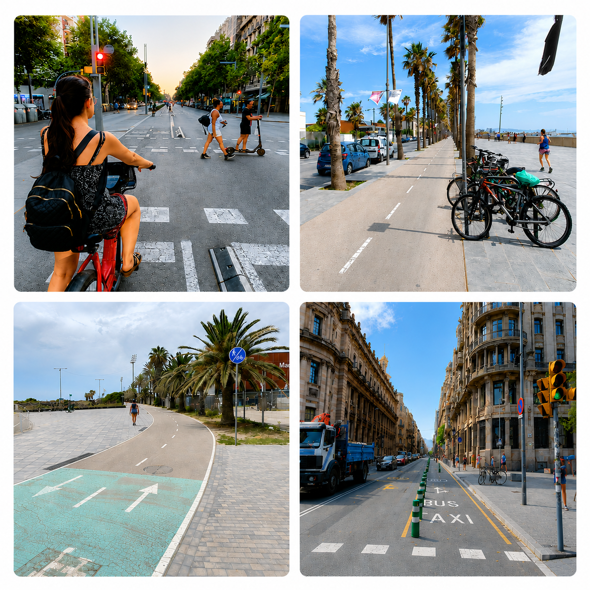
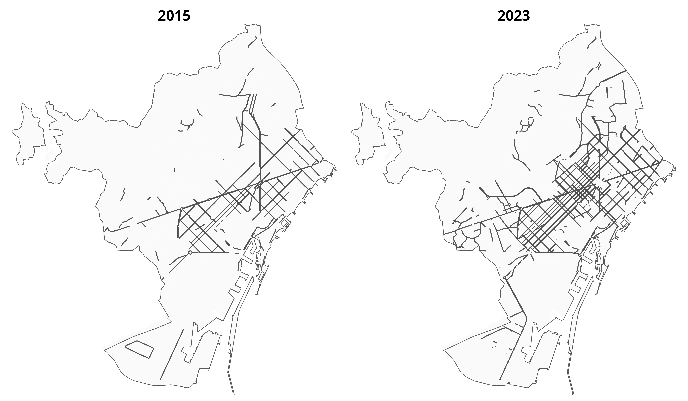
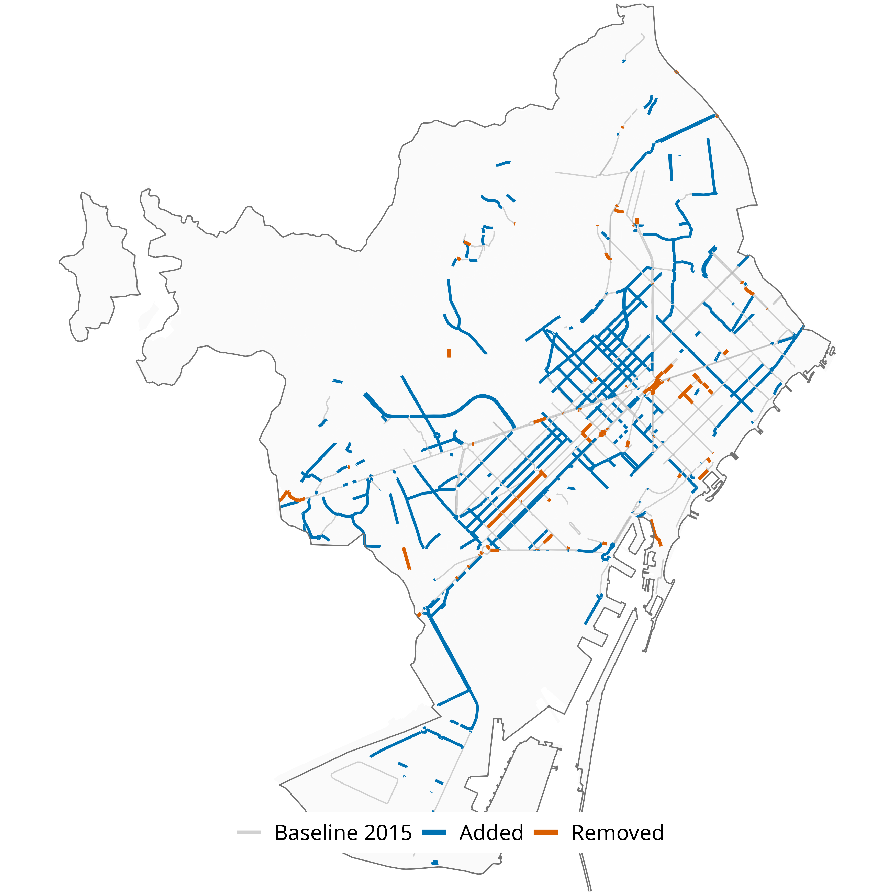
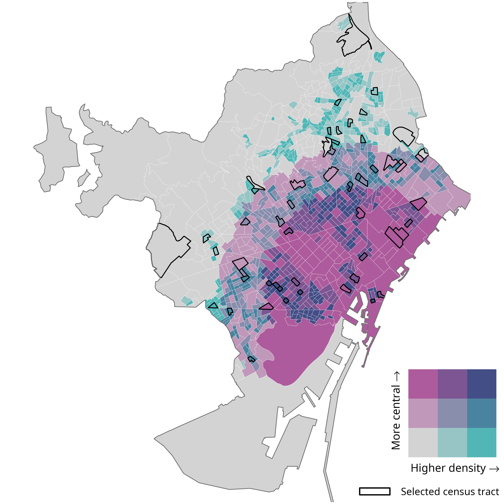
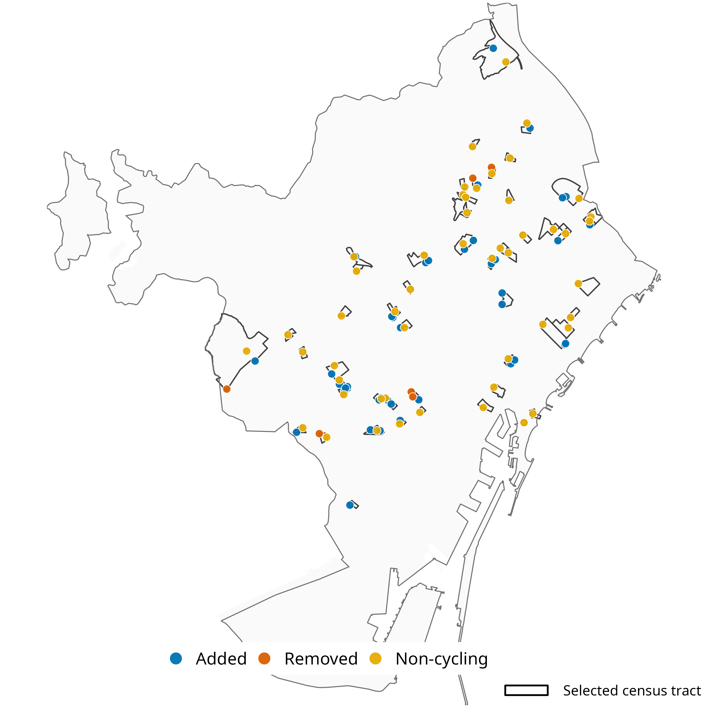
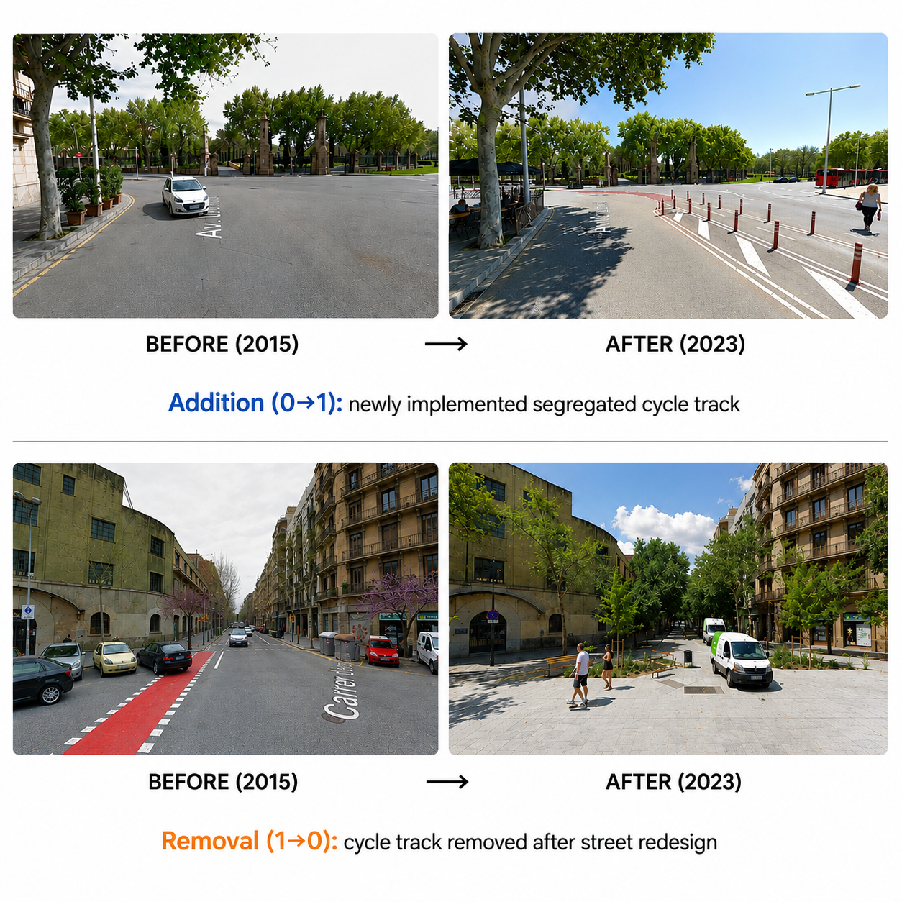
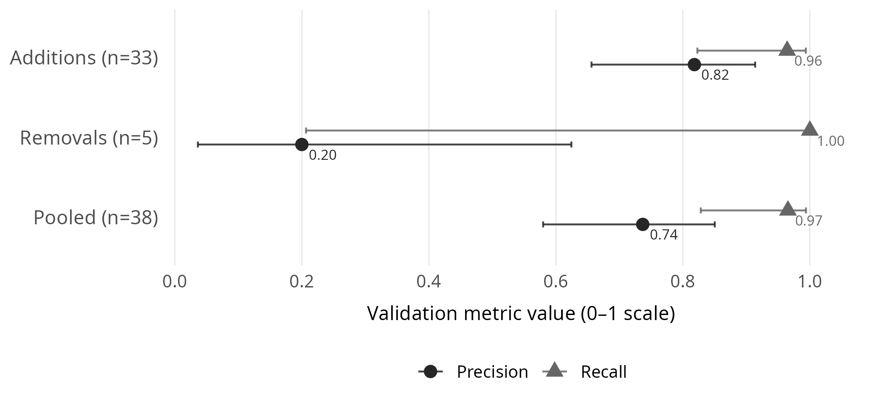

<section class="title-slide-custom">

::: main-title
Can We Trust OpenStreetMap to Measure Cycling-Infrastructure Change?
:::

::: main-subtitle
A Reproducible Validation Framework Using Google Street View
:::

::: talk-authors
Eugeni Vidal-Tortosa, Víctor Gonzàlez-Parra, Oriol Marquet
:::

::: talk-place
GEMOTT, Universitat Autònoma de Barcelona  WSTLUR 2026 · Beijing
:::

::::: logo-row

::: divider
:::

::: divider
:::

:::::

::: project-credit
Project: 101117700 — ATRAPA — ERC-2023-STG
:::

</section>

## Why does this matter?

::: section-label
INTRODUCTION
:::

:::::: {.columns .motivation-slide}
::: {.column width="45%"}
- Cities are rapidly expanding cycling infrastructure

- We need *longitudinal* data to understand its impacts

- OpenStreetMap (OSM) offers global, historical data

- But can we trust OSM to detect *change* over time?
:::

:::: {.column width="55%"}
::: photo-strip-single

:::
::::
::::::

## Research aim

::: section-label
INTRODUCTION
:::

::: big-statement
Quantify the accuracy of OSM for detecting cycling-infrastructure change
:::

## Study setting and data

::: section-label
DATA & METHODS
:::

::::: columns
::: {.column width="35%"}
**Study setting**

- Barcelona, Spain

- 2015–2023

**Data sources**

- Historical OSM cycling-infrastructure snapshots

- Census-tract boundaries

- Historical Google Street View (GSV) imagery
:::

::: {.column width="65%"}

:::
:::::

## Analytical workflow

::: section-label
DATA & METHODS
:::

::: {style="text-align: center; font-size: 1em; line-height: 2;"}
1.  Detect OSM cycling-infrastructure change

↓

2.  Stratify census-tracts

↓

3.  Generate network validation points

↓

4.  Inspect and code historical GSV imagery

↓

5.  Calculate validation metrics
:::

------------------------------------------------------------------------

### 1. Detect OSM cycling-infrastructure changes

::: section-label
DATA & METHODS
:::

::::: columns
::: {.column width="40%"}
- OSM differencing identified:
  - 127 km additions
  - 25 km removals
- Net network growth:
  - +80%
- 946  candidate change segments
:::

::: {.column width="60%"}
{width="100%"}
:::
:::::

------------------------------------------------------------------------

### 2. Stratify census-tracts

::: section-label
DATA & METHODS
:::

::::: columns
::: {.column width="40%"}
- Barcelona stratified by:

  - population density
  - centrality

- 3 × 3 density–centrality strata

- 6 census tracts randomly sampled per stratum (54 total)

:::

::: {.column width="60%"}
{width="100%"}
:::
:::::

------------------------------------------------------------------------

### 3. Generate network validation points

::: section-label
DATA & METHODS
:::

::::: columns
::: {.column width="40%"}
- Validation points sampled within selected census tracts

- Up to:

  - 2 additions
  - 2 removals
  - 1 non-cycling control

- Points linked to historical GSV imagery
:::

::: {.column width="60%"}
{width="100%"}
:::
:::::

------------------------------------------------------------------------

### 4. Inspect and code historical GSV imagery

::: section-label
DATA & METHODS
:::

::: {style="text-align: center"}
{width="60%"}
:::

------------------------------------------------------------------------

### 5. Calculate validation metrics

::: section-label
DATA & METHODS
:::

 

::::::::: columns
::::: {.column width="50%"}
 

::: {style="font-size: 1.2em; text-align: center;"}
$\mathrm{Precision} = \frac{TP}{TP + FP}$
:::

 

::: {style="font-size: 0.85em; text-align: center; color: #555; line-height: 1.4;"}
What proportion of detected OSM changes are real?
:::
:::::

::::: {.column width="50%"}
 

::: {style="font-size: 1.2em; text-align: center;"}
$\mathrm{Recall} = \frac{TP}{TP + FN}$
:::

 

::: {style="font-size: 0.85em; text-align: center; color: #555; line-height: 1.4;"}
What proportion of real changes are captured by OSM?
:::
:::::
:::::::::

## Validation performance

::: section-label
RESULTS
:::

{width="85%"}

- High precision and recall for additions

- Most apparent removals were not confirmed; estimates remain uncertain (small sample)

## Limitations

::: section-label
DISCUSSION
:::

- Historical GSV imagery is only a proxy for ground truth

- Validation had to be carried out manually

- Removal estimates remain uncertain

- Findings may not generalise to other cities

## Conclusions

::: section-label
DISCUSSION
:::

**Can we trust OSM to measure cycling-infrastructure change?**

It depends on the type of change being measured

- Additions are detected reliably

  + Useful for tracking cycling-network expansion

- Removal estimates remain uncertain

  + Often reflect mapping edits rather than real infrastructure loss

OSM accuracy should not be assumed everywhere

  - Performance may differ across cities
    
Main contribution

  - Reproducible framework to measure, evaluate, and calibrate OSM-derived change where suitable validation data are available

------------------------------------------------------------------------

### Thank you · 谢谢

### Questions?

::: {style="font-size: 0.85em; color: #555; margin-top: 1.2em;"}
eugeni.vidal@uab.cat
:::

Code and reproducible workflow available upon request