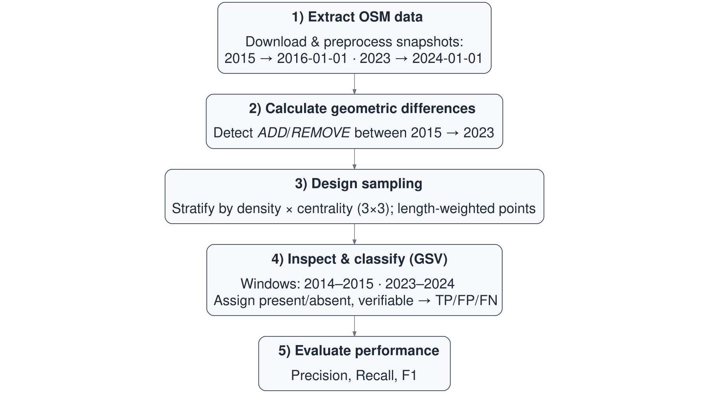
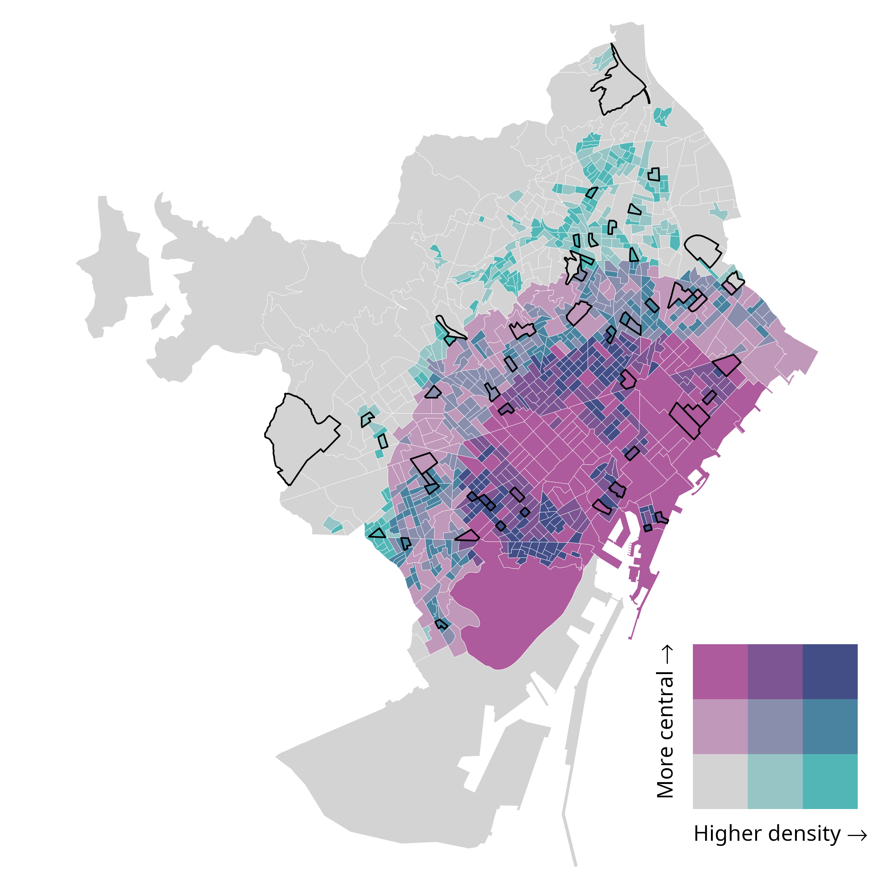

## Context and aim

-   Urban transformations such as new bike lanes reshape mobility and health, yet standardised datasets tracking infrastructure change over time remain scarce.

-   OpenStreetMap (OSM) offers open, historical data but its reliability for detecting change is still uncertain.

-   **Aim**: Assess whether OSM reliably reflects new or removed bike lanes in Barcelona (2015–2023) using Google Street View (GSV) as ground truth, as a basis for scalable validation in other cities.

## Data and methods

### Data sources

-   🗺 **OSM:** collaborative vector data tagged by infrastructure type\
-   📸 **GSV:** dated street-level imagery
-   🧩 **Urban tracts:** spatial units classified by population density and centrality

## Data and methods

### Methods

```{r}
#| include: false
source("../R/00_setup.R")
source("../R/utils_geom.R")
source("../R/utils_ci.R")
source("../R/utils_validation.R")
source("../R/01_osm_download.R")
source("../R/02_ci_networks.R")
source("../R/03_change_detection.R")
source("../R/04_nonci_network.R")
source("../R/05_tracts_strata.R")
source("../R/06_sampling_points.R")
source("../R/07_export_excel.R")
source("../R/08_results_general.R")
source("../R/09_results_validation.R")
source("../R/10_maps.R")
```

```{r}
#| label: fig-workflow
#| fig-cap: Main workflow steps (2015–2023).
#| out-width: 100%
#| echo: false



```

## Data and methods

### Methods

#### 1. Extract OSM data

-   **Snapshots:** 2016-01-01 (≈2015) and 2024-01-01 (≈2023)

-   **Cycling-Infrastructure (CI) network definition**

A segment is classified as **(CI)** if **any** of the following conditions hold:

1.  `highway = cycleway`\
2.  Any of `cycleway`, `cycleway:left`, `cycleway:right`, or `cycleway:both` is in\
    `{lane, track, opposite_lane, opposite_track, separate}`\
3.  `bicycle_road = yes`\
4.  `highway` ∈ `{service, unclassified}` **and**\
    `bicycle` ∈ `{yes, designated}` **and**\
    `motor_vehicle = no`

<!-- **Explicit exclusions:** -->

<!-- - Shared paths (`highway ∈ {path, footway, track}` with `bicycle ∈ {designated, yes}`) -->

<!-- - Local/shared bikeways (`cycleway* ∈ {shared, designated}` without one of the CI rules above) -->

-   **General (NONCI) network definition**

A segment is classified as **NONCI** if:

-   It **does not** meet the CI rule above, **and** `highway` ∈ `{primary, secondary, tertiary, unclassified, residential, primary_link, secondary_link, tertiary_link, living_street, pedestrian}`

## Data and methods

### Methods

#### 2. Calculate geometric differences

-   **ADDED**: CI in 2023 but not 2015

-   **REMOVED**: CI in 2015 but not 2023

#### 3. Design sampling

-   9 strata: density × centrality (3 × 3)

-   6 tracts per stratum (54 total), randomly selected

-   Within each tract, up to:

    -   2 ADD segments (expected new lanes)

    -   2 REMOVE segments (expected removals)

    -   1 NONCI segment (no expected change, control)

-   The midpoint of each segment serves as the validation location

## Data and methods

### Methods

```{r}
#| label: fig-bivar-map
#| fig-cap: Stratified tracts (density × centrality) used for samplying.
#| echo: false



```

## Data and methods

### Methods

```{r}
#| label: fig-validation-points
#| echo: false
#| warning: false
#| fig-cap: Distribution of validation points (with GSV links).

make_validation_points_map()

```

## Data and methods

### Methods

#### 4. Inspect & classify (GSV)

-   Each sampled segment was inspected in two periods: a **follow-up (≈2023)** and a **baseline (≈2015)**.

-   For each period, we first opened the **anchor year** (2023 or 2015).

-   If the anchor year image **could not be coded** (e.g. peg misplaced, view obstructed), we **adjusted the peg within that same year** to verify the segment from a nearby panorama.

-   If the segment remained **not verifiable**, we consulted the **next rescue years** in the predefined order:

    -   Follow-up: 2023 → 2024 → 2022\
    -   Baseline: 2015 → 2014 → 2016

-   We **stopped as soon as one year** provided a clear presence (1) or absence (0). Information from different years was **not combined**.

-   When an **unexpected discrepancy** with OSM was found, the **neighbour years** (e.g. 2022 or 2024 for follow-up; 2014 or 2016 for baseline) were also checked to ensure that the apparent disagreement was not due to a time lag between the real change and the GSV image month/year.

-   If no year in the sequence could be coded, the period was recorded as **NA**.

## Data and methods

### Methods

Codes: **1 = CI visible · 0 = clearly absent · NA = not verifiable**

Full details are in **Supplement S1 (protocol)** and **Supplement S2 (Excel workbook)**.

-   **ADD (OSM claims a new lane)**\
    True Positive (TP) if 0→1\
    False Positive (FP) if any other verifiable pattern\
    NA if any year is NA

-   **REMOVE (OSM claims a removal)**\
    TP if 1→0\
    FP if any other verifiable pattern\
    NA if any year is NA

-   **NONCI (no change expected)**\
    Used to find False Negatives (FN: real change with no OSM claim)

<!-- - Keep only points verifiable for both years -->

## Data and methods

### Methods

#### 5. Evaluate performance

-   **Precision = TP / (TP + FP)**\
    Percentage of OSM changes that were correct. (How many OSM-detected changes are real)

-   **Recall = TP / (TP + FN)**\
    Percentage of real changes detected by OS. (How many real changes OSM detected)

-   **F1 = 2 · Precision · Recall / (Precision + Recall)**\
    Balanced indicator combining both metrics.

## Results

### Network change detected by OSM

-   OSM cycling network grew **153.6 → 288.4 km (+88%)**

-   Segment differencing results: **156.0 km added, 24.8 km removed**

```{r}
#| label: fig-changes
#| echo: false
#| fig-cap: Distribution of validation points (with GSV links).

make_infra_change_map()

```

## Results

### Network change detected by OSM

```{r}
#| label: tab-consistency
#| tbl-cap: "Table 1: Consistency between yearly totals and differencing estimates (2015–2023, Barcelona)"
#| echo: false

knitr::kable(
  consistency,
  align = c("l","r")
)

```

-   **Additions** were concentrated in **dense–central tracts** (D1_C2, D1_C3, D3_C2), which together accounted for **≈58%** of total added length.

-   **Removals** were concentrated in **intermediate-density tracts** (D2_C1, D2_C3, D1_C2), representing **≈62%** of total removed length.

## Results

### Network change detected by OSM

```{r}
#| label: tab-strata
#| tbl-cap: "Table 2: OSM-estimated additions and removals (2015–2023) by density × centrality stratum"
#| echo: false

knitr::kable(
  stratum_out,
  align = c("l","r","r","r","r")
)

```

## Results

### Validation results

-   105 sampled points across 9 strata (48 ADD · 8 REMOVE · 49 NONCI)

-   93 usable validation points (both periods coded)\
    (42 ADD · 7 REMOVE · 44 NONCI)

```{r}
#| label: tab-summary_stratum
#| tbl-cap: "Table 3: Validation points by class and stratum (usable points only)"
#| echo: false

knitr::kable(
  summary_stratum_class_full,
  align   = c("l","r","r","r","r"),
  digits  = 0
)

```

## Results

### Validation results

```{r}
#| label: tab-validation_performance
#| tbl-cap: "Table 4: Validation performance (usable points only)"
#| echo: false

knitr::kable(
  t_class,
  align   = c("l","r","r","r","r","r","r","r"),
  digits  = 0
)

```

## Interpretation and calibration

### Interpretation

-   OSM captures nearly all true additions (**recall = 1.00**) but includes several false positives (**precision ≈ 0.81**).\
    For removals, OSM rarely identifies true cases (**precision ≈ 0.29**) and often flags false ones, although recall remains high for the few real removals present.

-   Most errors stem from **re-tagging, micro-geometry adjustments**, or **short-term mapping churn**, which can appear as artificial additions or removals between snapshots.

-   Overall, **OSM is a reliable proxy for additions but a weak proxy for removals**, slightly **overstating net cycling-network growth**.

### Calibration potential

-   These metrics can be used to **calibrate OSM-derived estimates** of network change.

> For example, with **precision = 0.81**, multiplying OSM-detected additions by 0.81 yields a closer estimate of true additions.

-   Stratified validation can further support **spatial calibration** and **cross-city comparability** in multi-city analyses.

## Supplements

### S1. Google Street View coding protocol (PDF)

[Download here](../outputs/procedure_gsv_coding.pdf)

### S2. Raw validation workbooks: coder 1 and coder 2 (XLSX)

[Download coder 1](../outputs/barcelona_samples_2015_2023_coder1.xlsx)\
[Download coder 2](../outputs/barcelona_samples_2015_2023_coder2.xlsx)

### S3. Final adjudicated validation results (XLSX)

[Download joined results](../outputs/barcelona_samples_2015_2023_joined_results.xlsx)
