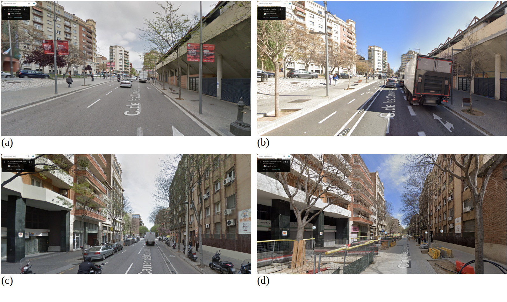
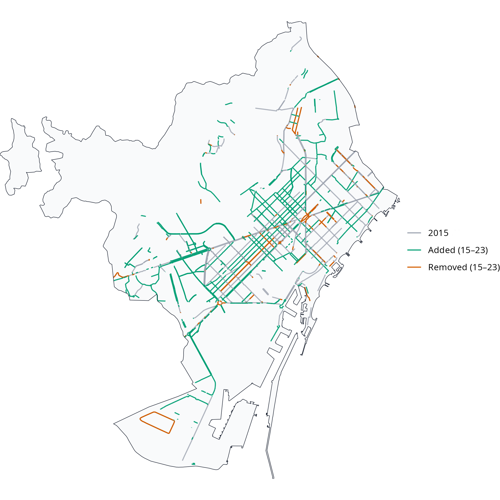

<!-- Extended abstracts (between 1500 and 2500 words) by 15 November 2025. The abstract should include the research motivations, objectives, and findings, emphasising the methodological and/or theoretical advances. All contributing authors and their affiliations should be included. -->

## Introduction and motivation

In recent years, many cities worldwide have expanded their cycling networks in pursuit of cleaner, healthier and more equitable mobility [@szell_growing_2022; @buehler_cycling_2021]. Reliable data on how these networks evolve are essential to guide fair and evidence-based planning and to enable robust longitudinal research on their impacts. Yet longitudinal information is often missing: official inventories are rarely maintained consistently, while local field audits, though accurate, are costly and difficult to reproduce at scale. As a result, even in cities with substantial cycling expansion, consistent and longitudinally comparable data on infrastructure change are often limited and fragmented.

The growing availability of Volunteered Geographic Information (VGI) [@goodchild_citizens_2007] offers new opportunities to address these data gaps. Among such sources, OpenStreetMap (OSM) stands out for providing open, editable and time-stamped spatial data on a wide range of urban features. In principle, OSM could enable the reconstruction of past infrastructure networks and support empirical studies of built-environment transformations.

However, the use of OSM for longitudinal analysis faces several challenges. Previous research has shown that not all edits correspond to physical change (false positives), some genuine changes may remain unmapped (false negatives), and even valid updates are not always recorded at the time they occur [@barron_comprehensive_2014; @ferster_using_2020; @viero_how_2025]. These uncertainties raise questions about whether OSM’s temporal record can be trusted to detect infrastructure additions and removals.

This study addresses these questions by evaluating the reliability of OSM for detecting cycling-infrastructure change in Barcelona between 2015 and 2023, using Google Street View (GSV) imagery as ground truth. It assesses OSM’s ability to identify added and removed cycle lanes and introduces a simple calibration framework to adjust OSM-based estimates to real-world conditions. The work forms part of the ATRAPA project (The Active Travel Backlash Paradox), which studies how people perceive and respond to built-environment sustainable-travel interventions across European cities [@gemott_research_group_atrapa_2025].

## Data and methods

The analysis followed a five-step reproducible workflow (@ fig-workflow) with two main components: temporal differencing of dated OSM extracts to detect additions and removals of cycling infrastructure, and stratified GSV validation to check a sample of these detected changes. All stages were implemented in R using open-source packages, including *osmextract* to retrieve dated OSM snapshots.

```{r}
#| label: fig-workflow
#| fig-align: right
#| fig-cap: "Workflow for detecting and validating OSM-based cycling-infrastructure change, 2015–2023"
#| out-width: 100%
#| echo: false
knitr::include_graphics("figs/osm_gsv_flowchart.png")
```

##### OSM temporal differencing

Baseline and follow-up cycling networks were built from OSM extracts dated 1 January 2016 and 1 January 2024 (approximating 2015 and 2023). Road segments tagged as cycleways or otherwise designated for bicycle use were classified as cycling infrastructure; all other urban segments were treated as non-cycling. 

After cleaning and projection, the two cycling network layers were compared geometrically to identify added segments (present in 2023 only) and removed segments (present in 2015 only). Small positional realignments, where added and removed segments lay very close together, were excluded so that minor mapping adjustments were not misclassified as physical change.

##### Stratified GSV validation

To validate these OSM-detected changes, we used a stratified sample of Barcelona’s 1,063 census tracts. Tracts were cross-classified by population density and centrality into nine strata, from which six tracts per stratum were randomly selected (54 in total). Within each tract, up to two added, two removed, and one non-cycling segment were sampled, with selection weighted by length. The midpoint of each sampled segment served as the validation point and was linked to the nearest available GSV panorama.

Each validation point was then assessed by two trained coders using GSV panoramas for 2015 (baseline) and 2023 (follow-up). When imagery for the target year was unavailable or obscured, the closest available years were used (2024 and 2022 for follow-up; 2014 and 2016 for baseline). Coders assigned 1 if cycling infrastructure was visible, 0 if absent, and NA if indeterminate. Agreement was high: in 91 of 95 usable cases (95.8 %) both coders assigned the same code; disagreements were resolved by consensus. Based on these observations, OSM-detected additions were classed as True Positives (TP) when GSV showed a 0 to 1 pattern and as False Positives (FP) otherwise; removals were treated analogously using 1 to 0 patterns, and non-cycling segments were used to identify False Negatives (FN). Examples of TP additions and removals are shown in @fig-gsv-examples.

```{r}
#| label: fig-gsv-examples
#| fig-align: right
#| fig-cap: "Examples of True Positive changes observed during GSV validation: (a) 2015 baseline with no cycling infrastructure; (b) 2023 follow-up showing a new segregated track (0→1); (c) 2015 baseline with a cycle track; (d) 2023 follow-up showing its removal during a street redesign (1→0)."
#| out-width: 100%
#| echo: false

```

Validation accuracy was then assessed using standard metrics. Precision (TP/(TP+FP)) captures the share of OSM-detected changes that were real. Recall (TP/(TP+FN)) captures the share of real changes correctly detected by OSM. The F1 score is the harmonic mean of precision and recall. Ninety-five per cent Wilson confidence intervals (CI) were computed for each measure.

## Results and discussion

Between 2015 and 2023, the OSM-derived cycling network in Barcelona increased from 153.6 to 288.4 km, representing an 88 % expansion (@fig-map). Geometric differencing indicated 156.0 km of added and 24.8 km of removed infrastructure, corresponding to a net gain of about 131 km. The small gap between this estimate and the change in totals (–3.7 km) suggests good internal consistency. Additions were concentrated in dense and central tracts, particularly high-density areas close to the city core, which together accounted for roughly 58 % of the new network length. Removals were much less common and tended to occur in intermediate-density areas.

```{r}
#| label: fig-map
#| echo: false
#| fig-align: center
#| out-width: 100%
#| fig-cap: "OSM-detected cycling-infrastructure changes in Barcelona, 2015–2023."


```

Of the 105 sampled sites, 95 (90 %) provided usable GSV panoramas, comprising 44 OSM-detected additions, 7 removals, and 44 non-cycling controls. @tbl-validation summarises the validation outcomes.

```{r}
#| label: tbl-validation
#| tbl-cap: "Validation metrics for OSM inferred cycling-infrastructure changes (2015–2023). “ADD” refers to added segments (present in 2023 but not in 2015); “REMOVE” refers to removed segments (present in 2015 but not in 2023); “Pooled” combines both change types. “n (usable)” is the number of sampled segments with codable GSV panoramas for both years."
#| echo: false
#| message: false
#| warning: false

library(knitr)

tbl <- data.frame(
  Class     = c("ADD", "REMOVE", "Pooled"),
  n         = c(44, 7, 51),
  TP        = c(34, 2, 36),
  FP        = c(10, 5, 15),
  FN        = c(0, 0, 0),
  Precision = c("0.77 [0.63-0.87]", "0.29 [0.08-0.64]", "0.71 [0.57-0.81]"),
  Recall    = c("1.00 [0.90-1.00]", "1.00 [0.34-1.00]", "1.00 [0.90-1.00]"),
  F1        = c("0.87", "0.44", "0.83")
)

kable(
  tbl,
  align     = c("l", rep("r", 7)),
  booktabs  = TRUE,
  escape    = FALSE,
  col.names = c("Class", "n (usable)", "TP", "FP", "FN",
                "Precision (95% CI)", "Recall (95% CI)", "F1")
)
```

Results show that OSM captures all observed additions (recall = 1.00, 95 % CI [0.90–1.00]) but also includes some FP (precision $\approx$ 0.77). For removals, recall was likewise 1.00 but with a wide CI due to the small sample size, while precision drops sharply to around 0.29, meaning that most apparent deletions do not correspond to true infrastructure loss. Overall precision across all changes is 0.71 with an F1 of 0.83.

Together, these results suggest that OSM is a strong proxy for additions but a weaker one for removals. Although all real changes were captured, OSM tended to flag more additions and removals than were visible in GSV. Because the volume of apparent additions greatly exceeded that of removals, this imbalance likely produces a slight overestimation of net network growth when using raw OSM differencing. 

A simple calibration using the observed precision values (0.77 for additions, 0.29 for removals) can adjust OSM-based estimates of change, reducing bias in net growth calculations. As validation was stratified by density and centrality, calibration factors can be adapted to specific urban contexts.

Methodologically, the study demonstrates a transparent, open-source framework for assessing the temporal reliability of OSM data on cycling infrastructure. The workflow, combining historical differencing, stratified sampling, and visual inspection, is reproducible in any city with sufficient Street View coverage. It underpins the ATRAPA Built Environment Transformations Dataset, which will extend this validation approach to other European cities including Milan, Ljubljana, Warsaw, Utrecht, Malmö, and Paris.  

Theoretically, this work supports the view of OSM as a dynamic socio-technical system rather than a static dataset. Temporal variation in OSM reflects both genuine infrastructure evolution and the rhythms of community mapping activity. By distinguishing true from apparent edits, the approach contributes to a broader framework for assessing the temporal validity of VGI – an essential step for longitudinal research in transport, health, and environmental studies.

Several limitations should be acknowledged. True removals were few, producing wide confidence intervals for that category. GSV imagery dates vary within each anchor year, occasionally creating minor temporal mismatches. Although inter-rater agreement was high, subtle interpretive differences – for example, in deciding whether a feature should count as cycling infrastructure or not – remain possible. Finally, Barcelona’s large and active mapping community likely ensures relatively high data quality; replication in less-mapped cities will be required to test generalisability.

## Conclusions and implications

This Barcelona pilot demonstrates that OSM can reliably detect additions to cycling infrastructure but struggles to capture removals. Overall, OSM slightly overstates network growth. Despite these limitations, OSM remains a valuable, low-cost resource for longitudinal analysis of cycling infrastructure when accompanied by empirical calibration.

The study introduces a transparent validation framework that combines OSM historical data, stratified sampling, and GSV-based inspection to generate quantitative precision and recall metrics. These can be used to correct OSM-derived measures of change and to support comparisons within the ATRAPA framework. More broadly, the findings strengthen confidence in using VGI for temporal urban analysis while highlighting the need to understand the social and temporal dynamics behind its production.

## Acknowledgements {-}

This research forms part of the ATRAPA project and is funded by the European Research Council (grant 101117700). We also thank Víctor González Parra for his collaboration as second coder during the Google Street View validation and the OpenStreetMap community for their contributions.

## References  {-}

